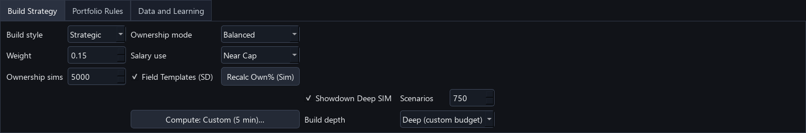
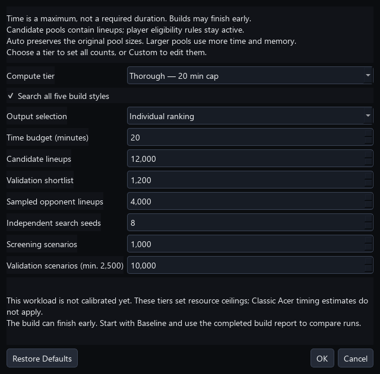
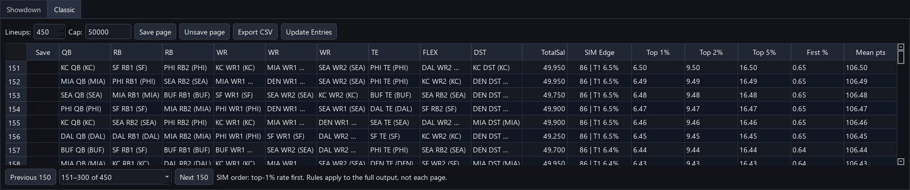
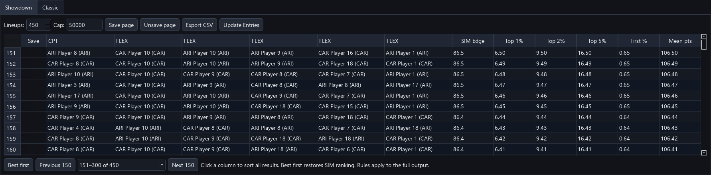

# DFS Optimizer


A Windows desktop lineup optimizer for DraftKings NFL, MLB, NBA, NHL, and WNBA slates.


## User documentation


- [Five-minute quick start](docs/QUICK_START.md)

- [Complete user guide](docs/USER_GUIDE.md)

- [Troubleshooting](docs/TROUBLESHOOTING.md)

- [Release notes](docs/releases/)


Tagged releases include a downloadable `DFS-Optimizer-User-Guide.pdf`.


## Download the Windows app


1. Open the repository's [latest release](../../releases/latest).

2. Download `DFS-Optimizer.exe` and `DFS-Optimizer.exe.sha256`.

3. Optionally verify the download from PowerShell:


   ```powershell

   Get-FileHash .\DFS-Optimizer.exe -Algorithm SHA256

   ```


   The displayed hash should match the value in `DFS-Optimizer.exe.sha256`.


4. Double-click `DFS-Optimizer.exe`.


The release executable is self-contained; Python does not need to be installed. The app is currently unsigned, so Windows may identify it as being from an unknown publisher. Only use binaries downloaded from this repository's Releases page.


## Run from source


Python 3.12 is recommended.


```powershell

py -m venv .venv

.\.venv\Scripts\Activate.ps1

python -m pip install -r requirements.txt

python app.py

```


On Windows, `Launch_DFS.bat` also starts the app after its dependencies have been installed.


## Results & Learning


1. Save the lineups you plan to enter, then choose **Export Saved CSV** on the Showdown or Classic tab.

2. After the contest, download the DraftKings contest standings or contest-history CSV.

3. Open **Results & Learning** and choose **Import DraftKings Results**.

4. For complete NFL Classic or Showdown standings, choose **Attach Matching Salaries** and select the matching historical DKSalaries CSV or DKEntries CSV containing its embedded player salary table.


The app matches result rosters to exact lineups it previously exported. The report includes net return, ROI, cash rate, finish percentile, projection error, and guarded breakdowns by salary use, ownership, construction, and context adjustment. Complete standings can also measure actual and winning ownership profiles, exact duplication, salary use, QB stacks, bring-backs, and FLEX patterns. Large fields import in the background with progress and cancellation. Personal entry history is never mistaken for a complete opponent field.


Export history and imported results stay on the computer. They are stored in the app's local `history` folder and are not uploaded to this repository.


## Portfolio & Exposure


The optimizer can shape the complete set of generated lineups, not just each lineup in isolation:


- set minimum and maximum player exposure, including separate Showdown Captain limits;

- require a minimum number of unique players between lineups;

- cap the percentage of lineups containing a team or game;

- create selected-player groups that require at least one player or prevent players from appearing together;

- balance ownership concentration and duplication risk across the portfolio; and

- review a portfolio compliance summary before exporting to DraftKings.


The app generates a larger candidate pool and selects a compliant portfolio from it. If aggressive settings cannot all be satisfied, it returns the feasible lineups it found and clearly reports any relaxed uniqueness or minimum-exposure shortfall.


## NFL SIM Edge


NFL Classic builds can use the **NFL SIM Edge** option. The app first removes inactive and low-depth players from the automatic field pool while preserving manual locks. It then:


- applies a **Single Entry**, **3-Max**, **20-Max**, or **150-Max** opponent-field preset;

- creates candidates from projection-led optimization, realistic field constructions, and correlated ceiling, balanced, leverage, and low-duplication scenarios;

- creates only complete, near-cap field lineups with realistic QB-stack, bring-back, and FLEX construction;

- evaluates candidates with separate balanced, shootout, defensive, and blowout game scripts plus role-aware player ranges and guarded rare ceiling outcomes;

- rotates across three sampled opponent fields rather than treating one generated field as exact;

- ranks every candidate against the same active opponent field in each scenario; and

- selects a 150-lineup portfolio that covers different top-one-percent outcomes while respecting exposure rules.


The Classic results table shows slate-relative SIM Edge and top-one-percent rate. Its tooltip also includes top-five-percent rate, representative win rate, cash and bust rates, average percentile, simulated ceiling, tournament return index, leverage, duplication risk, scenario count, and representative field size. These metrics are decision aids based on the loaded projections and assumptions, not guarantees of contest results.


For a specific NFL Classic contest, open **Settings > Contest-Aware SIM** and save its field size, entry fee, your entry count, and payout tiers. The candidate SIM replaces the generic payout-shape proxy with that contest's actual prizes. After selection, a joint pass places every chosen entry into the same contest, so your lineups occupy ranks together and share covered prizes across ties. Portfolio Insights and build reports add total entry cost, expected payout and profit, profit and double-up chances, payout percentiles, estimate stability, and a 95% ROI range. A pre-build prompt catches profile and lineup-count mismatches. Saved profiles are reusable and local to the current Windows user. Choose **Use Preset Only** at any time to return to the normal preset workflow.


**Build depth** offers two compute profiles. **Fast (default)** preserves the normal candidate budget and scenario setting. **Deep (custom budget)** is an optional NFL Classic SIM mode that:


- defaults to as many as 6,000 candidate lineups across four independent optimizer seeds plus field-shaped and correlated scenario constructions;

- runs a quick screening SIM over the expanded bank and keeps a source-diverse shortlist;

- validates that shortlist with a different random stream, at least 2,500 scenarios, and a larger representative field; and

- performs constraint-safe lineup swaps when they improve the complete portfolio.


Choose **Compute settings** beside Build depth to set a **1–60 minute** maximum, up to **20,000 candidate lineups**, a **2,000-lineup validation shortlist**, up to **10,000 sampled opponents**, **4–32 independent search seeds**, and **250–1,000 screening scenarios**. Zero/Auto pool values preserve the original budgets. The existing Scenarios control now supports up to **10,000** validation scenarios (Deep still uses at least 2,500). The sampled opponent count applies to independent validation; coarse screening retains its smaller field. Pool sizes are ceilings subject to the deadline, available unique lineups, and requested portfolio size. These controls expand candidate lineups, not the eligible-player pool.


Settings persist on this computer and in named build recipes. Older recipes retain the original five-minute defaults. Build reports include the requested time/pool limits and actual completed counts. More time alone may still finish early at a local optimum; increase candidate count and search seeds to broaden exploration. More computation reduces sampling noise, not projection/model error.


For an initial dedicated-machine test, try **15 minutes / 8,000 candidates / 1,200 shortlist / 4,000 opponents / 8 seeds / 750 screening scenarios**, with **5,000 validation scenarios**. Compare actual work, timing, and independent agreement using the same slate and strategy. Larger settings use more RAM; cancellation remains available between work units.


Deep Build reserves time for final selection and, when a payout profile is active, the joint-contest pass. After the normal coverage refinements, it uses remaining compute to search for lower-duplication replacements that retain the lineup's combined Edge and return strength and continue to satisfy every hard portfolio rule. It stops at the time limit or when that constrained search reaches a local optimum; it never burns time solely to fill the selected time window. Cancellation and a slower computer therefore return the best valid portfolio available instead of discarding the run. The copied build report records the expanded bank, shortlist, screening and validation scenarios, independent top-candidate agreement, total and duplication-polish swaps, search time, stop reason, remaining budget, and joint-contest uncertainty.


When an NFL SIM lineup is exported, Results & Learning retains those original estimates, including contest-specific expected ROI when a payout profile was active. Imported DraftKings results can then compare predicted and actual top-one-percent, top-five-percent, cash, and contest ROI rates, plus the relationship between SIM Edge and finish percentile. Complete fields can also be compared directly with the latest representative NFL SIM field for the same preset. After three complete fields, 1,000 entries, and 70% metadata coverage for a named preset, a guarded blend can refine its salary, construction, and winning-ownership assumptions. Small samples remain report-only.


## NFL Game-Day Check


NFL salary files automatically receive current player availability, injury status, practice participation, roster status, news notes, and depth-chart roles from Sleeper. The status strip reports how many salary-file players matched, when the check ran, and whether anything changed. **Game-Day Check** refreshes the data on demand, and a stale check is refreshed before lineup generation.


- Confirmed out, inactive, injured-reserve, suspended, and practice-squad players are automatically removed unless the user locked them.

- A locked unavailable player is never silently removed; lineup generation stops and names the conflict.

- Questionable and doubtful players remain available, with their uncertainty reflected in the NFL role adjustment.

- The Status and Role columns expose starter/backup depth, practice participation, the source, and freshness details.


NFL Showdown generation uses the same key-free player, role, usage, matchup, and weather inputs without applying the Classic low-depth pool filter. When a confirmed starter is unavailable, the next active depth-chart player receives a small, reversible opportunity adjustment; manual locks and exposure limits remain hard rules.


High-volume Showdown builds create a wider candidate bank before selecting the final portfolio. Captain-specific ownership, key-free QB/receiver and RB/DST correlations, team splits, salary use, leverage, estimated duplication, and distinct Passing Stack, Receiver Captain, Rushing Control, Defensive, Onslaught, and Balanced constructions guide selection. These are portfolio decision aids rather than predictions of exact contest outcomes.


## Slate Readiness


**Slate Readiness** is a one-click, report-only preflight. For NFL it refreshes stale player status first, then audits roster viability, projections, ownership, locks, role certainty, and news freshness. After generation it also checks complete lineups, salary use, and how the portfolio's QB stacks, bring-backs, FLEX mix, and ownership coverage compare with the selected contest preset.


Actionable findings can filter the player table directly. The adjacent **Space** dashboard shows the current eligible pool, structural lineup possibilities, requested entries, and live generation phase. It updates after fades and locks. Normal NFL Classic styles use a compact starter/rotation pool with or without SIM Edge; locks, minimum exposures, and required player groups remain eligible. **Randomized** with SIM Edge off is the deliberate broad-pool option. The tooltip clearly distinguishes exact NFL roster-shape counts from upper bounds and reports generation, simulation, and selection timing after a build.


Findings are separated into Pass, Review, and Block. Hard problems such as missing positions, poor projection coverage, or a locked unavailable player are blockers. The audit never changes player settings or lineups.


## Final Lock Check, Entry Safety, and build recipes


Immediately before an NFL export, **Final Lock Check** refreshes the live source and maps late changes or unavailable players to exact saved lineup numbers. The user can preserve the unaffected portfolio and replace only the affected rows.


Every saved-lineup export then passes through **Entry Safety**. It audits the exact portfolio for roster and position validity, unique athletes, slot-specific DraftKings IDs, salary data and cap compliance, current-slate membership, Classic and Showdown team diversity, one-game Showdown construction, duplicate entries, unavailable players, and current portfolio-rule violations. Hard failures block export and can be repaired by replacing only the blocked rows; questionable players, stale slate data, and intentional salary leverage remain review items that can be acknowledged. The app never changes a lineup unless the user explicitly chooses and confirms replacement.


Named build recipes are available under **Settings**. They preserve reusable contest and strategy choices—including lineup count, NFL preset, SIM depth, ownership behavior, salary strategy, uniqueness, and concentration caps—without carrying slate-specific player locks, fades, exposure limits, or groups into a future slate.


NFL Classic SIM tooltips include a **Why this SIM Edge** breakdown showing each component's slate percentile, direction, and model weight. Build progress identifies candidate generation, field simulation, and portfolio selection as separate phases.


## Portfolio Insights


After generation, **Portfolio Insights** explains the finished lineup set and turns its review signals into a repair workflow. With a contest profile, the overview leads with the joint portfolio's total economics, profit chance, payout range, and estimate stability. It also reports grade distribution, salary and ownership shape, QB stacks, bring-backs, FLEX mix, candidate-source selection, scenario archetypes, leverage, duplication risk, preset fit, scenario coverage, concentration, and automatic review flags. The lineup table can filter and select C/D grades, high-duplication builds, excessive unused salary, unstacked NFL lineups, and concentrated cores. Selected rows can be removed or replaced while every unselected lineup remains fixed.


The **Player exposure** tab lists each player's portfolio percentage and exact lineup numbers, then jumps directly to those rows for review. Repair uses the current slate and settings, applies the same portfolio constraints, and generates only the open slots.


Candidate provenance survives NFL contest simulation and portfolio selection, so the report can distinguish projection-led optimizer lineups, realistic field-shaped candidates, and correlated Ceiling, Balanced, Leverage, or Low-Dup scenario builds.


## Build diagnostics


After lineup generation, **Settings > Copy Last Build Report** copies a shareable snapshot of the build-space count, pool size, candidate flow, phase timing, active strategy, portfolio rules, preset fit, selected source mix, SIM quality, scenario coverage, and generalized warnings. The NFL SIM Edge candidate budget distinguishes projection-led optimizer candidates, realistic field-shaped candidates, and correlated scenario-built candidates. **Settings > Build History…** keeps the 25 most recent runs available, compares two selected runs side by side, and lets the user copy or clear the local reports.


Unexpected interface exceptions are caught by an application-level safety handler. The user can copy the technical details and retain any valid on-screen lineups instead of losing the entire session without an explanation.


Build diagnostics stay in the app's local history folder. They contain aggregate settings and counts only—not player names, lineup contents, source-file paths, or API keys.


## Create a release


The `Windows Release` GitHub Actions workflow supports two modes:


- **Manual build:** Open **Actions → Windows Release → Run workflow**. When it finishes, download the Windows artifact from the workflow run.

- **Published release:** Push a version tag such as `v1.0.0`. The workflow runs the tests, builds the executable and user-guide PDF, calculates the executable's SHA-256 checksum, and publishes all three files to GitHub Releases.


Example release commands:


```powershell

git tag v1.0.0

git push origin v1.0.0

```


Create release tags from a reviewed commit on `main` so the published executable matches the supported source version.


Every release must also update the user-facing guide and release notes, recapture screenshots for changed workflows with `scripts/capture_documentation_images.py`, and visually inspect the refreshed images before tagging. The versioned PDF must be rebuilt from that reviewed documentation.


## Tests


```powershell

python -m unittest discover -v

```


### Compute tiers and Acer runtime estimates


In **Build Strategy → Deep → Compute settings**, choose a tier to set every resource control, including validation scenarios. Choose **Custom** to edit the current tier's values. OK saves the changes; Cancel leaves the active settings unchanged. Tier selection is recovered from its saved values, and recipes include those values. Changing the main Scenarios control can turn a preset into Custom.


| Tier | Time cap | Candidates | Shortlist | Opponents | Search seeds | Screening | Validation | Acer planning range |

| --- | ---: | ---: | ---: | ---: | ---: | ---: | ---: | --- |

| Baseline | 5 min | 4,500 | 900 | 2,700 | 4 | 600 | 5,000 | 3–6 min |

| Balanced | 15 min | 8,000 | 1,200 | 4,000 | 8 | 750 | 10,000 | 7–12 min |

| Thorough | 20 min | 12,000 | 1,200 | 4,000 | 8 | 1,000 | 10,000 | 9–17 min |

| Extended | 30 min | 16,000 | 1,600 | 6,000 | 12 | 1,000 | 10,000 | 11–27 min (extrapolated) |

| Maximum | 60 min | 20,000 | 2,000 | 10,000 | 16 | 1,000 | 10,000 | 16–39 min (extrapolated) |


These are **reference estimates for the Acer i7-9750H/16 GB and 150 NFL Classic lineups**, using a similar 192-player eligible pool and no contest-specific payout profile. The four completed reference runs took 261.06, 574.71, 747.16, and 790.29 seconds. The earlier 300.10-second time-limited run is excluded from calibration. Only workload timings are stored in code, not lineups or player data.


The heuristic scales generation, SIM, and selection phase costs from the closest measured workload. Its assumed SIM split is 40% screening / 60% validation, adjusted for opponent sample size; this split is not separately measured. The planning band is ±25%, widened to ±40% outside the measured workload range, rounded outward to minutes. It is not a statistical confidence interval. Changes in player pools, hard rules, search seeds, hardware, or joint-contest validation can substantially change actual runtime. The estimate is capped by the selected time budget, with a small allowance for finishing work units; a low time cap can stop work before the pools are exhausted.


The time cap does not force the app to keep running. A 60-minute tier can finish much sooner when its search reaches a local optimum. These presets are not claims of improved prediction quality.


### NFL Showdown Deep


Load a one-game NFL Showdown slate, enable **Showdown Deep SIM**, select **Deep (custom budget)**, and choose a compute tier. Start with **Baseline**. The tier sets candidate count, shortlist, sampled opponents, search seeds, screening/validation scenarios, and the time cap. Showdown timings are not yet calibrated; the dialog does not show Classic's Acer estimates.








Deep explores candidates across independent optimizer seeds, screens them against a Showdown opponent sample, validates a Captain-aware shortlist with a different random stream, and refines the selected portfolio. Captain identity survives deduplication: changing Captain produces a distinct entry even with the same six athletes. Every scenario draws each player's outcome once, then applies 1.5x to the Captain. Kickers have a separate offensive-opportunity correlation rather than using the defense model.


The opponent sampler uses Captain/FLEX ownership with a projection-based fallback, requires six unique athletes, both teams, and legal salary, and retains repeated entries as sampled duplicates. Personal locks and fades do not restrict the opponent field. Confirmed unavailable players are excluded; an unavailable user lock raises an error. No Classic starter/rotation pruning is applied. Existing Captain/FLEX locks, fades, and final portfolio constraints remain active. Repairs preserve the retained lineup identities.


The results table adds **SIM Edge** with scenario/top-one-percent details. Export still uses one Captain and five FLEX slots. The copied build report includes actual candidate, screening, validation, shortlist, refinement, and timing counts. Cancellation or a deadline returns the best available stage; missing independent validation is explicitly reported as a warning.


This version uses a generic tournament payout proxy and relative candidate metrics, **not contest-specific Showdown ROI or a calibrated opponent model**. Classic contest payout profiles and historical field calibration are not applied to Showdown. Higher compute does not guarantee stronger predictions. Keep the original Fast Showdown path available for comparison.


### All-style search and ranked results


For NFL Classic or NFL Showdown, enable SIM, choose **Deep**, and open **Compute settings**. Select **Search all five build styles** to share the tier's candidate and time budgets across Strategic, Balanced, Contrarian, Chalk, and Randomized. Each style uses the configured search seeds. Each search receives a share of the remaining generation time so one style cannot consume the whole generation phase. Identical entries are removed before screening; a different Showdown Captain remains a different entry. The report lists actual style candidate counts before deduplication. Locks, fades and player eligibility remain active; ownership preference remains a separate setting.


The combined pool is screened against common scenarios. Its shortlist is evaluated together against a fresh scenario stream and opponent sample. **Individual ranking** shortlists and selects by top-1% finish rate, then top-2%, top-5%, first-place rate, and mean points. It disables automatic Showdown exposure guardrails, diversification bonuses and portfolio refinement. Explicit player, group, team/game and uniqueness rules still affect selection; minimum exposure shortfalls are reported rather than prioritized. Existing uniqueness relaxation is reported if needed to fill the output. Retained repair entries remain included. **Portfolio selection** uses the existing complementary-outcome selection and refinement, then displays that selected group in the same finish-rate order.


Set **Lineups** to 300, 450, or any count up to **1,000**. Results display 150 per page with global row numbers, a page selector, and Previous/Next controls. The finish-rate columns show top-1%, top-2%, top-5%, first-place (including ties), and mean simulated points. The first page is the strongest individual ranking within the selected output. Portfolio rules and exposure percentages apply to the **entire output**, not each page. Choosing a subset can change exposures. All-style or larger-output runtime is uncalibrated; the dialog does not apply the previous 150-lineup Classic estimates to these workloads.


Use **Save page**, **Unsave page**, or individual checkboxes. Saved selections survive page changes and are ordered by finish rates when added. Export still contains only the proper roster IDs; generating more alternatives does not change a contest's entry limit. Finish-rate ordering is for comparisons within the same simulation run, not calibrated comparisons between separate runs. Non-SIM Classic builds keep their grade order. Equal metrics may tie. Budget exhaustion can produce fewer candidates or outputs, and incomplete validation is reported. Ranked results cover tested candidates, not every possible lineup.


Automatic Showdown guardrail relaxation is now explicitly reported when portfolio selection raises its starting caps to fill the requested count.


Illustrative results on synthetic fixtures (finish rates below are demonstration values):








### Sorting results and reading finish rates


Click a column heading in either generated-results table to sort **all generated results**, across every page. Numeric columns start highest first; player names start A–Z. Click again to reverse the order. **Best first** restores top-1%, top-2%, top-5%, first-place rate and mean-points ordering. Row numbers describe positions in the current view. Sorting changes the view, not the selected lineup set or simulation results. Save checkboxes remain attached to the correct lineup after sorting and paging.


Top 1%, Top 2% and Top 5% are the shares of simulated scenarios where the lineup reaches those opponent-field thresholds, including ties. They are cumulative: top-1% outcomes are also within top 2% and top 5%; do not add the columns. First % includes ties for the best sampled opponent score. Mean pts is average simulated fantasy points. SIM Edge is a relative composite score out of 100, not a probability. For example, a 19.58% top-1% rate over 10,000 scenarios means 1,958 qualifying scenarios. These are model results, not calibrated actual-contest winning probabilities.


Result refreshes rebuild exactly one set of finish-rate columns. Reentrant table rendering is removed to prevent stale renderers appending repeated metric groups.


### Broader candidate search and ranked-group diagnostics


NFL Classic and Showdown Deep now pass previously found lineup identities into subsequent seed/style searches. These are **exact exclusions**, not a requirement that every candidate differ by multiple players from the entire candidate bank. Classic retains the separate minimum-uniqueness checks within a batch and against retained repair lineups. Showdown treats Captain plus five FLEX identities as the entry identity; swapping Captain remains a distinct lineup. Search can still stop short of its candidate ceiling when time or feasibility is exhausted.


**Individual ranking** allocates up to 60% of the total time cap to generation, then screens until 78% of the cap, with the remaining time reserved for independent validation and selection. Maximum therefore allows up to **36 minutes of generation**, instead of 22 minutes 48 seconds. **Portfolio selection** keeps the previous 38% generation / 58% screening deadlines so it retains refinement time. These are phase deadlines, not forced waits or measured runtime predictions. Spare time after validation is not recycled into new unvalidated candidates. All-style budgets remain shared rather than multiplied by the number of styles.


Build reports include **Ranked groups**, covering 1–150, 151–300 and every remaining block, including a partial final block. Groups always follow canonical SIM finish-rate order, regardless of the table's current sort. Each block reports average top-1%, top-2%, top-5% and first-place rates, the range of individual top-1% rates, mean points, salary-strategy exceptions, and the five highest player exposures. Showdown also includes Captain exposures and correlation flag counts/types. Group exposures use the actual block size as their denominator; these groups are not independently optimized portfolios. Reports with these summaries include player names and say so in the privacy footer.


Individual ranking now reports **refinement disabled in individual ranking**, with zero refinement time; its normal mode explanation is no longer classified as a failed rule. Reports explicitly identify automatic Showdown cap increases, the effective relaxed uniqueness when available, incomplete validation, and candidate shortages while retaining identifier-free constraint warnings.


### Simulation input integrity


NFL simulation projections and opponent sampling ignore internal minimum-exposure/group search boosts. Explicit team projection adjustments still apply; optimizer search continues to use exposure preferences. Showdown fills missing opponents from its two validated slate teams and shares game context across the pool. Conflicting opponent or game metadata stops the build with an explanation. These are input-integrity fixes, not historical calibration or new penalties against unusual lineups.


### Replaying identical NFL build inputs


Under **Settings**, use **Save Build Snapshot** to save the currently loaded, enriched player data and build settings, then **Load Build Snapshot** to restore them without a live refresh or ownership recalculation. This supports NFL Classic and Showdown. Snapshots include locks, fades, exposure limits, groups, contest settings and field calibration; they do not include account settings or API keys. They contain player data, so share them deliberately.


Each ordinary NFL build also saves its effective pre-build inputs automatically under `history/snapshots`. The existing history-folder USB backup includes these files. Repair builds do not claim a replayable snapshot because they also depend on retained lineups. Snapshot files accumulate and can be copied or removed manually when no longer needed.


The workspace displays **Snapshot replay** while automatic pre-build refresh is paused. **Settings > Data Freshness** shows the original recorded check time and available player/odds source states. Unknown means no source status was recorded. Manually refreshing live data or loading another CSV leaves replay mode. Before using old snapshots for current contests, refresh current availability.


Build reports include an **Input ID**. In **Settings > Build History**, select two reports and choose **Compare Two Builds**: matching IDs confirm identical captured input data/settings; different IDs identify an uncontrolled comparison. Older reports cannot establish an input match. IDs include player order and metadata, so a changed ID does not prove projections changed. Matching inputs do not guarantee identical results across software versions or time-limited searches. No historical accuracy claim is implied.


To compare updates: keep the automatic snapshot from the first build, load it after updating, run the same build, and compare input IDs in Build History. A manually saved snapshot captures the current controls, which may differ from an earlier build. Generated lineups still use the separate export controls.


### Independent ranking audit


After independent validation, NFL Classic and Showdown Deep can score the same shortlist against **2,000 additional scenarios and a fresh sampled opponent field**. The separate fixed seed is 481516. Audit results never change selection or displayed scores. The audit starts only with at least 120 seconds before the existing selection reserve, and stops within 120 seconds or at that reserve, whichever comes first. SIM timing includes this work, so builds may take longer than earlier versions with the same snapshot.


The report compares the **top 50**: overlap, median absolute rank movement of the original leaders, and their worst audit rank. Banks below 200 use one quarter of the candidates; banks below 20 or validation below 1,000 scenarios are not audited. Exact boundary ties are disclosed. This measures sensitivity to both scenario and opponent sampling within the model, not historical accuracy or a confidence interval. A 2,000-scenario audit is noisier than a 10,000-scenario validation.


Skipped or incomplete audits are identified; partial audits never publish overlap percentages. The audit is not used to select or tune lineups. Existing screening/validation agreement remains a separate diagnostic.


The audit consumes available build time. Its scores never guide selection, but less time may remain for optional portfolio refinement; the existing selection reserve is preserved. Compare software versions as well as snapshot inputs when assessing changes.


### Sampled opponent-field diagnostics


NFL Classic and Showdown build reports describe the actual base opponent sample used for the reported simulation. They show sample size, unique entries, repeated copies beyond the first, largest duplicate group, mean/range salary and cap usage, team-count splits, and same-team WR/TE counts per QB. QB stack observations count quarterbacks, not entries; a Showdown entry with two quarterbacks contributes twice. Showdown also shows both-defense and three-plus kicker/defense frequencies and separate Captain/FLEX ownership.


The report lists the most sampled players and the largest absolute differences between recorded ownership percentages and sampled exposure. Missing inputs remain unknown, distinct from zero; zero-use players in the sampling pool are included. Ownership guides conditional sampling and is not an enforced marginal target. Slot-specific inputs may fall back to total ownership or projections. These diagnostics do not adjust field generation, scoring, or rankings and are not measured contest outcomes.


Duplicate entries count every sampled opponent; bootstrap field copies are not added to these counts. Showdown Captain swaps are distinct entries. If Classic cannot generate a field and uses candidate lineups as fallback opponents, the report discloses this limitation. Reports containing these diagnostics include player names in their privacy notice. The ranking audit uses a separate field; this section describes the primary simulation, not that audit or a later joint payout validation.


### NFL projection sources


Historical PPG is now separate from supplied forecasts. NFL Classic and Showdown honor manual overrides and imported projections before using automatic role-and-usage workload estimates, then historical estimates. Double-click BaseProj or AdjProj to edit a forecast; inspect the source beside the selected player. Read [projection sources and limitations](docs/USER_GUIDE.md#projection-sources-and-players-without-nfl-history). Reload the salary CSV to use the new handling; old snapshots preserve their original inputs.


NFL usage now uses the current weekly-statistics endpoint. Workload-v2 preserves historical player differences when usage is missing. The [shared server preparation command](docs/USER_GUIDE.md#shared-server-preparation) generates projections and ownership through the desktop code, with source hashes for reproducibility.


### Shared specialist event scoring


Classic and Showdown now share experimental possession events for K/DST scoring, with common field goals, touchdowns, extra points and opposing points allowed. Reports disclose uncalibrated event rates and the distinction between input projections and resulting SIM means. Offensive-player scoring remains projection-based; this is not a complete game ledger. See the user guide for assumptions and omitted events.


### Kicker opportunity forecasts


Matched kickers now receive explicit attempts/accuracy/distance/XP forecasts from weekly records, with documented shrinkage and context. Components drive shared specialist events. Source details and report counts are visible; manual/imported forecasts and missing-data fallbacks are preserved. Reload the salary CSV to adopt this model; old snapshots retain their recorded inputs. See the guide for uncalibrated assumptions and tonight’s validation sequence.


### One-file results and username

Open **Results & Learning**, enter your **DraftKings username**, and choose **Save username**. The setting stays on this computer and is not included in shared source code. Import the complete contest standings CSV to identify your submitted entries by exact username (case-insensitive, ignoring the trailing entry counter), save their scores and ranks, and compare your regular-slot and Captain exposure with the observed field. No salary or entry-upload file is required for these comparisons.

If you previously imported the same file without a username, save your username and import it again; the field and personal entries are not duplicated. Different username spellings are not guessed. **Optional Salaries** adds salary/construction detail when desired. Forecast validation still requires original saved forecasts; winnings/cash rate require payout data. This update stores empirical results and ownership comparisons; it does not automatically retrain projections or tune Showdown from a single contest.


### Results audit and Copy Report

Results & Learning now appends a diagnostic audit automatically. **Copy Report** copies the complete displayed text, including per-contest match counts, up to five unmatched rosters, lineup score reconciliation, Captain/FLEX scoring consistency, player forecast misses, saved ownership ranges, and available export version/timestamps. Keep the original standings file accessible for its player FPTS side table. Missing files or fields are reported rather than guessed.

Identical player-score tables across contests indicate shared outcomes; the count is a proxy, not a verified game count. Repeated player appearances are not independent observations. Older exports may lack forecast provenance and ownership units; low saved ownership alone does not prove a normalization bug. New exports preserve forecast source and workload/kicker context for future audits. No forecasts are regenerated and no model weights change automatically. Copied reports contain player names, username and aggregate results, but omit file paths, entry IDs and API keys.


### Results folder

In **Results & Learning**, choose or create a folder with **Choose folder**. The location is saved on this computer. Store downloaded standings there, then click **Import New Results**. The app scans that folder and subfolders, ignores non-result CSVs, and imports contents it has not already saved. Identical contents are skipped even after a rename; moved files refresh their audit location. Your saved username identifies your entries. An unavailable USB drive is reported without changing saved results.

The scan runs only when clicked. Keep **Import DraftKings Results** for selecting individual files or reprocessing an existing field after changing your username. File-content identity prevents duplicate imports of identical files; changed contents are treated as a new import.


Long Search now supports checkpointed NFL Classic/Showdown candidate libraries, 1–12 hour sessions, and fresh Deep scoring after loading. NFL builds exclude unverified/backup QBs unless the next quarterback is confirmed eligible. New quick ownership uses roster exposure units. See the user guide for controls and limits.


Results & Learning adds cached Construction & Scenario Review for NFL Classic/Showdown and player performance histories. Analyze Saved Results uses matching history/snapshots; Refresh Free NFL Stats caches the selected and previous regular seasons from nflverse, with PPR and DraftKings scores kept separate. See the guide for coverage and date limitations.


Results reports reconcile overlapping same-date player scores across contests, distinguishing missing Captain rows from score conflicts. New NFL SIM build reports track QB counts through generation, screening, independent simulation and selection. These diagnostics do not change projections or lineups.


Deep Showdown now samples opponents with a documented experimental salary-spending distribution. Build reports show target/actual salary bands, fallback entries and explicit Captain/FLEX locks. Ownership percentage-point comparisons require recorded percent-of-entries units; old snapshots retain their original weights. See the guide for a frozen-candidate comparison command and limitations.
