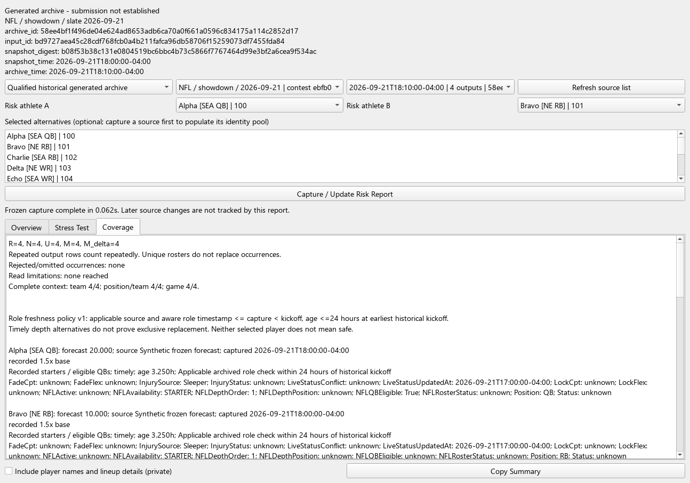

# Portfolio Risk (RL-06)

Results & Learning now has a **Portfolio Risk** tab with Overview, Stress Test and
Coverage views. It reports dependence in one selected portfolio and the point
impact of explicit retained-production assumptions. It does not run a solver or
SIM, change a lineup, learn a correction, recommend backups, or enforce exposure.
Concentration is not itself an error. Neither selected player does not mean safe.

## Sources and authority

**Qualified historical generated archive** requires a contest identity, qualified
salary revision, exact qualified pregame snapshot and one completed pregame build
archive. Submission is not established. Cached choices are suggestions only;
Capture invokes RL-05A `derive_contests` in a caller-owned read-only SQL
transaction. An outcome-only blocker, including missing actual scores, does not
withhold otherwise qualified forecast review. Other archive candidates do not
qualify. Multiple qualified archives require an explicit choice; a sole archive
may be selected automatically with its identity visible. Archives are never merged.
Use Historical Coverage to reconcile missing evidence or resolve ambiguity.

The selected snapshot is bound by input ID, recorded time, full-content digest
and any saved explicit resolution. An embedded archive timestamp cannot replace
that selection. Roles come from the full chosen snapshot, not the compact slot
objects. Each present archive ID, name, role, team, salary and game field must
agree with the frozen salary/snapshot pool. Absent redundant fields do not trigger
enrichment. Whole-archive validity still applies. No fuzzy/name-first fallback is
used for archive athlete identity.

**Recorded saved export** reads one explicit export ID and its original lineup and
player rows. Submission and original pregame input are not established. Recorded
base-player keys retain Captain/FLEX identity; malformed slots, duplicate athletes
and contradictory recorded identities are excluded and counted. Missing optional
context reduces the relevant denominator. Exact Classic upload positions are not
established by `SLOTn`. Export time never supplies a slate date or game identity.

The current export schema has no exact qualified pregame input association.
Stress and qualified historical roles are therefore **Unavailable**, even when
legacy projection columns contain zeros. Recorded projections/status are visible
only as unqualified metadata. No nearby snapshot, name match, current player pool,
schema migration or backfill fills that gap. Team co-occurrence alone is not a
same-game claim.

## Frozen capture and reuse

| Component | Reused contract |
| --- | --- |
| `historical_identity` | Existing salary/snapshot/build qualification and saved resolution; optional injected bounded reader, unchanged rules |
| `review_build_evidence.Reader` | Member allowlist, checksums, scope, timing, format, cancellation and budgets; `archive()` keeps four returns, `archive_details()` additionally returns validated occurrences from the same bytes |
| `entry_review.roster_signature` | Small pure extraction of the existing Captain-aware identity convention; ordinary entry-review counts unchanged |
| `nfl_eligibility` / `forecast_group` | Recorded depth/unavailable concepts and existing role labels; never recompute eligibility |
| `ResultsLearningDialog` | Existing real Qt worker, stale/duplicate callback and retirement lifecycle |

`portfolio_risk_evidence.py` opens SQLite with `mode=ro`, `query_only` and `BEGIN`.
It does not call initialization, `_connect`, reconciliation, imports, enrichment,
learning/report writers or export/build writers. A missing database remains absent.
It collects validated raw occurrences and full snapshot data during the authority's
inventory pass. It rechecks source hashes, inventory stamps and captured byte
receipts before publication. SQLite reader sidecars are owned by SQLite; tests
compare logical database state separately from immutable CSV/JSON/ZIP bytes.

Existing limits remain: 1,000 directory entries, 100 matching files per evidence
folder, 32,000,000 bytes per bounded read, 64,000,000 bytes total evidence-read budget, 2,000 snapshot
players and 1,000 archive outputs. Receipt rereads use the same budget. Archive
truncation/ambiguity fails closed; saved exports explicitly disclose occurrences
omitted by the 1,000-row limit. Cached source choice lists display at most 1,000
contests/exports and disclose truncation. This slice does not redesign cache policy.

`RiskCapture` and `RiskReport` are frozen serialized records. The adapter passes
only roster occurrences, scoped identity/context, allowed forecast/role fields and
provenance. Structured actual scores, ranks, payouts, ownership and the live player
graph are not calculation inputs. A successful report stays a frozen capture; it
does not continuously track later source changes. These consistency checks are not
cryptographic authentication of a user's archive.

## Counts and denominators

| Symbol | Meaning |
| --- | --- |
| R | Original source occurrences, including rejected/omitted export rows |
| N | Structurally valid, identity-resolved occurrences |
| U | Unique valid Captain-aware rosters; supplementary to N |
| M | Fixed cohort with complete qualified projections for the entire requested grid |
| M_delta | Fixed cohort whose selected contributions are all known, even when unselected forecasts are missing |

Repeated output rows retain their full weight. The set of RL-05A generated roster
signatures cannot supply occurrence counts, and output-count minus set-size never
supplies invented weights. Identical archive copies are one source; conflicting
payloads with the same archive identity are rejected.

Any-role = Captain + non-Captain appearances. Showdown uses Captain/FLEX labels;
Classic uses roster appearances, not Showdown FLEX. A known pool athlete absent
from every valid entry has 0/N coverage. An identity outside the captured pool is
unknown, not zero. A zero denominator yields Unavailable, not 0%.

Selected A/B buckets are both, A only, B only and neither; they sum to N.
Either (at least one) is their union excluding neither; exactly one excludes both.
Team concentration uses occurrences with complete team context. QB-WR/TE pairs
use complete team/position context and show a game only when both identities
support it. Showdown can contain zero, one or multiple QBs. These are shared roster
dependencies, not measured outcome correlations or an arbitrary safety score.

Selected alternatives come from the whole frozen pool, including zero-exposure
athletes. Each pair has the same exclusive buckets, any-role/Captain coverage,
union coverage and an explicit all-appearances-coexist flag. Exposure never proves
compensation for an injured starter; unrelated alternatives stay user selections.

## Deterministic point assumptions

Default: no targets. Select one athlete for five cases, or two for a 5 by 5 grid.
Retentions are 100%, 75%, 50%, 25%, 0% of frozen base projection. They are not exact
minutes, injury probabilities, scenario frequencies or workload transfers.

For each occurrence, baseline B is the sum of weighted base forecasts; stressed
S multiplies each selected athlete by its retention; signed change D = B - S.
Captain weight is 1.5 exactly once. An athlete uses the same factor in every entry.
Nonselected players retain their baseline contributions; alternatives gain no points.

Only finite, explicit `FlexProjection` qualifies. `ProjectionSource == Missing
forecast` overrides a numeric value; an absent source label is shown as source not
recorded. Explicit zero and negative values stay recorded values. Missing redundant
Captain projection may be transparently derived as 1.5 times base without changing
stored data. A present conflicting Captain projection (absolute tolerance 1e-6
points) blocks that role's forecast calculations. Reducing a negative contribution
can increase points; signed changes are not universally labeled losses.

Baseline/stressed means and full-entry change distributions use the same M in
every case. Direct selected-player change has its own M_delta and mean/min/median/
p90/max. Empirical quantiles take sorted index floor((n-1)q). These are
**distributions across portfolio entries under this assumption**, not simulated
portfolio outcomes. Cases are not averaged as equally probable. No marginal
scoring-distribution quantiles, independent injury draws or money metrics are used.
Projection share is selected contribution divided by the total on M, only for a
positive known denominator.

Synthetic oracles: [AB, AB, neither, neither] and [A, A, B, B] with A=20 and B=10
both have 50% individual exposures and mean direct change 15 at 0% retention.
Largest changes are respectively 30 and 20; neither portfolio is declared safer.
A at Captain retained 25% plus B in FLEX retained 50% changes 27.5 points. That
direct change remains available on M_delta when an unselected forecast is missing,
while full baseline/stressed totals are unavailable.

## Report-only role freshness v1

Timely archived role evidence requires recorded depth and availability, applicable
`InjurySource` (Sleeper or DraftKings file + Sleeper role), aware
`LiveStatusUpdatedAt` <= snapshot capture < earliest slate kickoff, and role age
at kickoff <=24 hours. The exact 24-hour boundary qualifies. Missing, contradictory,
future, naive or stale evidence stays visible without certifying a relationship.
Usage/news/global refresh timestamps are not substitutes. Historical age is
measured at that game's kickoff, never today.

A timely same-team/position depth alternative is not an exclusive replacement.
Non-QB labels retain **Other depth roles / rotation**. Raw availability/depth,
eligibility/fade/lock flags, source, timestamp, age and decision reason remain visible.
Frozen QB exclusions are displayed, not promoted. Missing role evidence does not
erase exposure; missing forecast evidence does not erase known roles. The 24-hour
rule changes neither live eligibility nor an injury forecast.

## Cancellation, privacy and validation

Jobs detach the source/assumptions and pin the DB/history root. A plain cancellation
Event survives QObject retirement. Cancel after queued completion suppresses a
pending read-only report; already committed reconciliation results keep their
existing late-cancel behavior. Close/Escape, stale/duplicate deliveries and changed
selectors cannot apply a wrong result. Controls remain gated through retirement.
Prior completed output is retained and labeled on cancel/failure; copying is
disabled until a matching complete capture succeeds.

**Copy Summary** includes aggregates by default and omits player names, usernames,
contest/archive/export/input IDs, paths, filenames and roster strings. The explicit
private-details checkbox adds names and lineups. RL-06 writes no report ZIP/CSV,
receipt or persistent risk history and does not extend the review-report schema.

Tests in `test_portfolio_risk.py`, `test_portfolio_risk_evidence.py` and
`test_portfolio_risk_ui.py` cover pure oracles, real SQLite/ZIP gates, byte/logical
immutability, prohibited writers/solver/SIM paths, real queued Qt cancellation and
a measured 1,000-occurrence view. `scripts/capture_portfolio_risk.py` reproduces
synthetic screenshots through the production worker and verifies unchanged sources.
Actual baseline/focused/full/Windows counts, durations and artifact receipts belong
to the review PR. Offscreen source-runtime checks and successful executable
packaging are separate from launching the packaged executable.

RL-07A/RL-07B, CO-02 and DC-02B remain future work. RL-06 changes no projection,
ownership, SIM/ranking, payout, Tournament, learning, AR-01/AR-02 or saved-lineup rules.
