# DFS Optimizer User Guide

Version 1.23.0 | Windows desktop app | [Release notes](https://github.com/mnicho17/DFS/releases/tag/v1.23.0)


DFS Optimizer builds DraftKings lineups for NFL, MLB, NBA, NHL, and WNBA. It combines projections, contest construction, exposure rules, live NFL context, simulation, and local result tracking in one desktop workflow.


> Use the app to organize decisions, not to replace a final review. Player news, projections, ownership, and simulations can be incomplete or wrong.


## 1. Install the app


1. Open the repository's [latest GitHub release](https://github.com/mnicho17/DFS/releases/latest).

2. Download `DFS-Optimizer.exe`.

3. Optional: download `DFS-Optimizer.exe.sha256` and compare it with the executable's SHA-256 hash.

4. Double-click the executable. Python is not required.


The app is currently unsigned. Windows may identify it as coming from an unknown publisher. Only use the executable from this repository's Releases page.


{compact}


## 2. Five-minute workflow


1. Choose the sport and load the DraftKings salary CSV.

2. Choose **Slate Readiness**. For NFL, it refreshes a stale game-day check before auditing the slate.

3. Choose **Showdown** or **Classic** and set the lineup count. If you saved a setup earlier, choose **Settings > Apply or Delete Recipes** first.

4. Review **Build** and **Portfolio Rules**.

5. For NFL Classic, turn on **NFL SIM Edge** when you want field-based tournament scoring.

6. Choose **Generate** and wait for the progress message to finish.

7. Open **Portfolio Insights**. Filter review signals, inspect player exposure, and remove or replace weak rows before saving.

8. Choose **Export CSV**. For NFL, review the fresh **Final Lock Check**, replace any affected rows, then resolve every **Entry Safety** blocker before uploading to DraftKings.

9. After the contest, import DraftKings results through **Results & Learning**.


The pictured examples use representative NFL data. Player names, projections, ownership, live context, and SIM results will differ by slate.


The detailed Build, Portfolio Rules, and Data and Learning controls are folded away at startup so the player pool and generated lineups get most of the window. The quiet recipe summary beside the sport shows the active build style, salary approach, and, when applicable, SIM depth and contest preset. Choose **Settings > Show Build Controls** to change the detailed recipe. Choose **Settings > Show Saved Portfolio** to hide or restore the saved-lineup panel.


## 3. Classic and Showdown


**Classic** uses each sport's normal multi-game DraftKings roster. The selected sport controls slots, eligibility, grading, and sport-specific columns.


**Showdown** uses one Captain and five FLEX players. Captain salary and projection are multiplied according to DraftKings rules. Showdown keeps its own Captain exposure controls and uses the same NFL availability, roles, news, usage, matchup, and weather context. Larger builds explore a wider candidate bank, use Captain-specific ownership when available, estimate duplication risk, and balance Passing Stack, Receiver Captain, Rushing Control, Defensive, Onslaught, and Balanced lineup stories across the selected portfolio.


Always confirm that the loaded salary file matches the contest type you intend to enter.


## 4. Load and review the player pool


Choose **Load Player CSV** and select a DraftKings salary file. The player table is your slate workspace.


- **BaseProj** is the original projection.

- **AdjProj** includes supported context adjustments.

- **Status** and **Role** show NFL availability and depth information.

- **Own%** is the projected field ownership used by build and SIM logic.

- **Tags** show locks, fades, and related choices.

- Exposure columns hold maximum and minimum portfolio limits.


Sort and inspect the table before generating. A strong optimizer cannot repair a poor or stale player pool.


Player columns use content-aware alignment: descriptive fields stay left-aligned, team and position fields are centered, and numeric values align on the right. The table redistributes spare width among names, injury notes, roles, and tags when the window changes size.


{compact}


## 5. NFL Game-Day Check


For NFL slates, **Game-Day Check** refreshes structured availability, injuries, practice participation, roster status, news notes, and depth-chart roles. The app automatically excludes confirmed inactive, out, injured-reserve, suspended, and practice-squad players unless they were manually locked.


A locked unavailable player is never removed silently. Generation stops and names the conflict so you can decide what to do.


Run the check again near lock. No automated data source is a substitute for late-news review.


### Slate Readiness


{compact}


Choose **Slate Readiness** for a report-only preflight before generation and again before export. It gives the loaded slate a 0-100 score and separates findings into **Pass**, **Review**, and **Block**.


Select a finding and choose **Show Players**, or double-click it, to filter the player table to the affected players. Choose **Clear player filter** in the status strip to restore the full table. This is a visual filter only; it never changes lineup eligibility by itself.


The audit checks:


- salary-file identity and enough eligible players at each roster position;

- positive projection and ownership coverage, including unrealistic ownership-pool totals;

- locked players whose latest status is unavailable;

- freshness and coverage of NFL player news and depth roles;

- questionable players and active depth-order 3+ backups that deserve review;

- after generation, complete rosters, salary use, and the NFL portfolio's fit with the selected contest preset.


Only hard preparation problems are blockers, such as a missing roster position, poor projection coverage, or a locked-out player. The audit never changes a player, projection, ownership value, lock, fade, or lineup. Choose **Copy Report** when you want to keep or share the findings.


Reopen Slate Readiness after generation. The portfolio check then compares salary use, QB-stack mix, bring-backs, FLEX mix, and ownership coverage with the selected NFL field preset.


## 6. Build


The **Build** tab controls how candidates are created and ranked. Available choices vary by sport and contest type.


- Choose a style that fits the contest, such as balanced, projection-oriented, or leverage-oriented.

- For NFL Classic, Strategic, Balanced, Contrarian, and Chalk use the starter/rotation pool even when SIM Edge is off. Locks, minimum exposures, and required player groups are preserved. Choose Randomized with SIM Edge off when you intentionally want the broad player pool, including deep backups.

- Use ownership mode and weight to decide how much popularity affects ranking.

- For MLB, choose stack preferences and use optional lineup, form, matchup, park, weather, and Vegas inputs.

- Use salary strategy to discourage obviously under-cap builds without forcing every lineup to spend the full cap.

- For NFL Classic, enable **NFL SIM Edge** for correlated scenario and field evaluation.

- For NFL Classic, choose the contest entry-limit preset: **Single Entry**, **3-Max**, **20-Max**, or **150-Max**. This changes the opponent field size, salary floor, ownership emphasis, stack mix, bring-back rate, and FLEX mix used by the SIM.

- Choose **Build depth: Fast (default)** for normal builds. Choose **Deep (custom budget)** for broader NFL Classic SIM exploration and independent validation.


### Saved build recipes


Choose **Settings > Save Current Recipe** to give the current build configuration a reusable name. A recipe remembers the sport, contest type, lineup count, salary cap, ownership settings, build style, salary strategy, NFL SIM settings, contest preset, build depth, uniqueness, team and game caps, and ownership balancing.


Recipes intentionally do **not** save player locks, fades, exposure limits, or groups. Those choices belong to one slate and could be dangerous if silently carried into another. Choose **Settings > Apply or Delete Recipes** to inspect, apply, or remove a saved recipe. When a recipe changes sports, the app warns before clearing the current Classic results.


{medium}


## 7. Portfolio Rules


Portfolio rules shape the whole set rather than one lineup at a time.


- **Max Exposure%** limits how often a player appears.

- **Min Exposure%** requests a floor across the portfolio.

- Showdown has separate Captain minimum and maximum controls.

- Minimum uniqueness requires a set number of different players between lineups.

- Team and game caps prevent too much concentration in one source.

- **Group: At Least 1** requires one or more selected players.

- **Group: Never Together** blocks selected players from sharing a lineup.


Locks, fades, salary, roster eligibility, and hard maximums remain hard rules. Some minimums and uniqueness targets may be relaxed when the requested portfolio is impossible. The completion message and **Portfolio Insights** disclose those shortfalls.


## 8. Generate and review lineups


Choose **Generate** from the active Classic or Showdown area. During a build, the progress area reports the current stage and offers **Cancel**. Cancellation keeps valid lineups already completed.


The compact **Space** display shows the current eligible build pool, structural lineup possibilities, and requested lineup count. Fading, locking, or changing the NFL build style recalculates it immediately. Normal NFL Classic styles use the same starter/rotation role pool as generation whether SIM Edge is on or off, so omitted inactive players and deep backups visibly shrink the count. NFL Classic is an exact roster-shape count; Showdown and multi-position sports are labeled as upper bounds. Salary cap, stacking, correlation, exposure, and uniqueness rules narrow the real build space further.


During generation, the Space display follows the Generate, SIM, and Select stages. After completion, hover it for the last build's phase timing and the number of candidates evaluated versus lineups selected.


Deep Build shows Explore, Screen, Validate, and Select/Refine. When a contest profile is active, a final **Joint Contest** stage evaluates the selected entries together. Its selected time budget is a ceiling, not a required wait. After the normal coverage refinements, Select/Refine uses remaining compute to search for lower-duplication replacements that retain combined Edge and return strength. Every replacement must still satisfy uniqueness, exposure, group, team, and game rules. The search stops at the deadline or at a constrained local optimum, and time is reserved for the final joint check. The app keeps the strongest completed stage if you cancel or the compute budget is reached.


To share a complete performance snapshot, open **Settings** and choose **Copy Last Build Report**. The report includes the build-space count, eligible and omitted pool sizes, candidate budget, generated and selected counts, Generate/SIM/Select timing, strategy settings, portfolio rules, preset fit, and aggregate warnings. For NFL SIM Edge, the budget separates optimizer candidates from additional field-shaped and scenario-built candidates. Deep reports also show the coarse shortlist, independent validation count, top-candidate agreement between the two SIM passes, portfolio swaps, and time-budget status. The report identifies the slowest phase so a performance problem can be isolated without guessing.


{compact}


Choose **Settings > Build History…** to review the 25 most recent runs and copy any earlier report. Select exactly two rows and choose **Compare Two Builds** for a side-by-side view of candidate counts, timing, contest preset, SIM quality, duplication risk, scenario coverage, and selected candidate sources. Compare similar slates and inputs; a score change is not meaningful when the underlying assumptions changed. History is saved automatically after a completed or cancelled build and stays on this computer. Choose **Clear History** in that window when you no longer need it.


### Portfolio Insights


Choose **Insights** beside the saved-lineup tables or **Settings > Portfolio Insights…** after generation. If lineups are saved, the report analyzes that saved set; otherwise it analyzes the currently generated lineups.


The Overview explains:


- A/B/C/D grade distribution and salary bands;

- the selected mix of optimizer, field-shaped, and scenario-built lineups;

- selected Ceiling, Balanced, Leverage, and Low-Dup scenario archetypes;

- QB stacks, bring-backs, FLEX usage, and combined ownership shape;

- average SIM Edge, leverage, duplication risk, and preset fit;

- top-one-percent scenario coverage and portfolio concentration;

- when a contest profile is active, joint total cost, payout, profit chance, payout range, and estimate stability; and

- automatic review flags for weak grades, high duplication, excessive unused salary, unstacked NFL lineups, or concentrated player cores.


The sortable **Lineup details** tab identifies the exact rows behind those signals. Use **Show** to filter all flagged rows or one signal type, then choose **Select flagged**. You can also select rows manually.


- **Remove selected** deletes those rows from the generated or saved set after confirmation.

- **Replace selected** keeps every unselected lineup fixed and generates only the open slots with the current slate, strategy, and portfolio rules.

- Closing the window without choosing an action leaves the portfolio unchanged.

Saved repairs apply only when the complete replacement portfolio still matches the saved set and rules that
launched it. Cancelling before application preserves the current saved entries, even if computation already
finished. A shortage, changed saved set, changed player eligibility, or obsolete result also leaves current
entries intact. Live news updates remain current; unchanged saved entries can still need an Entry Safety review.
Successful repairs apply once. Closing the main window during a build requests cancellation and waits for its
worker to finish safely. Ordinary generated-only builds keep their existing partial-result behavior.

Build History records whether a saved repair was applied and why a proposal was rejected. Rejected attempts do
not replace the current portfolio's report. A diagnostic-write or display error after application does not undo
the committed repair. No repair automatically exports a file. These checks do not provide process-crash recovery.

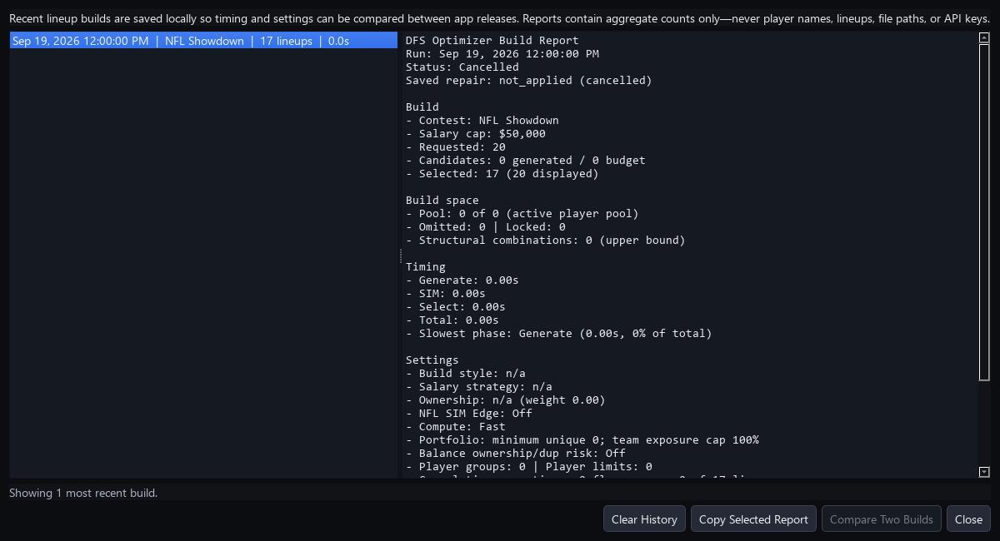{medium}

This synthetic Build History example illustrates the application status. It is separate from the real-worker
cancellation and successful-repair acceptance tests.

The **Player exposure** tab lists every player's count, percentage, and lineup numbers. Select a player and choose **Show selected player's lineups** to jump back to the exact affected rows. This is useful for reviewing a concentrated core before deciding whether individual lineups need replacement.


{compact}


{compact}


### After generation


- review salary and every roster slot;

- inspect the grade or NFL SIM Edge details;

- look for repeated cores and unexpected exposure;

- save only lineups you might enter;

- open **Portfolio Insights** before export and repair only the rows you do not want; and

- correct warnings rather than assuming they are harmless.


Generated-lineup columns keep salary and grade/SIM summaries compact so the roster slots receive most of the available width.


Large candidate pools, NFL simulation, and restrictive portfolio rules take more time than a simple projection build.


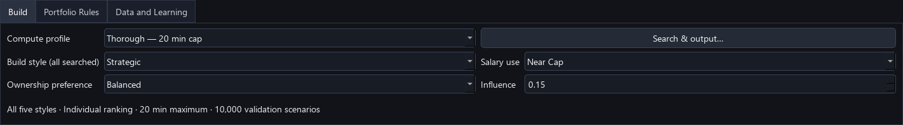


Choose a **Compute profile** in **Build**, then **Search & output** for search scope, selection mode and optional resource details. Fast remains the startup default; named Deep profiles apply their listed counts together. You can choose 1–60 minutes, up to 20,000 candidate lineups, a 2,000-lineup validation shortlist, 10,000 sampled validation opponents, 4–32 search seeds, and 250–1,000 screening scenarios. The Custom profile allows up to 10,000 validation scenarios; Deep uses at least 2,500. Screening uses the smaller of its configured count and the validation scenario setting, with a minimum of 250. Its opponent field stays smaller than the validation field.


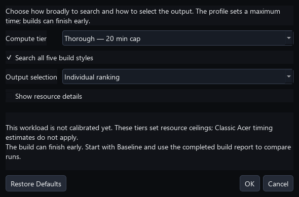


Auto retains the original pool budgets. Explicit candidate and shortlist sizes are raised to accommodate the requested portfolio when necessary. Pools describe **lineups**, not extra eligible players. Availability filters, locks, and portfolio constraints stay active. Time and pool values are maximum budgets; deadlines and available unique constructions can reduce the actual work. A local optimum may stop a build early. Cancellation is checked between work units, so the time budget is not an exact wall-clock guarantee.


For a first server test, use 15 minutes, 8,000 candidates, 1,200 shortlisted lineups, 4,000 opponents, eight search seeds, 750 screening scenarios, and 5,000 validation scenarios. Increase one setting at a time while comparing the same slate. Larger counts increase time and memory consumption and do not guarantee stronger predictions. These controls apply to NFL Classic SIM Deep builds. The final joint-contest pass retains its existing adaptive sample budget.


Compute settings persist locally and are included in saved build recipes. Loading an older recipe restores the original five-minute compute settings. Copy Last Build Report includes the chosen limits alongside actual counts and timing.


## 9. Understand NFL SIM Edge


NFL SIM Edge is for NFL Classic tournament decisions. It combines projection-led optimizer lineups, realistic field-shaped lineups, and lineups built from correlated ceiling, balanced, leverage, and low-duplication scenarios. The app evaluates them against a representative opponent field with a separate set of simulated outcomes, then selects a portfolio that covers different strong scenarios. Separating candidate creation from evaluation reduces overfitting.


{compact}


Deep Build strengthens that separation. A coarse random stream screens the expanded bank, while a different random stream validates only the strongest source-diverse shortlist. The final pass uses at least 2,500 scenarios even when the Fast scenario control is lower. A local search first improves the overall portfolio, then uses spare time for duplication polish. A polish replacement must lower duplication risk, preserve the combined Edge/return signal within a narrow guardrail, and satisfy every hard group, uniqueness, player, team, and game limit. The build report records total swaps, duplication-polish swaps, search passes, stop reason, and unused time.


Choose the preset that matches the contest's maximum entries per person. Presets are conservative starting assumptions, not promises. After at least three complete fields, 1,000 entries, and 70% player metadata coverage have been imported for that preset, the app can blend measured salary, construction, and winning-ownership patterns into its baseline. Until then, measurements remain report-only.


When the contest lobby provides the actual economics, open **Settings > Contest-Aware SIM**. Enter the contest name, total field size, entry fee, how many entries you plan to submit, and the payout table. Use one rank or range per line, such as `1 = $100,000` or `2-10 = $5,000`. **Save and Use** keeps the profile for later slates and turns on NFL SIM Edge. **Use Preset Only** removes the contest profile from the build without deleting it. If the requested build count differs from the profile's planned entries, the app stops before generation and lets you use the profile count, keep the requested count with a visible warning, or cancel.


{medium}


With a profile active, candidate grading first converts each simulated finish into the listed prize. After portfolio selection, the app runs all selected entries in the same contests. Your entries occupy ranks together, can take prizes from one another, and split ties with your other entries and sampled opponents. Results show **Edge | ROI** using this portfolio-adjusted pass. The tooltip adds each lineup's expected payout and profit plus the portfolio's total cost, payout, profit chance, and 95% ROI range.


The final outlook uses three sampled opponent fields instead of treating one generated field as exact. Game outcomes rotate through balanced, shootout, defensive, and blowout scripts informed by available totals and spreads. Established starters receive narrower scoring ranges than uncertain backups, while guarded rare ceiling outcomes preserve tournament tails. Adaptive stopping can finish early only after the portfolio estimate is both sufficiently precise and stable; top-heavy results normally use the full scenario budget.


{medium}


Portfolio Insights and the copied build report show expected total payout and profit, chance of finishing profitable or doubling the entry cost, any top-10 probability, 10th/median/90th-percentile payout, number of opponent-field samples, and estimate stability. The contest preset still controls how opponents are constructed; the saved profile controls the payout economics. These are model estimates, not guaranteed returns.


- **SIM Edge** is a slate-relative 0-100 summary. It is useful for comparing candidates from the same build, not as a universal score across slates.

- **Top 1%** and **Top 5%** estimate how often the lineup reached those field thresholds.

- **Win rate** is the representative-field first-place frequency, not an exact contest promise.

- **Cash rate** estimates how often the lineup cleared the simulated cash threshold.

- **Bust rate** measures poor simulated finishes.

- **Average percentile** summarizes normal field position.

- **Ceiling** is a high-end simulated score.

- **Tournament return index** combines upside, top finishes, and other tournament signals on a 0-100 scale.

- **Leverage** rewards useful paths that differ from expected field behavior.

- **Duplication risk** estimates how likely the construction is to be shared. Lower is generally better when other qualities are similar.

- **Joint contest ROI** is the selected portfolio's expected total profit divided by its total entry cost after your own entries occupy ranks together.

- **95% ROI range** is uncertainty around the estimated average, not the range of possible single-contest results. A wide range is normal for top-heavy tournaments.


The Classic results show Edge and top-one-percent rate, or Edge and expected ROI when Contest-Aware SIM is active. The **Why this SIM Edge** detail explains slate percentile, direction, and model weight for top finishes, ceiling, tournament return or contest ROI, and duplication safety. Generation and Slate Readiness show preset fit; the copied build report separates optimizer, field-shaped, and scenario-built candidates.


Portfolio selection rewards coverage of different strong scenarios, but applies a soft quality guardrail below the B-grade boundary so novelty alone does not rescue a weak candidate. Do not choose by one number alone. Compare ceiling, top-five rate, leverage, duplication, construction, news risk, preset fit, and portfolio coverage.


## 10. Save and export


Use **Save page**, individual save choices, or **Unsave page** to control the portfolio. Saved-lineup tools include player exposure, stack and team exposure, and Portfolio Insights.


Open **Settings > Stack / Team / Salary Exposure** to review saved-lineup concentration and construction. The dashboard is sport-aware: NFL and other non-baseball sports show team, stack-shape, and salary-band views, while the **Pitchers** tab appears only for MLB.


{medium}


Choose **Export CSV** from the correct contest tab. The export uses DraftKings roster IDs and does not add analysis columns that could break upload format. Every completed export is also recorded locally for Results & Learning.


For NFL, **Final Lock Check** first refreshes the live player source immediately before export. It maps every returned status change and every currently unavailable player to the exact saved lineup numbers. Choose **Replace Affected Lineups** to keep all unaffected saved rows fixed and rebuild only those rows. If the live source is unavailable, the dialog says so plainly and lets you continue with cached data for the remaining safety review.


{medium}


Next, **Entry Safety** checks the exact saved portfolio, not merely the last generated set. It blocks export when it finds an incomplete or position-invalid roster, a player repeated at their position and FLEX or at Captain and FLEX, the wrong or missing DraftKings slot ID, missing salary data, an over-cap lineup, a player absent from the current slate, a one-team Classic lineup, a Showdown lineup that does not use both teams or mixes games, duplicate entries, an unavailable player, or a violation of the current exposure, group, concentration, or uniqueness rules.


Questionable players, stale or incomplete slate data, and unusually low salary use appear as **Review** items. Those may be intentional, so Entry Safety allows **Export Anyway** after you inspect them. A blocker disables export. Choose **Replace Blocked Lineups** to preserve every unaffected row and rebuild only the blocked rows, or return to the workspace to make a different decision. Choose **Copy Report** when you want to preserve the full check. Neither safety step changes a lineup unless you explicitly choose replacement and confirm it.


{compact}


Before submitting:


1. Confirm the slate and contest type.

2. Confirm late scratches and start times; for NFL, require a fresh Final Lock Check whenever possible.

3. Review salary, slot-specific IDs, duplicate athletes, team diversity, slate membership, and exposure.

4. Upload to DraftKings and review the entries there.


## 11. Results & Learning


The app can compare exact exported rosters with DraftKings standings or contest-history CSV files. It can also measure the whole opponent field when the selected file contains complete standings.

### Export a review report

Choose **Export Review Report** to prepare a local report of performance, recorded build settings, data quality, and available issues for review with an assistant or developer.

1. Use current app history, or choose an existing **history folder** from another checkout. This reads its database, diagnostics, snapshots and build archives without moving files or changing the launcher. Choose dates, sport and format. Results use recorded slate dates; build evidence uses recorded game dates; settings and diagnostics use their own timestamps. Specific filters exclude unknown values.
2. Leave **Include lineup and build-player details** unchecked for summaries only. Checking it includes bounded player names, IDs, recorded roster slots and saved player decisions. Legacy matched rosters are labelled recorded exports; their submitted lineup and Captain-role identity are unverified.
3. Optionally describe what you did, expected, and observed (up to 2,000 characters). Obvious paths and credentials are redacted, but review the text for personal information.
4. Choose **Generate Preview**. Inspect the `summary.md` and `evidence.json` tabs and, when included, `lineups.csv`. Changing an option or observation requires a new preview.
5. Choose **Save Report ZIP**, select a destination outside the source history folder, and share that file manually. Nothing is uploaded. Save retries use the same captured report; Generate Preview captures a new one. Cancel/Close waits for the current worker to clean up.

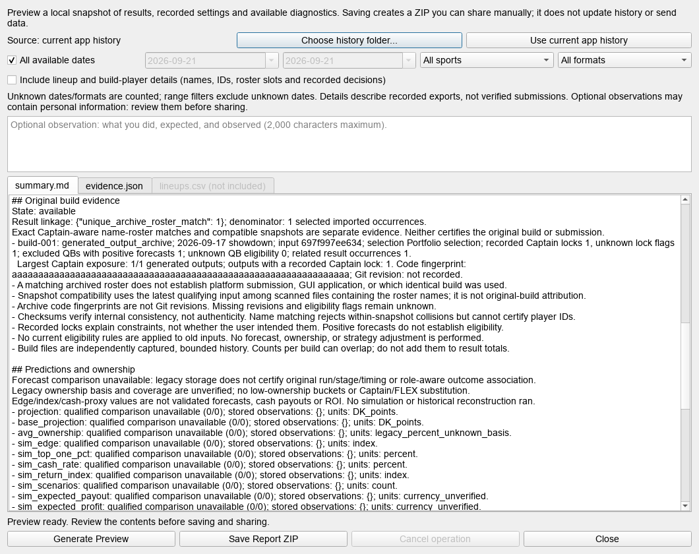{medium}

The ZIP always contains `summary.md` and `evidence.json`; `lineups.csv` is opt-in. Summary defaults omit player/account/entry/contest names, source paths, raw logs and databases. Optional detail still excludes account names, raw input rows and credentials.

Explicit zero winnings means a known loss when fee/currency are supported. Missing winnings stays unknown. Cash needs original amounts and explicit compatible currency; many older imports lack that evidence. Paid-subset fees, winnings, net and weighted ROI share the same qualified rows. The report shows missing coverage and does not reinterpret the old net-currency field as ROI percent.

Legacy forecasts and ownership remain unverified where original run, completion, timing, role or outcome identity is absent. Stored numeric observations can survive missing Edge, but are not certified simulations or validated prediction comparisons. Export settings and recent diagnostic records are separate observations. The running app version/revision is unavailable when it has not been embedded in the source.

**Original build evidence** explains recorded Captain locks, exposure limits, selection mode and QB eligibility when saved inputs exist. A positive forecast does not mean the player was eligible. A Captain lock can explain concentrated outputs without proving that the user intended that lock. Missing eligibility flags remain unknown; current rules are never applied to old snapshots.

Completed pregame archives can match imported results by normalized player names, with Captain identity preserved and the same recorded slate date. Multiple matching archives stay ambiguous. A compatible pregame snapshot is listed separately and does not identify the producing build. Neither match certifies submission or GUI application. Archive code fingerprints are shown where recorded; they are not Git revisions. This reader does not create missing archives or rewrite history, and no projections or strategy settings are adjusted.

Build evidence reads at most 100 archives and 100 snapshots, with a shared 64 MB expanded-byte budget and at most 1,000 optional player-detail rows. Missing, damaged, filtered and capped evidence is disclosed. Build counts can overlap; use the result-linkage denominator, not the sum of counts across builds.

Capture scans at most 100,000 rows per source table, shows up to 500 breakdown groups and, optionally, 1,000 result-detail rows with up to 12 recorded slots each. Diagnostic input is limited to 8 MB and 100 records. Counts/truncation are recorded; detail limits do not change performance totals. Imported occurrences and opponent-field summaries are not proof of personal submissions or a bankroll ledger. Entries from one contest are correlated.

The new capture/save is read-only to history. Opening this existing Results & Learning screen or choosing **Refresh Report** retains its legacy matching behavior. Export Review Report is disabled until an import or salary attachment finishes. A report can still be saved when a source is missing or unavailable; read its source states before drawing conclusions.

### Import results and use the existing learning summary

Importing standings identifies submitted results using your saved username. Original exports or qualified snapshots are needed for forecast comparisons.

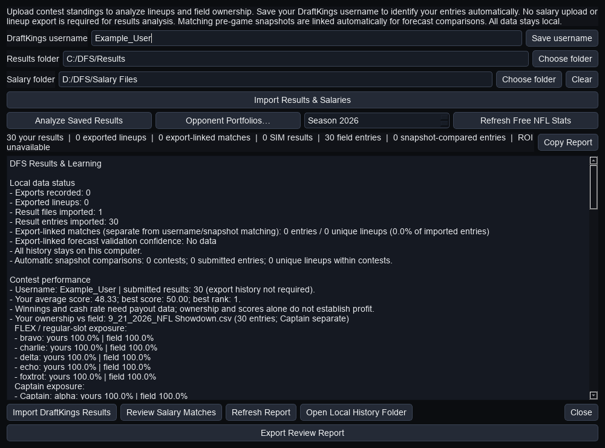{compact}


1. Export the lineups you actually plan to use.

2. After the contest, download the DraftKings result CSV.

3. Open **Results & Learning**.

4. Choose **Import DraftKings Results** and select the file.

5. Choose a **Salary folder**, then **Import Results & Salaries** to save historical NFL Classic/Showdown salaries alongside results. Standard DKSalaries files and DKEntries files with embedded salary tables are supported. **Review Salary Matches** shows the association for each results contest. Captain and FLEX prices and IDs remain distinct. An entry-only file without a salary table is not sufficient. Saved matches supply descriptive salary/construction detail; they do not update strategy calibration.

6. Review the match rate, ROI, cash rate, finish percentile, projection error, and guarded breakdowns.


{compact}


The app reports general outcomes and projection calibration. Starting with v1.6.1, NFL SIM exports also retain their original Edge, top-finish, cash, return, leverage, and duplication estimates. Contest-Aware SIM exports additionally retain the contest name, field, fee, expected payout, profit, and ROI. When the Results & Learning summary shows matched SIM results, the report compares predicted and actual top-one-percent, top-five-percent, cash, and contest ROI rates. It also checks whether Edge tracks finish percentile and whether the return index tracks net results.


For a complete standings file, the report also measures:


- actual player ownership and its error versus the saved projection;

- field-wide and top-one-percent total ownership, including low-owned and high-owned player counts;

- ownership bands showing field share, top-one-percent rate, and exact-duplication rate;

- exact duplicated rosters, including duplication among top-one-percent entries;

- salary used and the low end of normal field salary;

- QB stack and bring-back patterns; and

- RB, WR, and TE FLEX usage.


A file is treated as a complete field only when it contains at least 25 entries and roughly 95% of the advertised contest field. Personal entry-history files still update your results, but they are not used to model opponents. To associate a complete field with a SIM preset, include **Single Entry**, **3-Max**, **20-Max**, or **150-Max** in the contest name or CSV filename. Entry labels such as `(92/150)` can also identify a 150-Max contest. Unclassified fields remain report-only.


Large complete standings are summarized in the background while they are read. The Results & Learning window stays responsive, shows progress, and lets you cancel safely. The app stores the field measurements rather than creating millions of local opponent-result records. DraftKings files that omit sport and contest-name columns can still be recognized from NFL roster slots and entry-name suffixes.


The matching salary file is optional, but it unlocks accurate salary, QB-stack, bring-back, and FLEX analysis when the standings file only contains names and roster slots. The app checks the player overlap first and refuses to attach a mismatched slate; at least 70% of the historical field players must match.


After generating and exporting an NFL Classic SIM build for the same preset, reopen **Results & Learning** to compare the latest simulated field with the measured real field. The comparison includes duplication, salary, construction, and ownership profile differences. It is a diagnostic comparison, not proof that the real contest will repeat.


{thumb}


SIM validation is labeled directional until at least 50 matched entries. Complete-field learning has separate, stricter guardrails. When those guardrails are met, only a small part of the measured winning-ownership profile affects candidate scoring, while salary and construction patterns are blended conservatively into the preset.


Exact matching matters. An entry can remain unmatched if it was edited after export or if its result row lacks a parseable lineup.


## 12. Troubleshooting


**Slow generation:** test fewer lineups and relax conflicting minimums, groups, uniqueness, or concentration limits.


**Too few lineups:** read the generation message and Portfolio Insights; the pool may not support all current rules.


**Replacement could not fill every selected row:** replace fewer rows together or relax the rule named in the warning.


**Rejected upload:** use a fresh DraftKings salary file from the exact slate and export again without modifying the upload columns.


**Unmatched results:** confirm the submitted roster exactly matches a lineup exported from this app.


**Incomplete learning comparison:** a preset with partial historical field data may show the real-field duplication value as **n/a**. Generation and results remain available; importing a complete matching field can fill the missing measurement.


**Recovered error message:** copy the technical details, keep any valid visible lineups, and include the last build report.


See the separate Troubleshooting guide for more detail.


## Section 13 - Local data and privacy


The optimizer stores exports, imported results, slate snapshots, build diagnostics, and settings on the computer. Choose **Open Local History Folder** in Results & Learning to inspect the history location, and back it up if the accumulated learning record matters to you.


{medium}


Build diagnostics contain aggregate settings, timing, counts, and generalized warning categories. They do not store player names, lineup contents, salary-file paths, or API keys.


### Compute tiers and Acer runtime estimates


In **Build → Compute profile**, choose a Deep tier to set every resource control, including validation scenarios. **Search & output** contains search scope and output selection. Resource numbers are collapsed for presets; **Show resource details** reveals their read-only values. Choose **Custom** to edit the current tier's values. OK saves the changes; Cancel leaves the active settings unchanged. Tier selection is recovered from its saved values, and recipes include those values. Choosing Custom opens the resource editor; changes to those values can identify the profile as Custom.


| Tier | Time cap | Candidates | Shortlist | Opponents | Search seeds | Screening | Validation | Acer planning range |

| --- | ---: | ---: | ---: | ---: | ---: | ---: | ---: | --- |

| Baseline | 5 min | 4,500 | 900 | 2,700 | 4 | 600 | 5,000 | 3–6 min |

| Balanced | 15 min | 8,000 | 1,200 | 4,000 | 8 | 750 | 10,000 | 7–12 min |

| Thorough | 20 min | 12,000 | 1,200 | 4,000 | 8 | 1,000 | 10,000 | 9–17 min |

| Extended | 30 min | 16,000 | 1,600 | 6,000 | 12 | 1,000 | 10,000 | 11–27 min (extrapolated) |

| Maximum | 60 min | 20,000 | 2,000 | 10,000 | 16 | 1,000 | 10,000 | 16–39 min (extrapolated) |


These are **reference estimates for the Acer i7-9750H/16 GB and 150 NFL Classic lineups**, using a similar 192-player eligible pool and no contest-specific payout profile. The four completed reference runs took 261.06, 574.71, 747.16, and 790.29 seconds. The earlier 300.10-second time-limited run is excluded from calibration. Only workload timings are stored in code, not lineups or player data.


The heuristic scales generation, SIM, and selection phase costs from the closest measured workload. Its assumed SIM split is 40% screening / 60% validation, adjusted for opponent sample size; this split is not separately measured. The planning band is ±25%, widened to ±40% outside the measured workload range, rounded outward to minutes. It is not a statistical confidence interval. Changes in player pools, hard rules, search seeds, hardware, or joint-contest validation can substantially change actual runtime. The estimate is capped by the selected time budget, with a small allowance for finishing work units; a low time cap can stop work before the pools are exhausted.


The time cap does not force the app to keep running. A 60-minute tier can finish much sooner when its search reaches a local optimum. These presets are not claims of improved prediction quality.


### NFL Showdown Deep


Load a one-game NFL Showdown slate and choose a Deep tier in **Build > Compute profile**. Start with **Baseline**. The tier sets candidate count, shortlist, sampled opponents, search seeds, screening/validation scenarios, and the time cap. Showdown timings are not yet calibrated; the dialog does not show Classic's Acer estimates.


Deep explores candidates across independent optimizer seeds, screens them against a Showdown opponent sample, validates a Captain-aware shortlist with a different random stream, and refines the selected portfolio. Captain identity survives deduplication: changing Captain produces a distinct entry even with the same six athletes. Every scenario draws each player's outcome once, then applies 1.5x to the Captain. Kickers have a separate offensive-opportunity correlation rather than using the defense model.


The opponent sampler uses Captain/FLEX ownership with a projection-based fallback, requires six unique athletes, both teams, and legal salary, and retains repeated entries as sampled duplicates. Personal locks and fades do not restrict the opponent field. Confirmed unavailable players are excluded; an unavailable user lock raises an error. No Classic starter/rotation pruning is applied. Existing Captain/FLEX locks, fades, and final portfolio constraints remain active. Repairs preserve the retained lineup identities.


The results table adds **SIM Edge** with scenario/top-one-percent details. Export still uses one Captain and five FLEX slots. The copied build report includes actual candidate, screening, validation, shortlist, refinement, and timing counts. Cancellation or a deadline returns the best available stage; missing independent validation is explicitly reported as a warning.


This version uses a generic tournament payout proxy and relative candidate metrics, **not contest-specific Showdown ROI or a calibrated opponent model**. Classic contest payout profiles and historical field calibration are not applied to Showdown. Higher compute does not guarantee stronger predictions. Keep the original Fast Showdown path available for comparison.


### All-style search and ranked results


For NFL Classic or NFL Showdown, choose a Deep profile and open **Search & output**. Select **Search all five build styles** to share the tier's candidate and time budgets across Strategic, Balanced, Contrarian, Chalk, and Randomized. Each style uses the configured search seeds. Each search receives a share of the remaining generation time so one style cannot consume the whole generation phase. Identical entries are removed before screening; a different Showdown Captain remains a different entry. The report lists actual style candidate counts before deduplication. Locks, fades and player eligibility remain active; ownership preference remains a separate setting.


The combined pool is screened against common scenarios. Its shortlist is evaluated together against a fresh scenario stream and opponent sample. **Individual ranking** shortlists and selects by top-1% finish rate, then top-2%, top-5%, first-place rate, and mean points. It disables automatic Showdown exposure guardrails, diversification bonuses and portfolio refinement. Explicit player, group, team/game and uniqueness rules still affect selection; minimum exposure shortfalls are reported rather than prioritized. Existing uniqueness relaxation is reported if needed to fill the output. Retained repair entries remain included. **Portfolio selection** uses the existing complementary-outcome selection and refinement, then displays that selected group in the same finish-rate order.


Set **Lineups** to 300, 450, or any count up to **1,000**. Results display 150 per page with global row numbers, a page selector, and Previous/Next controls. The finish-rate columns show top-1%, top-2%, top-5%, first-place (including ties), and mean simulated points. The first page is the strongest individual ranking within the selected output. Portfolio rules and exposure percentages apply to the **entire output**, not each page. Choosing a subset can change exposures. All-style or larger-output runtime is uncalibrated; the dialog does not apply the previous 150-lineup Classic estimates to these workloads.


Use **Save page**, **Unsave page**, or individual checkboxes. Saved selections survive page changes and are ordered by finish rates when added. Export still contains only the proper roster IDs; generating more alternatives does not change a contest's entry limit. Finish-rate ordering is for comparisons within the same simulation run, not calibrated comparisons between separate runs. Non-SIM Classic builds keep their grade order. Equal metrics may tie. Budget exhaustion can produce fewer candidates or outputs, and incomplete validation is reported. Ranked results cover tested candidates, not every possible lineup.


Automatic Showdown guardrail relaxation is now explicitly reported when portfolio selection raises its starting caps to fill the requested count.


Illustrative results on synthetic fixtures (finish rates below are demonstration values):


### Sorting results and reading finish rates


Click a column heading in either generated-results table to sort **all generated results**, across every page. Numeric columns start highest first; player names start A–Z. Click again to reverse the order. **Best first** restores top-1%, top-2%, top-5%, first-place rate and mean-points ordering. Row numbers describe positions in the current view. Sorting changes the view, not the selected lineup set or simulation results. Save checkboxes remain attached to the correct lineup after sorting and paging.


Top 1%, Top 2% and Top 5% are the shares of simulated scenarios where the lineup reaches those opponent-field thresholds, including ties. They are cumulative: top-1% outcomes are also within top 2% and top 5%; do not add the columns. First % includes ties for the best sampled opponent score. Mean pts is average simulated fantasy points. SIM Edge is a relative composite score out of 100, not a probability. For example, a 19.58% top-1% rate over 10,000 scenarios means 1,958 qualifying scenarios. These are model results, not calibrated actual-contest winning probabilities.


Result refreshes rebuild exactly one set of finish-rate columns. Reentrant table rendering is removed to prevent stale renderers appending repeated metric groups.


### Broader candidate search and ranked-group diagnostics


NFL Classic and Showdown Deep now pass previously found lineup identities into subsequent seed/style searches. These are **exact exclusions**, not a requirement that every candidate differ by multiple players from the entire candidate bank. Classic retains the separate minimum-uniqueness checks within a batch and against retained repair lineups. Showdown treats Captain plus five FLEX identities as the entry identity; swapping Captain remains a distinct lineup. Search can still stop short of its candidate ceiling when time or feasibility is exhausted.


**Individual ranking** allocates up to 60% of the total time cap to generation, then screens until 78% of the cap, with the remaining time reserved for independent validation and selection. Maximum therefore allows up to **36 minutes of generation**, instead of 22 minutes 48 seconds. **Portfolio selection** keeps the previous 38% generation / 58% screening deadlines so it retains refinement time. These are phase deadlines, not forced waits or measured runtime predictions. Spare time after validation is not recycled into new unvalidated candidates. All-style budgets remain shared rather than multiplied by the number of styles.


Build reports include **Ranked groups**, covering 1–150, 151–300 and every remaining block, including a partial final block. Groups always follow canonical SIM finish-rate order, regardless of the table's current sort. Each block reports average top-1%, top-2%, top-5% and first-place rates, the range of individual top-1% rates, mean points, salary-strategy exceptions, and the five highest player exposures. Showdown also includes Captain exposures and correlation flag counts/types. Group exposures use the actual block size as their denominator; these groups are not independently optimized portfolios. Reports with these summaries include player names and say so in the privacy footer.


Individual ranking now reports **refinement disabled in individual ranking**, with zero refinement time; its normal mode explanation is no longer classified as a failed rule. Reports explicitly identify automatic Showdown cap increases, the effective relaxed uniqueness when available, incomplete validation, and candidate shortages while retaining identifier-free constraint warnings.


### Simulation input integrity


NFL simulation projections and opponent sampling ignore internal minimum-exposure/group search boosts. Explicit team projection adjustments still apply; optimizer search continues to use exposure preferences. Showdown fills missing opponents from its two validated slate teams and shares game context across the pool. Conflicting opponent or game metadata stops the build with an explanation. These are input-integrity fixes, not historical calibration or new penalties against unusual lineups.


### Replaying identical NFL build inputs


Under **Settings**, use **Save Build Snapshot** to save the currently loaded, enriched player data and build settings, then **Load Build Snapshot** to restore them without a live refresh or ownership recalculation. This supports NFL Classic and Showdown. Snapshots include locks, fades, exposure limits, groups, contest settings and field calibration; they do not include account settings or API keys. They contain player data, so share them deliberately.


Each ordinary NFL build also saves its effective pre-build inputs automatically under `history/snapshots`. The existing history-folder USB backup includes these files. Repair builds do not claim a replayable snapshot because they also depend on retained lineups. Snapshot files accumulate and can be copied or removed manually when no longer needed.


The workspace displays **Snapshot replay** while automatic pre-build refresh is paused. **Settings > Data Freshness** shows the original recorded check time and available player/odds source states. Unknown means no source status was recorded. Manually refreshing live data or loading another CSV leaves replay mode. Before using old snapshots for current contests, refresh current availability.


Build reports include an **Input ID**. In **Settings > Build History**, select two reports and choose **Compare Two Builds**: matching IDs confirm identical captured input data/settings; different IDs identify an uncontrolled comparison. Older reports cannot establish an input match. IDs include player order and metadata, so a changed ID does not prove projections changed. Matching inputs do not guarantee identical results across software versions or time-limited searches. No historical accuracy claim is implied.


To compare updates: keep the automatic snapshot from the first build, load it after updating, run the same build, and compare input IDs in Build History. A manually saved snapshot captures the current controls, which may differ from an earlier build. Generated lineups still use the separate export controls.


### Independent ranking audit


After independent validation, NFL Classic and Showdown Deep can score the same shortlist against **2,000 additional scenarios and a fresh sampled opponent field**. The separate fixed seed is 481516. Audit results never change selection or displayed scores. The audit starts only with at least 120 seconds before the existing selection reserve, and stops within 120 seconds or at that reserve, whichever comes first. SIM timing includes this work, so builds may take longer than earlier versions with the same snapshot.


The report compares the **top 50**: overlap, median absolute rank movement of the original leaders, and their worst audit rank. Banks below 200 use one quarter of the candidates; banks below 20 or validation below 1,000 scenarios are not audited. Exact boundary ties are disclosed. This measures sensitivity to both scenario and opponent sampling within the model, not historical accuracy or a confidence interval. A 2,000-scenario audit is noisier than a 10,000-scenario validation.


Skipped or incomplete audits are identified; partial audits never publish overlap percentages. The audit is not used to select or tune lineups. Existing screening/validation agreement remains a separate diagnostic.


The audit consumes available build time. Its scores never guide selection, but less time may remain for optional portfolio refinement; the existing selection reserve is preserved. Compare software versions as well as snapshot inputs when assessing changes.


### Sampled opponent-field diagnostics


NFL Classic and Showdown build reports describe the actual base opponent sample used for the reported simulation. They show sample size, unique entries, repeated copies beyond the first, largest duplicate group, mean/range salary and cap usage, team-count splits, and same-team WR/TE counts per QB. QB stack observations count quarterbacks, not entries; a Showdown entry with two quarterbacks contributes twice. Showdown also shows both-defense and three-plus kicker/defense frequencies and separate Captain/FLEX ownership.


The report lists the most sampled players and the largest absolute differences between recorded ownership percentages and sampled exposure. Missing inputs remain unknown, distinct from zero; zero-use players in the sampling pool are included. Ownership guides conditional sampling and is not an enforced marginal target. Slot-specific inputs may fall back to total ownership or projections. These diagnostics do not adjust field generation, scoring, or rankings and are not measured contest outcomes.


Duplicate entries count every sampled opponent; bootstrap field copies are not added to these counts. Showdown Captain swaps are distinct entries. If Classic cannot generate a field and uses candidate lineups as fallback opponents, the report discloses this limitation. Reports containing these diagnostics include player names in their privacy notice. The ranking audit uses a separate field; this section describes the primary simulation, not that audit or a later joint payout validation.


## Projection sources and players without NFL history


NFL Classic and Showdown now separate DraftKings historical PPG from forward forecasts. Load a salary CSV with an optional `Projection`, `Proj`, or `Projected Points` column to supply expected FLEX points; `AvgPointsPerGame` and `FPPG` remain historical values. A supplied zero is respected. Blank, negative, or non-finite forecasts are treated as missing. Captain points always use 1.5 times the FLEX forecast, even if the CSV contains a separate Captain projection.


Priority is manual override, imported forecast, automatic workload estimate, historical average estimate, then missing forecast. No manual forecasting is required for known active QB/RB/WR/TE roles. Kicker, defense and unknown-role players retain labeled historical estimates when available. Imported and manual forecasts are not adjusted again by NFL context. Automatic workloads already incorporate roles and recent opportunities, so only matchup/weather/odds adjustments are added. Team adjustments and lineup rules remain separate preferences.


Select a player to see the source and expected workload in the right-hand inspector. Hover over BaseProj or AdjProj for details. Double-click either column to enter an optional manual forecast; submit a blank value to clear it. Overrides survive live refreshes and snapshot saves. Rebuild after changes; loading a new CSV replaces that slate's overrides.


### Automatic workload model (workload-v2)


This initial model uses explicit heuristic assumptions, not fitted predictions. Each team starts with 34 passing attempts, 26 carries and 32 targets. Carry shares are QB 12%, RB 85%, WR 3%; target shares are RB 20%, WR 58%, TE 22%. Within positions, depth shares are QB 100/0/0, RB 62/28/10, WR 40/30/20/10 and TE 70/25/5 percent. Five percent is reserved; missing positions/roles leave additional unassigned workload. Duplicate depth ranks are normalized to respect budgets. Unknown roles receive no invented starting workload.


Recent per-game attempts, carries and targets blend into role shares with weight min(0.5, games/8); prior-season or season-not-matching-game-date usage receives half that weight. A missing/zero history rookie still receives the role prior. Explicitly unavailable earlier depth slots promote known active backups; returning starters remove that promotion. Fades and exposure limits do not redistribute real team opportunities.


Position efficiency assumptions (yards per carry / catch probability / yards per catch) are QB 4.5/0/0, RB 4.2/0.75/7.5, WR 4.5/0.63/12 and TE 4/0.70/10. Passing uses 7 yards/attempt, 4.5% TDs/attempt and 2.5% interceptions/attempt; rushing uses 2.8% TDs/carry and receiving 5.5% TDs/catch. These are configurable-in-code priors, not measured player statistics. Expected points use base [DraftKings scoring](https://dknetwork.draftkings.com/2025/08/27/nfl-dfs-beginners-guide-draftkings/); yardage bonuses and fumbles are omitted from this initial projection model.


Both Classic and Showdown SIMs perturb opportunity weights from 0.65 to 1.35 and renormalize against shared position budgets plus unused reserves. Existing scoring/game-script variability remains in place. This is not a play-by-play simulation: QB passing and receiver production are correlated but not reconciled event by event. Imported/manual forecasts keep their supplied scoring means. The model is not calibrated. For positive historical PPG, version 2 blends 75% history / 25% workload when no usage games match; workload weight increases by games/16 to a maximum of 50%. Players without positive history use the workload estimate. The same blend is applied in simulations, so workload variation changes only its own component. This preserves individual evidence without treating PPG as a true forward forecast. Version-1 snapshots keep their original formula. Review changed rankings on a new snapshot.


Snapshots store model version, expected workload, team budgets, rates, efficiencies, role, recent usage and source. Preserve the pre-contest snapshot for later evaluation against results. No automatic fitting from uploaded outcomes is introduced in this update; contest fantasy-point results alone may not include the carries/targets needed to evaluate workload components.


Old snapshots replay their original projections without guessing their provenance. To adopt the new handling, reload the original salary CSV and save a new snapshot. An old snapshot can also receive an explicit manual override. Do not compare changed-input rankings as an identical-input replay.


## Shared server preparation


The nflverse source uses `stats_player/stats_player_week_{season}.csv`, with one prior-season fallback. Live-data/report freshness now distinguishes usage availability, match count and season from depth-chart availability. A quick status refresh labels previously loaded usage as retained; it does not download statistics again. Reload the salary CSV for a full data refresh.


Run the following from the updated test-branch checkout, using the server Python environment (install the app requirements there if needed):


```powershell

C:\DFS_Server\.venv\Scripts\python.exe scripts/prepare_nfl_server.py C:\DFS_Server\data\incoming\DKSalaries.csv --mode classic --ownership-sims 1000 --output C:\DFS_Server\data\players\shared-v2-first --parquet

```


Choose a new output directory for every run. This command uses the desktop CSV parser, enrichment, role-pool builder, and Recalc Own% (Sim) worker. Both formats use the same ownership-field assignment function. For Showdown use `--mode showdown`, adding `--template-sim` only to match that desktop option. Qt is a library dependency, but no window is opened.


Outputs include enriched players and role pool in JSON (and optional Parquet), enrichment status, and preparation metadata with source-file hashes. Parquet requires pandas/pyarrow, as used by the server jobs; nested model fields are JSON strings there and native objects in the JSON outputs. Matching code, inputs and options is necessary for comparisons; randomized ownership runs need not be identical. Ownership is estimated, not observed contest ownership.


The original `C:\DFS_Server\app_src` main checkout may contain local changes. This update does not overwrite it or existing server jobs. Use the updated feature checkout for this preparation command; do not keep feeding an older prepared pool to the brute-force generator. Inspect usage status, projection sources and ownership before scaling up.


## Shared defense and kicker events


NFL Classic and Showdown SIMs now use experimental shared possession events for defense and kicker points. A made field goal gives the kicker 3/4/5 fantasy points by distance and adds three real points to the opposing defense's points allowed. Offensive touchdowns and extra points use the same ledger; defensive return touchdowns do not count against the offense's DST, but their extra points do. Sacks, takeaways and return touchdowns produce integer DST points. Captain scoring remains 1.5 times the same FLEX outcome. Multiple listed kickers do not each receive a full team's opportunities; the highest-projected kicker receives the team's simulated kicks.


This replaces continuous specialist tails, not offensive-player scoring. Team form combines the existing game environment with aggregate sampled offensive performance. It is not a complete play-by-play model: individual offensive touchdowns and turnovers are not reconciled to the event ledger. Safeties, blocked kicks, special-teams return touchdowns and two-point tries are omitted in this first version. No new exposure caps are imposed.


K/DST input projections guide event rates; they are **not guaranteed simulated means**, including imported/manual values. Reports label the model experimental. A replay retains its input ID but can change across model versions. Preserve older exports when comparing results.


Initial uncalibrated assumptions: 8–16 possessions per team (center 11), a 12% base takeaway probability per possession, a 23% touchdown probability, 10% return-TD probability conditional on a takeaway, three sack opportunities per possession at 7.5% each, and 95% extra-point conversion. Shared game/team conditions and defense projections adjust these probabilities within bounds. Kicker projections adjust made-field-goal frequency, with a 50/30/20 split across under-40, 40–49 and 50+ yards. Missed field goals are included in empty possessions. Full formulas and bounds are in nfl_specialists.py. These priors await historical calibration and are not claims about a specific upcoming game.


DraftKings scoring references: https://dknetwork.draftkings.com/2025/08/27/nfl-dfs-beginners-guide-draftkings/ and https://support.draftkings.com/dk/en-us/game-style-showdowns-overview?id=kb_article_view&sysparm_article=KB0010694 .


## Automatic kicker opportunity forecasts


After loading a fresh NFL salary CSV and completing the normal context refresh, matched kickers show **Automatic kicker opportunities** as their source. The selected-player panel shows expected FG and XP attempts. Hover BaseProj or AdjProj for history season, games, accuracy and assumptions. The build report counts opportunity-based kicker forecasts. Manual/imported forecasts retain priority; missing or malformed kicking records retain the historical/missing fallback. Existing snapshots are not silently upgraded: load a fresh CSV to adopt this forecast, then save a new snapshot.


The existing nflverse weekly feed supplies FG attempts/makes, made-FG distance bands, and XP attempts/makes. The model uses the latest eight observed games, retaining recorded zero-attempt games and excluding missing/invalid records. Volume blends toward a six-game league prior. Accuracy uses a 20-attempt league prior; made-distance mix uses a 20-made-kick prior. Prior-season observations carry half weight. Opponent FG-attempt allowance adjusts opportunity volume with a damped factor capped at ±20%; a current available implied team total can similarly adjust scoring opportunities. Adverse weather lowers FG accuracy, at most 15%. Historical PAT attempts proxy team touchdown opportunities; measured red-zone conversion data is not available in this model. The priors are uncalibrated.


The forecast is expected FG attempts × conversion rate × distance-weighted fantasy points, plus expected XP attempts × XP conversion. These components feed the shared possession SIM directly for automatically forecast kickers. Missed attempts earn no kicker points and add no opposing points allowed. Made kicks and extra points still share the same team ledger as opposing DST scoring. There are no automatic player exposure caps. SIM means can differ because team form, possessions and drive competition vary. Imported/manual forecasts and old snapshots continue using the existing projection-guided specialist path.


For tonight: update, reload the original salary CSV, allow player context and ownership to finish, confirm available players and projection sources, then save the fresh snapshot and run the same Thorough settings once. A replay deliberately pauses refresh; do not use yesterday's replay as tonight's live slate. Use the existing final status/export checks before entering lineups. Results data will be used for evaluation later, not automatic training from one game.


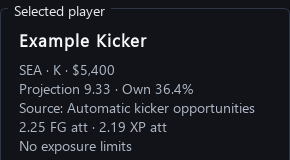


### Linking submitted entries after a complete-field import

Complete standings are summarized without storing every opponent as a personal result. In Results & Learning, attach the matching DKEntries file that contains both entry IDs and the embedded salary table. The app joins those entry IDs to the standings, verifies the actual roster (including Captain), and stores those submitted scores and ranks once. Repeating attachment does not duplicate results. A standalone salary file supplies metadata only. Entry Points remain separate from the side-table player FPTS column.

Prediction comparisons require the original saved lineup export on this device. If results import but exact matches remain zero, use the original generating device and its history; do not regenerate forecasts after the game to create a backtest. Missing winnings remain unknown. The Classic calibration and real-field SIM comparison sections exclude Showdown; importing a Showdown field does not increment the Classic training counter. No automatic projection training is added.


### Selected-player controls

The selected-player panel groups lineup status, portfolio exposure, and team adjustments with consistent two-column buttons. Minimum exposure controls are on the left and maximum controls on the right. When the player area is short, scroll within the panel to reach the lower actions; controls retain their spacing and remain readable.

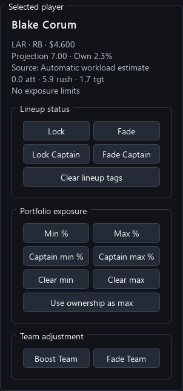


### One-file results and username

Open **Results & Learning**, enter your **DraftKings username**, and choose **Save username**. The setting stays on this computer and is not included in shared source code. Import the complete contest standings CSV to identify your submitted entries by exact username (case-insensitive, ignoring the trailing entry counter), save their scores and ranks, and compare your regular-slot and Captain exposure with the observed field. No salary or entry-upload file is required for these comparisons.

If you previously imported the same file without a username, save your username and use **Analyze Saved Results** or select it with **Import DraftKings Results**; the field and personal entries are not duplicated. The combined folder button skips previously imported files. Different username spellings are not guessed. A saved salary match adds salary/construction detail when desired. Forecast validation still requires original saved forecasts; winnings/cash rate require payout data. This update stores empirical results and ownership comparisons; it does not automatically retrain projections or tune Showdown from a single contest.

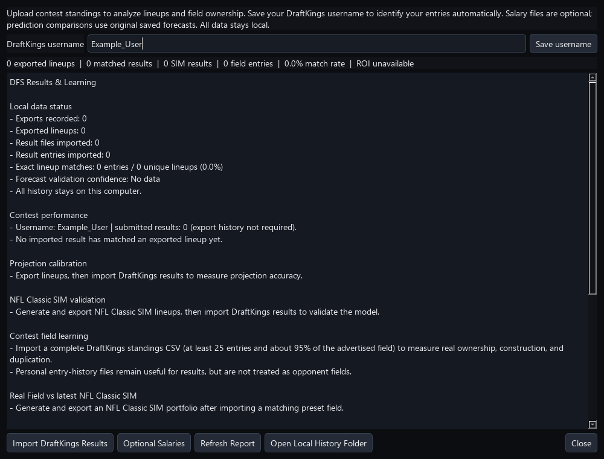


### Results audit and Copy Report

Results & Learning now appends a diagnostic audit automatically. **Copy Report** copies the complete displayed text, including per-contest match counts, up to five unmatched rosters, lineup score reconciliation, Captain/FLEX scoring consistency, player forecast misses, saved ownership ranges, and available export version/timestamps. Keep the original standings file accessible for its player FPTS side table. Missing files or fields are reported rather than guessed.

Identical player-score tables across contests indicate shared outcomes; the count is a proxy, not a verified game count. Repeated player appearances are not independent observations. Older exports may lack forecast provenance and ownership units; low saved ownership alone does not prove a normalization bug. New exports preserve forecast source and workload/kicker context for future audits. No forecasts are regenerated and no model weights change automatically. Copied reports contain player names, username and aggregate results, but omit file paths, entry IDs and API keys.

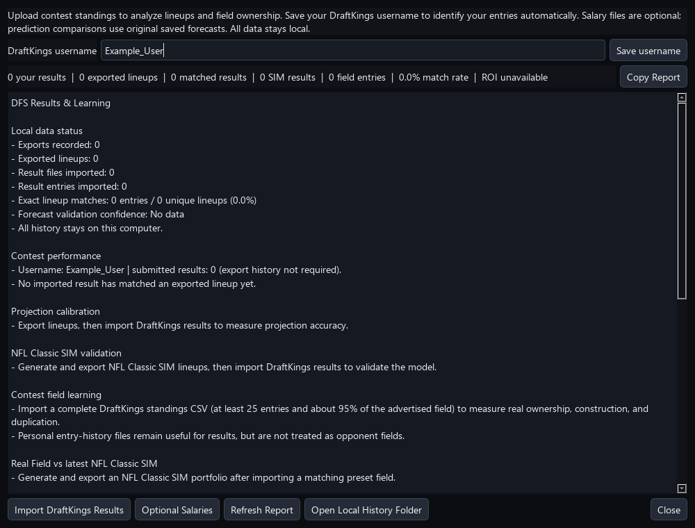

The same audit supports **NFL Classic and Showdown**. Classic checks all nine roster slots against player scores; Showdown also checks Captain scoring separately. Reimporting an identical standings file after moving or renaming it refreshes its readable location without duplicating results.


### Import results and salaries together

In **Results & Learning**, save your DraftKings username and choose a **Results folder** and optional **Salary folder**. Both locations are remembered on this computer. Put downloaded files in those folders, then click **Import Results & Salaries**. One click scans both folders and their subfolders. The folders may overlap or be the same. Results-only and salary-only scans are also supported; **Clear** removes the optional salary-folder setting.

Identical contents are skipped even after a rename or move, without rerunning result analysis. New contents are a new source revision. The completion message lists new results, new salaries, skipped duplicates, ignored CSVs, saved matches and errors. Unrecognized CSVs are ignored; malformed supported files are reported and can be retried. Salary import supports NFL Classic/Showdown DKSalaries and embedded DKEntries salary tables, preserving original rows and separate Captain/FLEX IDs and prices. Entry-template rosters are not imported as contest results.

The scan runs only when clicked. Cancel or close waits for the current worker to retire. Completed files remain saved, and an interrupted active results file rolls back; rerunning skips completed files. If a configured folder is unavailable, reconnect its drive or choose another folder before retrying. This check happens before import writes. Other file-level errors allow the remaining files to continue. Source files are never moved or edited; new imports keep hashed snapshots under local history. Include the entire history folder in backups.


Each results file has its own saved salary association. A unique compatible candidate can match automatically when the result date agrees with one salary slate and every observed readable player/role identity maps unambiguously. Explicit game/team conflicts, mixed formats, missing identities, namesakes and conflicting dates block a match. One salary snapshot can serve several contests on the same slate, with separate associations.

Use **Review Salary Matches** when several revisions qualify or the results lack a date. Select the exact contest and salary snapshot; an unknown result date needs explicit confirmation. Review shows unresolved identities and unreadable roster counts. Existing pairings cannot be silently replaced by a new salary revision. Salary files with multiple game dates currently remain unpaired. A pairing establishes coverage of readable observed rosters, not a complete eligible pool, a hindsight optimum or contest payouts.

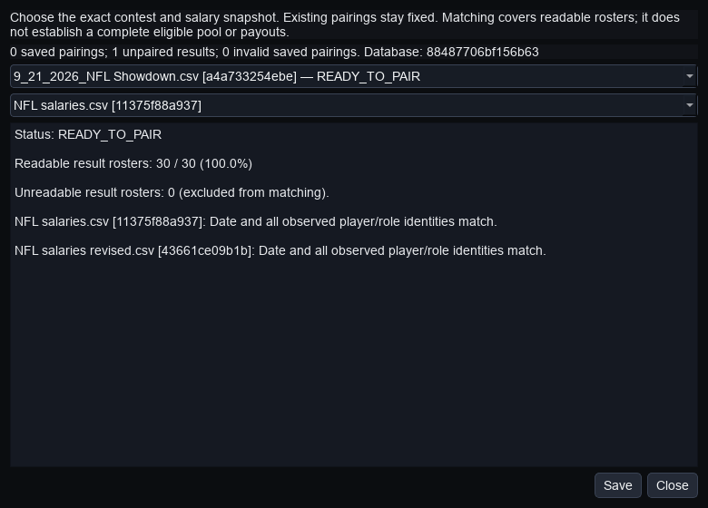

New result files receive the existing descriptive analysis. After pairing older imported results or adding salaries later, use **Analyze Saved Results** to apply the association to construction reports. Importing folders does not automatically rebuild historical reports. Saved salaries are historical prices, not forecasts; ownership, cash and payout information are never inferred from them. A changed saved snapshot is withheld from analysis. Keep **Import DraftKings Results** for individual files or use **Analyze Saved Results** after changing your username; the combined button deliberately skips already imported contents.


### Longer Acer searches and candidate libraries

In the settings menu, choose **Long Search / Resume...**. Start with a freshly
imported NFL slate and updated depth charts/ownership. Choose **New library**,
then 1, 2, 4, 8 or 12 hours and **Start / Resume**. This works for both NFL Classic
and Showdown. The time is a search allowance, not a promise that every possible
lineup will be examined. The current limit is 100,000 unique candidates.

All five build styles run in batches of up to 200 lineups with different seeds.
Completed batches are saved transactionally in one `.dfslib` file, including
complete roster identities, Captain identity, the original player snapshot,
settings and source-code fingerprint. Duplicate rosters are stored once. Keep
one search running per library. The default location is `history/candidates`, so
an existing backup of the whole `history` folder includes the library.

Keep the app open and the computer awake while searching. **Pause and save**
finishes the current step and saves its candidates. Closing the dialog first
requests a pause; close it after the status says the search stopped. A power
failure loses at most the unfinished batch. **Open existing** resumes using the
original inputs and the next batch seed. After changing inputs or updating the
app, start a new library; existing libraries can still be loaded for fresh scoring.

To use the search, load the matching slate, refresh player data and ownership,
then choose **Load Candidate Library...**. Select **Deep**, enable NFL SIM and
click Build. Current injuries, QB eligibility, fades, locks, groups and salaries
are checked again; exposure and uniqueness rules are applied during selection.
Candidates are screened and the shortlist is simulated again using current
projections. No old SIM score is reused. The build report shows accepted and
rejected library counts. **Clear Candidate Library** returns to ordinary generation.
Clear it before repairing an existing portfolio. Different slate IDs/game dates
are rejected rather than matched by player name alone.

The long search expands candidate discovery; it does not run an overnight final
outcome ranking or automatically train the forecast model. Final simulation still
uses the selected Deep limits and shortlist. Larger libraries can need more
screening time; the 100,000-candidate limit has not been benchmarked on the Acer.
This is CPU work, and running multiple searches at once competes for memory and
CPU time. All scoring remains conditional on the model and input quality.

For a Python-based unattended session, the same engine is available as
`scripts/long_search.py LIBRARY.dfslib --snapshot SNAPSHOT.json --hours 4`.
For subsequent resumes omit `--snapshot`. Ctrl+C preserves completed batches.
This command does not schedule jobs or prevent Windows sleep.

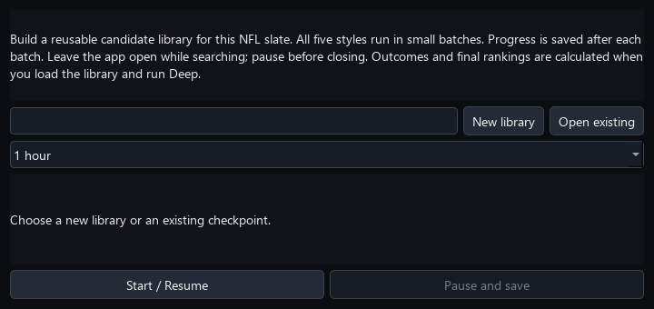

### Quarterback eligibility and ownership units

NFL Classic and Showdown builds exclude backup quarterbacks while the verified
QB1 is available. A questionable or doubtful label alone does not promote a
backup. When QB1 is confirmed unavailable, only the next verified active
quarterback is eligible; earlier depth slots must be accounted for. Missing or
conflicting depth-chart information is treated as unverified, and that quarterback
is excluded. Refresh live data rather than relying on salary or historical PPG to
identify a starter. A lock cannot override this rule. The player table shows
**QB excluded**, with the reason in the player details. Rotation RB/WR/TE players
are not subject to this quarterback-only rule.

New quick ownership estimates reflect roster exposure rather than weights that
sum to 100 across the entire pool. For a sufficiently populated NFL pool, Classic
estimates sum to 900%; Showdown sums to 600% (100% Captain and 500% FLEX), with each
player's combined exposure capped at 100%. These are heuristic estimates, not
observed field ownership; use Recalc Own% (Sim) for lineup-based estimates.
New exports record ownership source and percentage units. Historical exports
remain unchanged, and older unlabelled values must not be retrospectively rescaled.


### Construction review and player performance history

Results & Learning now analyzes new imports automatically. For previously saved
files, click **Analyze Saved Results**. The analysis runs in the background and
can be cancelled; completed contest reviews remain saved. Unchanged files and
metadata are skipped on later analyses. Cached reviews and player scores remain
available if an original CSV is moved; reimport it to update its location.

The report compares the full field, top 5%, top 1%, winners and your username's
entries. It includes duplication, average salary, average slot ownership,
Showdown Captain positions/team splits/QB pairings/specialists, and Classic QB
stacks, opposing skill players, secondary opposing pairs and FLEX positions.
Rank cutoffs include ties, so a top-1% cohort can contain more than exactly 1% of
entries. These overlapping groups are not independent samples.

Construction denominators include only fully covered lineups. Team, position and
salary metadata comes from exports matched to that contest or consensus among
NFL snapshots with matching game dates and coverage of the results player table.
Snapshot date matching relies on the results filename, so those dates remain
unverified. Conflicting metadata is omitted. The app does not apply today's slate
salaries to old results. Coverage is printed for each group: a low-coverage sample
may not represent the entire field or its winners.

Original saved SIM expectations are compared with actual top-1%/top-5% finishes
and saved ceilings for unique matched lineups, for both NFL formats. This is a
descriptive check, not proof of historical calibration. Multiple contests from
one game share outcomes. Standings scores alone cannot establish whether a game
was a blowout or passing/rushing script; no scenario probabilities or lineup
strategy weights are automatically fitted.

**Player performance history** stores base-slot DraftKings scores from the results
side table. Captain scores are not additional observations. Dated records are
collapsed to one player/date observation across contests; conflicting values are
excluded. Dates parsed from filenames are explicitly unverified. January/February dates are assigned to the previous NFL season; imported DK records
do not distinguish playoffs. Undated records
remain stored but are omitted from chronological averages. Missing player rows
are not treated as zero scores. Imported-result averages cover only the games
represented in your files, not necessarily an entire NFL season.

The report shows imported season averages, the last three available dated
observations, earlier observations, and saved forecast bias. Forecast comparisons
use the earliest matched export per player/date, normalizing Captain forecasts to
base scoring. Export timing is not verified as pre-lock. It never invents old
predictions or changes the original exports.

Choose a **Season**, then click **Refresh Free NFL Stats** to download and locally
cache that regular season and the previous one from nflverse. No subscription,
API key, or screen scraping is required. Downloads are explicit, not a scheduled
background monitor. Weekly player IDs prevent repeated refreshes from adding
extra games; refreshes upsert statistical corrections. Failed or empty downloads
preserve the existing cache and disclose its status and check time.

For QB/RB/WR/TE, these source records show **PPR fantasy points**, recent carries and targets,
with season, last-three-observed-game and earlier-game averages. PPR scores are
not DraftKings scores and are never pooled with contest DK observations or used
directly as a DK projection error. With imported results, the report focuses on
those player names; otherwise it previews 30 player-season records. Stat rows
can change after corrections, and absence from the source is not a zero-game score.
The full source rows and provenance stay in the local history database and are
included in a backup of the history folder.

Source documentation: [nflverse weekly player statistics](https://nflreadr.nflverse.com/reference/load_player_stats)
and [update schedule](https://nflreadr.nflverse.com/articles/nflverse_data_schedule.html).
Player/team statistics normally update after game days; these are not guaranteed
live scores. **Copy Report** includes the construction, SIM and player-history
sections along with their sample sizes and limitations.

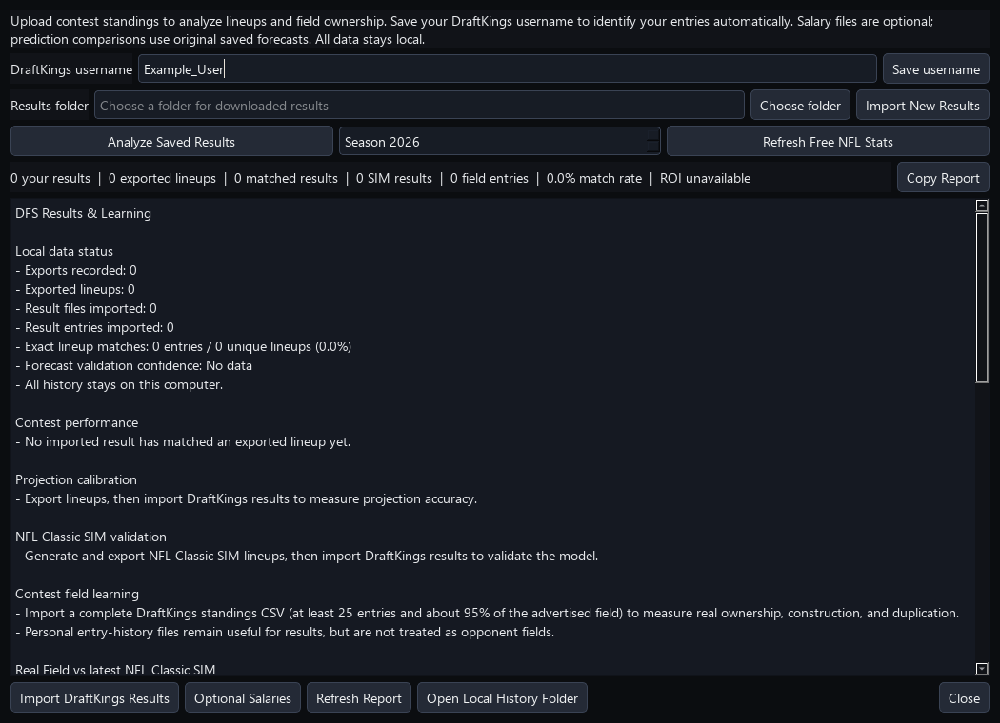


## Cross-contest scores and quarterback build diagnostics

**Results & Learning** now includes **Cross-contest score reconciliation** in **Copy Report**. After Analyze Saved Results has populated the cache, the report compares overlapping player names in contests with the same filename-derived date. It lists base-score conflicts, players present in only one file, and Captain/regular-slot score differences separately. Extra or missing Captain rows can explain different table fingerprints even when all shared scores agree. Dates and shared names do not verify identical games. Differences above 0.02 DK points are reported; no scores are overwritten. Missing original files leave cached base-score comparisons available.

New NFL Classic SIM and Deep Showdown **Build Reports** include **Quarterback construction through the build**. Each available stage lists counts and percentages for zero, one, two or more QBs, plus average simulated top-1% rates where available. Generated bank means the eligible deduplicated bank after generation filters, including a loaded Long Search library and retained lineups. The shortlist uses screening results; independent SIM uses fresh validation results. Selected output follows ranking or portfolio selection and applicable rules. Captain counts once. Classic normally requires exactly one QB.

To investigate a Showdown imbalance, replay the same saved snapshot with the same settings and copy the new Build Report. A high two-QB share in the generated bank points toward candidate supply; a rise after screening/validation points toward simulated ranking; a rise at selection can reflect portfolio rules or selection objectives. These are diagnostic clues, not proof of a model defect. Missing stages were not completed or do not apply. Older build reports cannot reconstruct discarded candidates. No construction targets, forecast weights or simulation probabilities are changed by these diagnostics.


## Showdown opponent salary model

Deep Showdown uses `showdown-salary-bands-v1` for screening, independent validation and ranking audits. It targets 60% of opponent entries leaving at most 1% of the salary cap unused, 25% leaving over 1% through 3%, 10% leaving over 3% through 6%, and 5% leaving over 6% through 15%. At a $50,000 cap those upper unused amounts are $500, $1,500, $3,000 and $7,500. These are experimental baseline proportions, not learned tournament frequencies. They are independent of your salary strategy, locks, fades, selected candidates and results.

Slot ownership supplies relative draw weights; missing slot inputs retain the existing total-ownership/projection fallback. Salary rejection changes the resulting exposures, so input percentages are not guaranteed. Opponents still obey the salary cap, six distinct athletes and two-team requirement. Genuine repeated rosters remain in the sample. Generation has a bounded attempt count and honors cancellation. When a band cannot be filled, existing legal proposals from other bands may fill the shortage; Build Reports disclose the fallback count and actual band distribution. A partial field remains explicitly smaller than requested. No candidate fallback or artificial copying is used to fill these salary bands.

New field reports compare ownership inputs in percentage points only when `percent_of_entries` provenance is recorded. Older values appear as stored weights with unverified units; snapshots are not silently rescaled. Reported duplicate rates describe the sampled field and must not be directly compared with full tournaments of different sizes. Captain/FLEX locks are now shown separately in Showdown Build Reports.

For development comparisons, `scripts/compare_showdown_fields.py` accepts a saved Showdown snapshot, creates a bounded diagnostic candidate bank once, and reuses it for the legacy and salary-band opponent models. Reusing the same bank path requires the same Input ID. The script compares shared player outcomes, top-50 overlap, top-150 QB mix, finish rates and salary distributions. The bank is a diagnostic sample, not a reconstruction of a previous build's discarded shortlist. It does not alter the app's history.

```powershell
python scripts/compare_showdown_fields.py "snapshot.json" --bank "comparison-bank.json" --output "comparison.json" --candidates 1200 --scenarios 2000 --field 4000
```

On one frozen Rams–49ers input, 681 diagnostic candidates and 2,000 shared scenarios produced mean opponent salaries of $45,945 versus $49,067. The top-150 average top-1% rate changed from 9.90% to 4.57%; two-QB lineups changed from 109 to 105 of 150. Candidate mean scores were identical. This shows sensitivity to opponent construction, not improved predictive accuracy or a calibrated two-QB rate. The new prior still needs testing across independent slates; observed winners are not used to tune this comparison.


## Simplified build controls

Choose **Settings > Show Build Controls** if the controls are folded away. The **Build** tab has one **Compute profile** selector: Fast, Baseline, Balanced, Thorough, Extended, Maximum and Custom. Choosing a Deep profile enables SIM and applies its counts together while preserving search scope, output selection and portfolio rules. Custom opens the resource editor with current values. Fast retains the existing Fast settings; NFL Classic can still enable its optional SIM and change its scenario count.

**Search & output** groups all-style search and Individual ranking/Portfolio selection. Preset resource counts are collapsed and read-only; use Show resource details to inspect them, or Custom to edit them. The main summary shows the active scope, selection method, time ceiling and validation count. When all five styles are searched, the single Build style selector is disabled and labeled accordingly. Named time profiles do not choose a build style or a portfolio strategy for you.

Ownership sampling count, the Showdown ownership-template option and the ownership-estimate action now live in **Data and Learning > Ownership estimates**. Ownership preference and influence remain in Build because they affect candidate construction. Existing saved recipes and snapshots retain their underlying settings.
# Projection and usage coverage

## Ownership and leverage

**Settings > Ownership & Leverage** opens a sortable comparison for the latest NFL simulated build. Field % is the recorded ownership forecast; Sampled % is the actual opponent sample; Contender % is exposure among the top 150 independently scored candidates (or the entire smaller bank). Difference is contender minus projected field ownership, in percentage points. Your % uses all selected outputs, even when only 150 are displayed. Classic has total ownership; Showdown keeps Captain and FLEX separate. Missing or unverified ownership stays unknown, distinct from zero. Copy Report includes the largest positive and negative gaps; the full table is saved with the build diagnostic.

These gaps depend on the generated candidate pool, player projections and opponent model. They are not optimal-lineup probabilities or automatic recommended exposures. Confidence remains uncalibrated until historical evidence supports a stronger statement. Review salary, role, upside and uncertainty before setting player exposure limits. This feature does not automatically fade popular players or alter personal limits.

Opponent generation may use two additional feedback passes when complete, explicit percentage ownership sums approximately to legal roster-slot totals. Draw weights are adjusted, new legal fields generated, and the field with the lowest player/slot mean absolute ownership error retained. Player forecasts are unchanged; duplicates are not manufactured to force targets. Salary, roster and existing construction rules still apply, but the mix can vary. Targets may be infeasible, and sampling may consume additional build time. Build reports show before/after error or the reason matching was skipped. Lower matching error is not proof of ownership forecast accuracy.

Results & Learning separately compares ownership forecasts from the earliest matched saved export per player/slot with actual imported ownership. It reports unique-player MAE and bias (forecast minus actual), coverage and largest errors per contest/slot. Pre-lock timing is not verified. Repeated entries count once; contests from one slate are not independent validation. New Showdown exports store FLEX ownership separately from total ownership. Legacy ambiguous FLEX values and unverified units are excluded; no old forecasts are fabricated. Original export history is needed for this forecast comparison, although one-file standings analysis still works without it. No results-driven model tuning is applied.

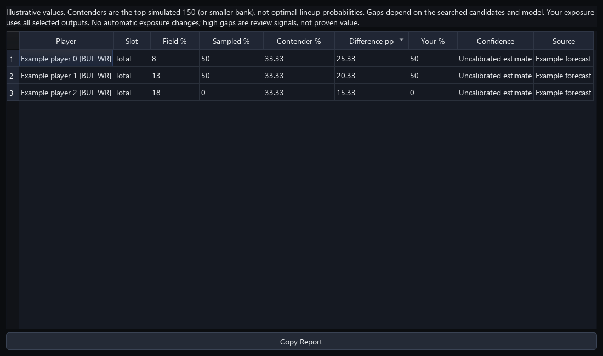

## Ranking repeatability

For hypothetical ownership changes, use **Ownership Sensitivity** below. It recalculates every profile, including baseline, and can reuse older candidate banks. Ranking Repeatability still requires matching simulation code.

After updating, complete an NFL Deep build to automatically save its independently validated shortlist under `history/ranking-banks`. This captures the candidates before output selection, including Captain identities, original ranking metrics, player inputs and opponent configuration. Saving failure does not discard the build; its report indicates whether the bank was saved. Existing snapshots cannot recover earlier shortlists, and replaying a snapshot under new code may generate a different set.

Open **Settings > Ranking Repeatability**, choose the saved bank, and run 2–10 batches with 2,000, 5,000 or 10,000 scenarios each. The default is five batches of 5,000. Each batch generates fresh opponents and player outcomes for the identical candidate set. Keep the app open; allow several minutes per batch. Cancel stops work and retains statistics from completed batches only. Repeating the same settings deliberately uses the same seed sequence; it is not another independent experiment.

The report shows average and range of top-1% rates, best/worst ranks, and top-50/150 batch counts. The screen lists 20 average-rate leaders and 10 unstable original leaders; **Copy Report** copies the displayed report. Full per-lineup statistics save automatically as CSV and JSON alongside the text report in `history/ranking-checks`. Groups are capped by bank size. Exact ties preserve saved order, and boundary ties are disclosed. No automatic stable/unstable cutoff is asserted.

This is a sampling-sensitivity diagnostic, not historical validation or a new portfolio optimizer. It does not alter the app's selected lineups, exports, forecasts or model weights. Classic and Showdown share this workflow; Showdown preserves Captain scoring. Banks from another simulation code version are rejected so a code change cannot masquerade as sampling variation. Reports contain player names; banks contain the frozen player inputs. Include both folders in local backups.

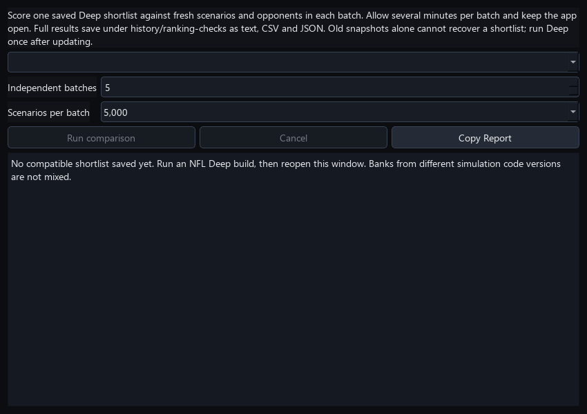

Classic's compact pool prioritizes verified starter/rotation depth slots before unknown-depth fallbacks. Unknown-depth players with forecasts can still fill gaps; no depth slot is invented. Players explicitly labeled Missing forecast are excluded from automatic NFL selection in Classic and Showdown. A locked player with that label requires a refresh or supplied forecast before building. Valid zero overrides and depth-based rookie estimates remain supported, as do older inputs with unknown provenance. Exclusion is a data-quality decision, not a claim that a player cannot play.

NFL Classic and Deep Showdown build reports describe projection sources and usage evidence for the actual eligible build pool. Automatic workload estimates, historical averages, imported forecasts, manual overrides and genuinely missing forecasts are counted separately. A missing usage record is not an observed zero; an estimate is still a forecast with limitations.

Fresh NFL loading now checks the prior season separately for players missing from a partial current-season statistics file. Current-season records take precedence, including zero opportunities. Prior-season usage remains labeled and receives the existing reduced historical weighting. Kickers retain their separate opportunity-history path. Manual and imported forecasts still take precedence. This is a coverage correction, not results-driven training.

Reload the salary CSV to adopt fresh evidence. Saved snapshot replay preserves its original inputs. Source counts do not prove accuracy, and missing source data can still leave a player on role-based or historical-average estimates.

## Ownership sensitivity

Open **Settings > Ownership Sensitivity** and select a saved Deep bank. Both NFL Classic and Showdown are supported. Older banks with complete explicit ownership percentages can be used without another build: baseline and both alternatives are recalculated under the current model. Saved ranks label candidates; old SIM rates are not compared with new ones. The saved top150 identifies favorites for the stress test only.

Every batch runs three profiles:

- **Baseline:** the bank's original ownership targets.
- **Higher ownership for favorites:** up to five players per slot with positive saved-contender-minus-field gaps receive additional raw ownership weight equal to the greater of five percentage points or their original ownership. Redistribution can reduce their final increase; the report shows actual targets.
- **Concentrated field:** raise ownership weights to power 1.35 before redistribution, concentrating ownership around popular players.

Classic preserves each position's original ownership total. Showdown preserves 100% Captain and 500% FLEX separately, with combined player exposure capped at 100%. Salary and roster constraints remain in force; target ownership is approximate and realized constructions can change. The report shows actual field mismatch, salary and duplication counts.

Default **3 batches × 3 profiles × 5,000 scenarios** runs nine simulations. Choose 1–5 batches and 2,000, 5,000 or 10,000 scenarios per profile. The window displays total work; allow several minutes per profile depending on bank size and hardware. Keep the app open. Cancel retains only complete all-profile batches. Repeating identical settings uses identical seeds. The saved bank is read-only; selected lineups and exposure limits are unchanged.

Scoring inputs, candidate identities and outcome seeds stay fixed within each batch; only opponent ownership inputs change. A changed candidate identity or mean candidate score rejects the comparison. Reports show current baseline leaders, alternative top1 rates, percentage-point changes, rank ranges and top150 batch counts. Exact rank ties preserve bank order; banks smaller than 150 use the whole bank. Sample roster matches are not full-contest duplicate predictions; zero matches do not establish uniqueness.

**Copy Report** copies the displayed analysis. Full candidate/profile/batch results, bank and model IDs, target changes, seeds and field diagnostics save as JSON, CSV and text under `history/ownership-checks`. Back up that folder and `history/ranking-banks`. Reports include player names but omit account settings and source paths. These are hypothetical model stress tests, not calibrated ownership forecasts, historical validation or automatic strategy recommendations.

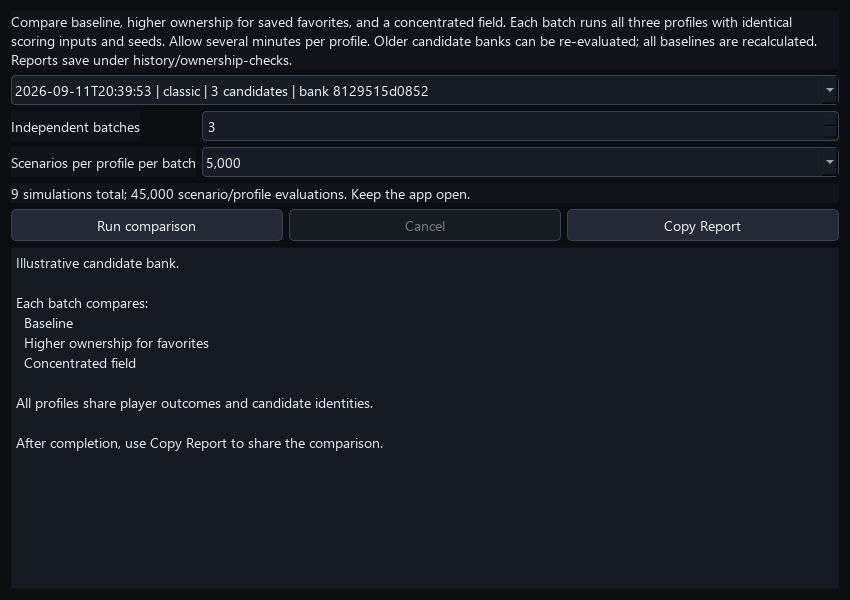

### Review and sort saved ownership comparisons

In **Settings > Ownership Sensitivity**, choose **View saved comparison** and open the completed JSON report from `history/ownership-checks`. Your existing completed report works without another run. The table includes the entire saved candidate bank, including candidates not selected for your original output. Click any column to sort; it initially sorts **Lowest tested %** descending.

| Column | Meaning |
|---|---|
| Own baseline % | Average simulated top1 rate under the paired comparison's baseline; separate from the original build rate. |
| Lowest tested % | Lowest profile-average top1 rate across baseline and both ownership stresses. |
| Own drop pp | Baseline minus lowest tested rate, in percentage points; smaller means less decline. |
| Test rank min / max | Best and worst observed rank across all profiles and completed batches in the saved bank. |

For current Classic or Showdown outputs, use **Comparisons… > Load ownership comparison** beside **Best first**. This also opens the full saved-bank review. Close that review to see the new columns beside matching current lineups. A match requires the same complete saved player inputs and Captain assignment; changed forecasts, roles or other player inputs leave a dash, not zero. A status message shows the matched count. Reports from another model version remain viewable as historical comparisons but cannot attach to current outputs.

Column clicks sort all current output pages while preserving saved-lineup identities. Baseline and lowest rates initially sort descending; drop and rank bounds initially sort ascending. Unmatched rows stay last in either direction. **Best first** restores the build's usual SIM order; **Comparisons… > Clear comparisons** removes both added column groups and restores that order. Neither action changes SIM metrics, exposure limits or portfolio selection. These rates are tested model outcomes, not confidence bounds or guaranteed worst cases. Keep the matching `.dfsbank` file in `history/ranking-banks` with your reports.

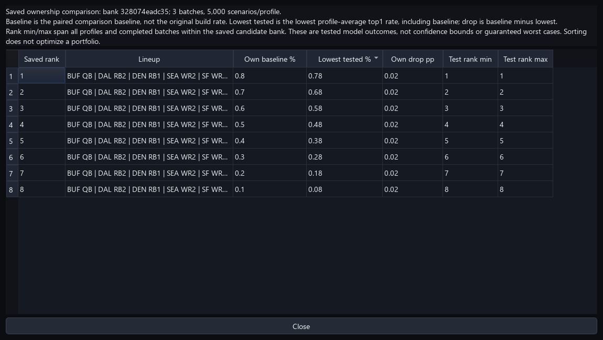

## Projection sensitivity

Open **Settings > Projection Sensitivity**, select an existing Classic or Showdown bank, and run the comparison. A new Deep build is not required; every baseline is rescored using current code. Defaults are **3 batches × up to 8 profiles × 5,000 scenarios** (up to 24 simulations). Keep the app open and allow several minutes per profile. Cancel preserves only fully completed all-profile batches. Repeating the same settings uses the same seeds.

The profiles are explicit stress assumptions:

- **Baseline:** unmodified simulated player outcomes.
- **Lower production for favorites:** reduce simulated points by 15% for the five most-used QB/RB/WR/TE players in the saved top150, counting Captain once. This is a workload-shortfall proxy, not a recalculation of carries, targets, team touch shares, game scripts or specialist effects. It scales both candidate and opponent scores for each affected player.
- **Wider limited-history outcomes:** for skill players explicitly flagged as rookies, with fewer than four matched games across available current/prior seasons, or with missing full-season history, independently multiply each scenario score by 0.75 or 1.25 with equal probability. This preserves expected score conditional on the underlying outcome and increases variability; finite-sample means can differ. Missing history does not establish rookie status. At least four observed games across the available seasons exclude a player unless explicitly flagged as a rookie. Legacy recent-window counts are only a lower bound on observed history. Kickers and defenses are excluded from both target groups.

Within each batch, candidate identities, opponent rosters, ownership inputs and underlying simulated game outcomes stay fixed. Fingerprints verify the unchanged opponent roster list and pre-stress outcome stream. Only player score transforms change, equally for both sides; Showdown Captain receives 1.5x that player's transformed outcome. Targets, reasons, realized player-mean changes and evidence are retained for troubleshooting. An empty target group is disclosed as identical to baseline. These assumptions are not fitted corrections or historical validation, and no live inputs or forecasts are overwritten.

Reports save automatically as text, CSV and JSON in `history/projection-checks`; **Copy Report** copies the displayed summary. **View saved comparison** reopens the completed full-bank table. **Comparisons… > Load projection comparison** adds **Proj baseline %**, **Proj lowest %**, **Proj drop pp**, **Proj rank min/max** beside compatible current lineups. Lowest means the lowest profile-average top1 rate, including baseline. Drop is baseline minus lowest. Ranks span every profile and completed batch. They are tested outcomes, not confidence bounds or guaranteed floors.

Ownership and projection columns may coexist, but represent separate experiments with potentially different baselines; they do not measure a joint ownership-plus-projection stress. Exact player inputs and model compatibility are required to attach either report. Older reports remain viewable as historical reviews; repeat the appropriate check on the current version to attach current-model columns. Back up `history/projection-checks` and `history/ranking-banks`. Strict Ranking Repeatability still requires a bank created with the current simulation code.

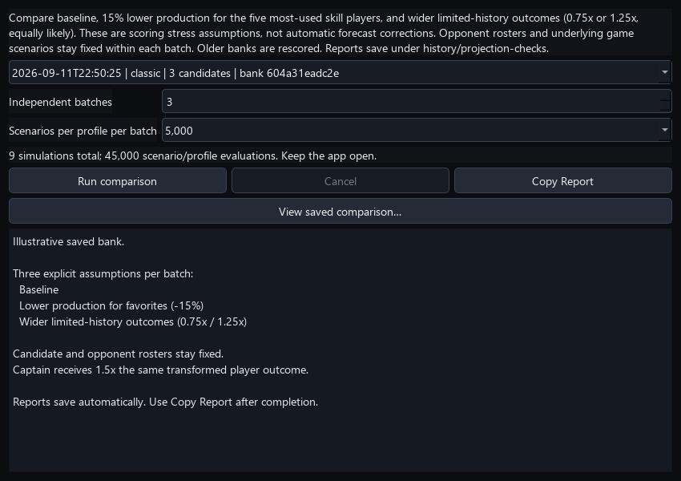


### Full-season history in projection checks

NFL Classic and Showdown keep two separate records: recent form from the latest four available weeks, and distinct observed regular-season games across the available current and prior seasons. A short recent window does not imply a rookie or an inexperienced player. Prior-season evidence can establish a larger sample even when a player missed the latest weeks. These are observed source rows, not complete career totals or a guarantee that all games were reported.

Projection Sensitivity's wider-outcomes profile targets explicit rookie flags, fewer than four matched games across those available seasons, or unknown history. Each target explains why and lists current/prior counts separately from recent-window games. Missing or ambiguous matches are unknown, never observed zero games. Unavailable source coverage is labeled. Players with at least four matched games across the available seasons are excluded from this particular stress unless explicitly marked as rookies.

Old snapshots and banks stay frozen. To capture full-season evidence, update the app, reload the salary CSV with automatic NFL data enabled, and complete a new Deep build. Then run **Settings > Projection Sensitivity** on that new bank. Replaying an old snapshot or testing an old bank does not fetch new history. Legacy reports remain viewable; new checks on old banks label missing full-season evidence explicitly. This change improves stress targeting and reports; it does not change recent-form workload weights or automatically adjust projections.


Projection Sensitivity now tests each of the five saved favorites individually at 15% lower simulated production, alongside baseline, the combined reduction and wider-history outcomes. Classic and Showdown both support this. Defaults run up to eight profiles per batch: 3 batches at 5,000 scenarios means 24 simulations, roughly 2.7 times the former three-profile workload. The dialog shows the exact profile count for the selected bank. Existing banks can be reused; no new Deep build is required for these additional tests.

Copy Report identifies each displayed baseline leader's largest individual decline and summarizes each tested player's effect across the baseline top150. JSON/CSV retain all candidate/profile/batch results. Effects apply equally to opponents and candidates, with shared Captain scoring; they do not redistribute touches or add up to the combined effect. Every requested profile must finish before a batch counts. Saved comparison columns include all tested profiles in lowest-rate/rank summaries; older three-profile reports remain viewable. This diagnoses dependence on forecasts, not proven projection errors or automatic exposure changes.


### Automatic forecast checks

Normal NFL Classic and Showdown build reports now include **Automatic forecast checks**, using recorded player inputs with no additional simulations, network requests or user setup. Open **Settings > Copy Last Build Report** or Build History to read them. Long sensitivity comparisons remain optional model-development tools; they are not a per-contest requirement.

Checks review automatic skill-player estimates when base points differ from a positive historical average by at least 5 points and 50%, or projected opportunities differ from at least four recent observed games by at least 50% and 8 attempts / 4 carries / 3 targets. Observed zero opportunities remain valid; missing observations do not become zero. The report identifies the usage season because prior-season roles may differ. Recorded position-budget overruns and missing/invalid opportunity breakdowns also appear. Limited-history automatic estimates of at least 6 base points receive informational notices, not assertions that they are wrong. Thresholds are uncalibrated review heuristics and can miss real errors; role changes can legitimately trigger them.

The copied report shows at most six review findings and two limited-evidence notices, with all findings retained in build diagnostics. Warnings summarize the number of players needing review. Player names are included under the existing report privacy notice. Supplied/manual projections are preserved and excluded from automatic-workload comparisons; K/DST are outside these skill-player checks. No projections, lineups, exposure limits or simulation weights are changed. Continue importing results after contests to evaluate original forecasts against outcomes; these checks do not train the model.


### Automatic entry targets

**Auto from lineup count** is on by default in the NFL Build controls. Request 1 for Single Entry; 2–3 for 3-Max; 4–20 for 20-Max; 21–150 for 150-Max. More than 150 uses 150-Max assumptions while keeping individually ranked alternatives, so a 450-lineup request remains a browsing bank rather than claiming one legal 450-entry portfolio.

For Deep Classic and Showdown, one entry uses Individual ranking; 2–150 entries use Portfolio selection to select the requested set together. More than 150 uses Individual ranking. Explicit player/group/uniqueness rules still apply, and shortages are reported. Best means selected under the app's uncalibrated model and constraints, not proven optimal entries or guaranteed winnings. The compute profile stays under your control; choosing a count does not automatically start a longer simulation.

Classic selects its existing contest preset (including the 150-Max large-field defaults); supplied Contest-Aware SIM field size and payouts remain authoritative where supported. Entry count does not verify the real contest. Showdown uses the automatic entry-selection approach but retains its generic opponent model; changing the target is not a new calibrated Showdown field model. The summary discloses that distinction.

Turn Auto off to choose the contest preset and Search & output selection manually. For example, 20 entries can still be intended for a 150-Max contest. Auto mode persists locally and in new recipes/snapshots; older recipes without this setting retain manual behavior. Existing snapshots are not silently rewritten. Build reports show the target and whether it came from count or manual settings. No additional setup or test run is required.

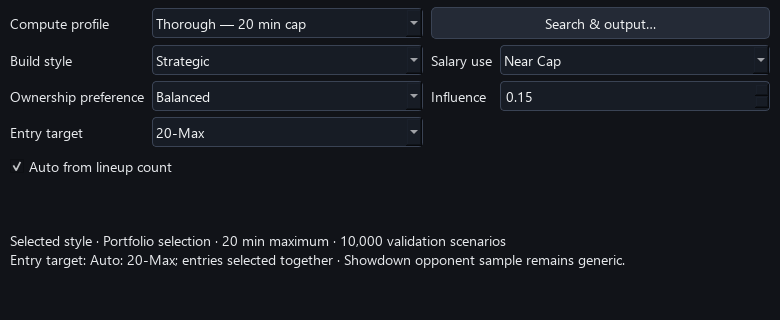


## Review my entries

Open **Settings > Review my entries** (also under the saved-entry **More** menu) for the active NFL Classic or Showdown tab. Choose **Generated outputs** for the whole build, including all pages, or **Saved entries** for your saved collection. No extra simulations run and no entries, rankings or settings change.

Sortable tables show player exposure, repeated pairs/trios, repeated full rosters, constructions and unused salary. Showdown adds Captain + FLEX pairs and Captain positions; Classic includes QB receivers, opposing players and game concentrations. Percentages use all analyzed rosters, including repeated entries. Missing salaries/context are disclosed. These are shared-player counts, not measured outcome correlations or opponent duplication estimates. Saved collections may contain multiple builds: review one slate together. **Copy Report** copies the summary and top 20 rows per section; all rows remain available in the tables.

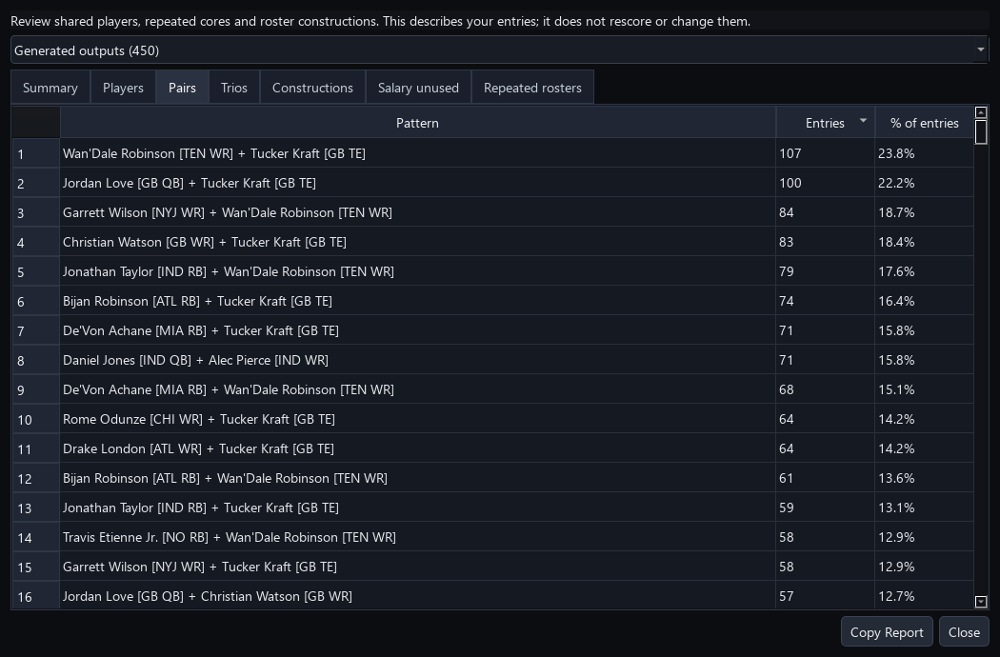


## Optional portfolio comparison

**Settings > Portfolio Comparison** compares the current portfolio selector with an experimental repeated-pair/trio penalty for NFL Classic and Showdown. Choose a saved Deep bank with more candidates than requested entries (1-150). Defaults: 150 entries and 2,000 scenarios per pass. Two passes run: shared selection scenarios, then fresh independent evaluation of both frozen selections. Allow several minutes; Cancel discards incomplete comparisons. This is optional development work, not a required step for every contest.

The trial adds a bounded 6-point penalty on the existing selection scale, normalized by roster core count and requested portfolio size. It supplements existing scenario-coverage rewards; it is not a calibrated risk estimate or a hard player cap. Athlete pairs/trios ignore Captain assignment, while existing Captain constraints remain. Production builds and Individual ranking stay unchanged.

Saved banks omit original group/team/game settings, so this does not recreate the original build. Both trials use minimum unique 2, ownership balancing on, saved player limits and standard Showdown guardrails, without refinement. The report discloses selection shortfalls/relaxations. Fresh evaluation reports average individual top-1% rates, scenarios covered by at least one entry, roster overlap and repeated-core concentrations. One held-out simulation stream does not establish historical accuracy, monetary returns or an improvement. Repeating uses the same seeds. Original forecasts and selected entries remain unchanged. **Copy Report** and automatic JSON/text files under `history/portfolio-checks` preserve the results, including player names and selected roster identities.

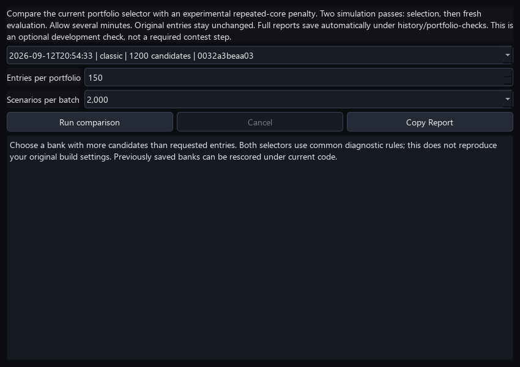


## Core Plays from loaded salaries

Core Plays opens with **Starting shortlist**: up to three distinct players per position and slot. It first takes the highest-projected anchor, then the highest-value remaining value candidate, then the highest-projected remaining lower-owned alternative. Any remaining places use projection among tagged candidates. This is a review starting point, not a SIM ranking, exposure recommendation or requirement to use all three. Warnings remain visible; **Core candidates** restores the full list. Filters narrow the existing shortlist. Captain and FLEX are handled separately. Alternative details show exact differences in salary dollars, projected points and ownership percentage points. Column widths and sorting remain in place while filtering.

After loading NFL salaries and refreshing player data, open **Settings > Core Plays** for the active Classic or Showdown output tab. No Deep run is required. This read-only view uses the currently loaded inputs; it does not fetch data, change projections, set exposure limits or lock players. Reopen after changing inputs. Filters show core candidates, all eligible/loaded players, individual signal categories and Captain/FLEX slots. Search by player/team/position; click headers to sort numerically, with unknowns last in either direction. Select a row for workload, sources, history, status-check time, reasons and review notes. **Copy Report** copies every row in the current filtered/sorted view.

Signals are transparent heuristics, not recommendations to lock a player: **Underpriced role candidate** requires points per $1,000 percentile >=75 and projection percentile >=50 among at least four supported positive-forecast peers at the same position/slot. **High-projection anchor** requires projection percentile >=80; equal peers do not count as strictly lower. **Popular play to assess** uses estimated ownership >=10% Classic, >=25% FLEX or >=8% Captain. **Lower-owned alternative** compares same-position/slot players with >=90% of a popular peer's projection, <=110% salary, and both >=5 percentage points and >=30% lower ownership. Similar mean projections do not prove similar ceilings. **Role-change opportunity** requires explicit unavailability in every earlier recorded depth slot. No salary file alone establishes current starters or actual ownership.

Supported roles are eligible starting/promoted QBs, RB1-2, WR1-3, TE1-2, and K/DST in separate positional comparisons. Unknown/deep roles can be inspected under All loaded but receive no positive tags. Missing forecasts differ from explicit zero; neither receives positive tags. Recorded unavailable players, backup/unverified QBs and slot-specific fades are excluded from candidates. Rookie/limited evidence, automatic forecast-check findings, uncertain status, unknown check times and status checks older than 24 hours remain review notes even on otherwise attractive candidates. These signals do not validate data accuracy or injury news.

Showdown uses separate Captain/FLEX prices, forecasts and explicit percentage ownership; missing slot values are not borrowed. Captain and FLEX points-per-dollar are often equal because both salary and scoring scale together, so value alone cannot rank the best Captain. Classic QB details suggest up to three same-team receiving partners from eligible supported roles. Ownership remains an estimate; unverified units show Unknown. Reports contain player names, forecast inputs and data timestamps, not account settings/API keys. The existing Ownership & Leverage view provides post-SIM contender comparisons separately.

Use the position filter to compare QB, RB, WR, TE, K or DST. Cross-position value sorting is not an overall player ranking.

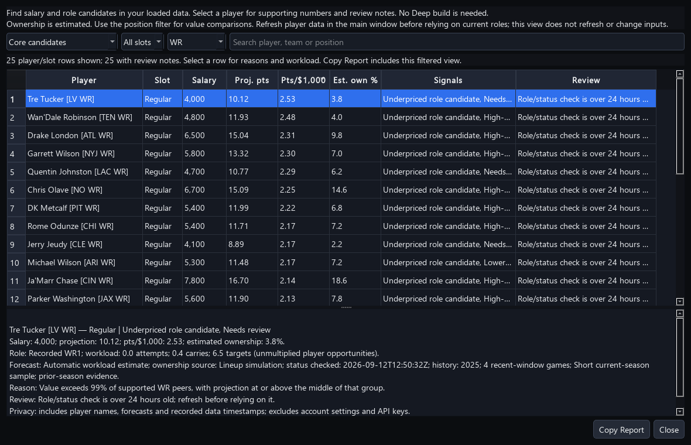

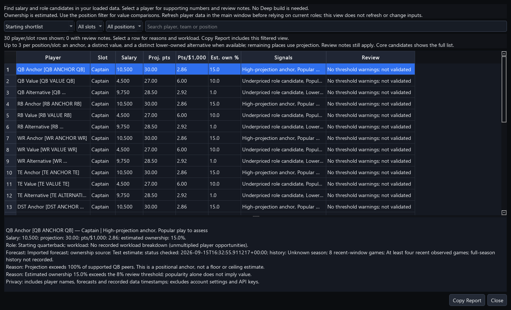


## Update one contest in a combined entries file

Save the replacement lineups, click **Update Entries**, and select your DraftKings entries CSV. When it contains multiple contests, choose the contest by name and ID. The dialog shows its entry count and how many other entries will remain unchanged; continue is enabled only when the saved lineup count matches. Same-name contests remain distinct by ID. **All contests** remains available for an explicitly ordered full-file replacement. Single-contest files retain the existing workflow.

Only the selected contest's roster cells change, in existing entry order. Entry IDs, contest metadata, other contests, instructions and embedded salary tables are preserved. Save a new upload file. To edit another contest, select that newly saved file as your next input, then upload the final combined file. Reusing the original download for the second update would omit your first update. This does not submit entries or change contest entry limits. Use replacement lineups from the matching slate.

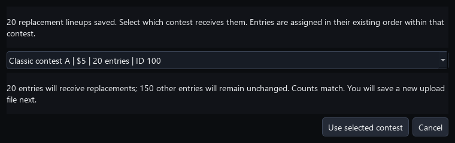


## Results plus username: automatic snapshot comparisons

### Opponent portfolios from one standings file

Choose **Results & Learning > Opponent Portfolios…**, select **NFL Showdown** or **NFL Classic**, then **Open standings CSV…**. Use the original downloaded file (or its copy under `history/imported_results`). This separate analysis reads locally without importing, rematching, refreshing sources or changing history.

The sortable table shows each username's observed entry count, readable rosters, unique lineups, average shared players, Captain variety, mean points, best rank and field copies. Filter by username or entry-count range. The table displays up to 1,000 matching entrants; narrow the filter to find any entrant in a larger field. Clear your saved username from the filter to see opponents.

Selecting an entrant shows total/Captain/FLEX exposure, common player pairs, field exposure and same-entry-count peer medians. Peers include every observed entrant at that entry count, including losing entrants, with each entrant weighted equally. These are descriptive comparisons, not proof that a construction predicts future success. Shared game outcomes are not independent samples.

**Copy selected report** shares that entrant's summaries and data-quality notes. **Save analysis JSON…** also includes every player-pair count for the selected entrant. Both omit detailed lineups by default; enable **Include detailed lineups** to share them. **All usernames in JSON (summary only)** exports aggregate table metrics for every entrant; select one entrant for exposure/pair details or lineups. Exports contain usernames and the source filename, so review before sharing.

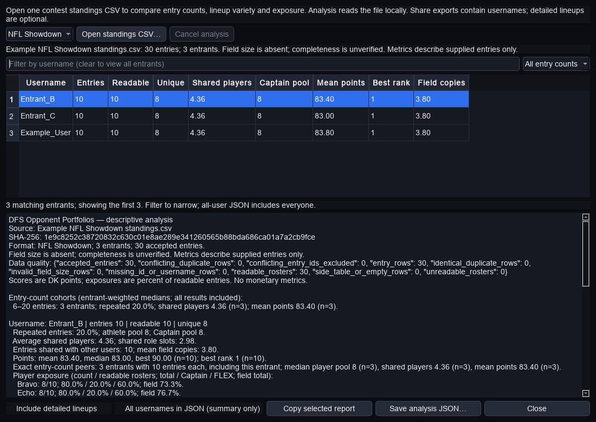

Metric definitions and limits:

- Exposure uses readable rosters as its denominator. Unknown rosters and missing scores remain unknown; a recorded zero score remains zero. A single entry has no pairwise-overlap value.
- Showdown identity retains Captain. Classic rearrangements of the same athletes across eligible slots count as one identity. Slot shape is checked, but salary and eligibility are not validated here.
- Player matching uses exact case-insensitive names, stripping appended numeric IDs because Captain/FLEX IDs can differ. There is no fuzzy matching; namesakes cannot be disambiguated and ID-only rosters are unreadable.
- Average shared players includes every pair of entries, including repetitions. Shared role slots treats Captain and FLEX separately.
- Field copies include the entrant's own entries. “Shared with other users” specifically requires another username with the same lineup. Both cover only the supplied readable field.
- Identical repeated EntryIds count once. Conflicting copies are excluded entirely. Missing EntryId/username rows are excluded and counted in the quality report. Multiple explicit contests are rejected.
- Without an explicit field size, completeness remains unverified. Ranks are reported as supplied; this tool does not infer payouts, ROI, finish percentiles, injuries or the mathematically optimal lineup.

Cancel or close waits for the reader to stop. A cancelled or failed analysis preserves the previous completed result.

See the [Results & Learning implementation sequence](RESULTS_LEARNING_PLAN.md) for injury exposure, hindsight optimization and overnight compute work.

For NFL Classic and Showdown, open **Results & Learning**, save your DraftKings username once, then **Import DraftKings Results** or **Import Results & Salaries** from your chosen folders. The app identifies your submitted entries directly from standings, including DraftKings entry-counter suffixes. No salary upload or lineup export is required to analyze your scores, ownership versus the field, repeated rosters and available constructions. If files were imported before you saved a username, use **Analyze Saved Results** or the individual-file import to find your entries without duplicating the contest. **Copy Report** includes the analysis, salary-catalog counts and comparison diagnostics.

Forecast comparisons automatically search local pre-game snapshots. Ordinary NFL builds save these automatically; repeating identical inputs preserves the original snapshot timestamp. **Update Entries** also records the selected contest ID with the current inputs so future standard `contest-standings-ID.csv` downloads can be linked. Older imports can match a date in their filename (for example `09_10_2026_NFL_Showdown_Results.csv`). No second file is required. A date or previously saved contest-ID association is needed; unknown dates are not guessed from scores or player names.

Matching requires NFL, the same roster format, complete coverage of observed player names without ambiguous identities, one scheduled game date, and a snapshot recorded before the earliest game starts. The latest qualifying snapshot supplies the reference forecasts. It may differ from inputs used for manually edited entries; it does not create an export record or claim exact prediction provenance. Missing, conflicting, post-game, unsupported-schedule or multi-date snapshots leave forecast comparisons unavailable while observed results analysis remains available.

The automatic comparison reports snapshot ID/time, per-player forecast errors and largest misses, Captain/FLEX ownership error separately for Showdown, and unique submitted-lineup forecast error when all player scores reconcile with the reported entry score. Repeated identical entries count once for this forecast comparison. Missing forecasts stay unknown; recorded zero forecasts remain zero. Teams, positions and salaries use saved metadata when available; a standings file alone cannot supply missing prices, depth roles, touches or payouts.

These are calibration diagnostics saved locally, not automatic model changes. Multiple contests from the same game and lineups sharing players are not independent evidence. Existing export-linked validation remains separate. Import results after each slate and use **Copy Report** to review mismatches before changing the model.


## Ownership and forecast report corrections

After updating, use **Results & Learning > Analyze Saved Results** once. Older lineup-ownership summaries are rebuilt from observed roster appearances; no salary file or new simulation is needed. Each player's field ownership and each lineup's ownership total now share the same denominator and observed source, including distinct Captain/FLEX slots. The CSV's listed percentages are compared separately as an input consistency check, never used in place of actual roster ownership. Older unversioned summaries are hidden and excluded from ownership-profile calibration until rebuilt; other field metadata remains intact. Cancel leaves the current contest's previous summary unchanged. Original files must still be available for rebuilding.

The summary distinguishes your username-matched results, reconciled snapshot-compared entries and export-linked matches. Snapshot comparisons count repeated submitted entries, while forecast error continues to count identical lineups once per contest. These counts overlap and must not be added together. A low export-match percentage is not a failure to identify your entries or match snapshots.

Snapshot player-error reports show separate groups for recorded starters/eligible QBs, other depth roles/rotation, backup QBs, recorded unavailable players, unverified/excluded QBs and unknown roles. Classification uses only frozen pre-game evidence. An eligible replacement QB stays in the eligible group. Other depth roles are not automatically inactive, and zero outcomes do not determine eligibility. Legacy snapshots with missing role evidence remain unknown. The all-player error is explicitly labeled as including these groups; no forecast, role, lineup or simulation weights change.


## Observed ownership accuracy and username finish summaries

**Analyze Saved Results** now refreshes snapshot ownership accuracy and construction-review ownership using the same observed roster counts as field summaries. Export-linked ownership audits also use those counts. Classic regular slots and Showdown Captain/FLEX remain separate. A player/slot present in the results side table but absent from all parsed field rosters has observed zero ownership. Without one complete field, observed ownership is unavailable; the CSV's listed percentages are not substituted. Existing snapshot ownership comparisons are hidden until refreshed. Forecasts, actual scores and simulation weights remain unchanged.

Finish summaries use all entries belonging to the saved username, independently of exports and snapshots. Reports show covered/total entries, overall and per-contest average finish percentile and top-1% rate. Missing field size, missing rank and out-of-range ranks are excluded with coverage disclosed. Higher percentile is better; percentile is `100 * (1 - (rank - 1) / field size)`. Rank ties share their reported rank, and the top-1% cutoff is rounded up. Overall figures are entry-weighted; repeated submitted entries count separately and do not establish independent predictive evidence. Monetary results and export-linked projection validation remain separate; finish rates do not establish cash rate or ROI.


## Automatically recorded scoring ranges

Complete a normal NFL SIM build before kickoff: Classic Fast or Deep, or Showdown Deep. The app records each player's actual simulated mean and percentiles from the scenarios already used by that build, without an additional simulation pass. **Copy Last Build Report** confirms whether scoring distributions were saved. Compact summaries, input ID, model version, scenario count and capture times stay under `history/scoring-distributions`; raw scenario draws are not retained. Save failure is reported without discarding lineups.

After the games, import your standings in **Results & Learning**, then use **Analyze Saved Results** to refresh comparisons and **Copy Report** to share them. Existing snapshot matching identifies the reference inputs; a scoring record must have that exact input ID and format, a complete scenario run, and a capture timestamp before the player's scheduled kickoff. Missing or ambiguous game identities, invalid records and later replays do not qualify. Old snapshots alone cannot recreate historical scoring ranges, so older results may correctly say unavailable. Continue with your next pre-game build; another long run on an old slate is unnecessary.

The recorded-distribution section separates Classic/Showdown and model versions, then groups observations by position and frozen role. It shows how often actual scores fall inside the simulated p10–p90 range, below it or above it, along with expected simulated tail rates, mean-score error and the largest misses. Quantile boundaries count inside; empirical tail rates account for ties and zero scores, so the expected inside rate is not always exactly 80%. These ranges are not hard minimums or maximums.

One player in one scheduled game counts once across repeated contests within a format, using the latest qualifying capture. Conflicting actual scores are excluded. Captain uses the same base-player outcome, not a second observation. Classic and Showdown can share games, so their sample counts are not additive; players in the same game remain correlated. No projection, ownership, scenario weights or lineup rankings are changed by this diagnostic. Many separate games are needed before drawing conclusions about calibration.

Older ownership aggregates are labeled **Legacy export-metadata ownership difference** because their forecast timing or units may be unverified. Use the snapshot-backed ownership comparison for current accuracy checks.


## Showdown Captain search coverage

Normal **Showdown Deep** builds now reserve a bounded part of generation and screening for plausible Captain alternatives. No extra control or results upload is required. Review eligibility requires a positive forecast and recorded eligible/starting QB status, RB/TE depth 1–2, WR depth 1–3, K/DST, a supplied forecast or an explicit Captain lock. Active-player/QB eligibility checks, Captain fades, FLEX locks, another Captain lock and explicit zero exposure limits still apply. Ownership alone neither qualifies nor disqualifies a Captain; unknown unsupported roles are not automatically included.

The search attempts up to 12 candidates per eligible Captain within 10% of the overall candidate budget. It uses at most 30 seconds or 10% of the generation time allowance, whichever is smaller, sharing that time across Captains. These are existing-budget candidates, not additional output entries. Temporary Captain search locks are removed before scoring and selection; user locks are preserved. Candidate shortage can mean insufficient time, budget or feasible constructions, not proof of an impossible lineup.

After coarse scoring, up to three of each review Captain's strongest generated candidates receive shortlist reservations. Reservations share at most 20% of shortlist capacity; existing retained entries take priority. Scarce slots are distributed round-robin, with higher projected players considered first. The remaining shortlist uses the existing selection policy. This applies to both **Individual ranking** and **Portfolio selection**. It improves coverage but cannot guarantee every Captain is tested under every budget or constraint. Saved candidate libraries are not expanded; their existing Captain candidates can receive shortlist reservations.

**Copy Last Build Report** and **Build History** include **Showdown Captain coverage**: generated, shortlisted, fully evaluated and selected counts for each review Captain, plus the best tested rank, top-1% rate and first-place rate including ties. Full evaluation is claimed only when all requested independent validation scenarios complete. Reports distinguish missing candidates, screening gaps, incomplete validation and evaluated-but-unselected alternatives. Ranks are among that build's evaluated candidates and do not measure historical prediction quality.

Coverage does not impose final exposure minimums or change forecasts, ownership, outcome models, or portfolio rules. Final lineup selection can still choose zero of a reviewed Captain. Classic and non-Deep Showdown behavior are unchanged. Run a fresh Showdown Deep build to use the expanded search; old banks are not rewritten. A new build may have different lineups because different candidates were compared.


## Usage resilience and build-rule integrity

Full NFL data refreshes retry a transient weekly-statistics download failure once (timeouts, connection failures, HTTP 429 or server errors). Successful, schema-checked season downloads are saved under `history/usage-cache`. If a later download fails, a matching season/source cache with a valid content digest can supply the last successful rows. The original download timestamp stays intact. Build input summaries explicitly label cached usage as not freshly downloaded; each player retains the fetch state/date. Current and prior seasons remain separate, and missing usage is never interpreted as an observed zero. Cache loss or corruption leaves the source unavailable. There is no cache to recover until a successful download has occurred. A successful empty season still allows the existing prior-season fallback.

Reload the salary file for a full data refresh after updating; the lightweight pre-build status check does not download weekly usage again. Snapshot replay continues to preserve its original inputs. Results & Learning's **Refresh Free NFL Stats** uses the same download cache and labels cached refreshes. Back up the history folder to retain this cache with snapshots and results.

Normal desktop Classic and Showdown builds no longer automatically weaken minimum uniqueness or raise automatic Showdown exposure caps to fill an output request. If greedy selection gets stuck, a bounded feasibility repair can rearrange candidates under the same maximums, group rules, team/game limits, retained entries and uniqueness. It prioritizes retaining greedy selections, then their quality order, and does not fit or change scoring models. The repair has a 15-second maximum, limited by remaining Deep time. A solver result is accepted only when it is integral and satisfies every modeled constraint; it need not be proven optimal. Existing minimum-exposure shortfalls remain reported rather than guaranteed.

If no complete compliant portfolio is found, the build explains the shortage instead of releasing the incomplete constrained portfolio or silently changing its limits. This is a search limitation, not proof of mathematical infeasibility. Increase candidate/shortlist coverage or explicitly change the requested count or rules before rebuilding. Evaluated Deep banks and pre-game scoring summaries saved before selection remain available. Cancellation still preserves retained entries. Unconstrained generator shortages may still return fewer entries with a warning.

Showdown's experimental opponent sampler now targets underfilled salary bands by drawing a Captain and four FLEX players, then choosing a weighted legal fifth FLEX that completes the requested band. It retains distinct athletes, both teams and legal salaries. Unavailable bands, finite search and cancellation can still cause disclosed shortages/fallbacks; it never copies a roster just to fill a quota. Ownership feedback accepts a lower-error field only if it does not worsen salary-band shortage. Matching the salary mix may therefore leave a larger ownership mismatch. Both diagnostics remain visible; this is not a calibrated joint ownership model or proven improvement in predictive accuracy.

Captain coverage now reports every Captain appearing in generated, shortlisted, validated or selected candidates, alongside reservation-eligible candidates with no generated lineups. Each row distinguishes **reserved-search eligible** from **ordinary search; no reservation**. This closes reporting gaps for successful ordinary-search Captains without expanding the reservation eligibility rules or forcing final exposure.


### Clear messages when lineup limits stop a build

A constrained portfolio shortage now opens a **Lineup limits** warning instead of a Python traceback. It lists the strongest blockers at the greedy selection stop: uniqueness, player total/Captain caps (automatic or explicit), team/game caps, specialist Captain caps, and player groups. Candidate counts can overlap; they are diagnostic observations, not proof that the constraints are impossible. No incomplete constrained portfolio is released and no rules are silently relaxed. Broaden the candidate pool or Deep shortlist to supply more choices; increasing scenario count alone does not do that. Reducing output count recalculates percentage caps, so it is not a guaranteed remedy. Unexpected programming errors still retain their traceback for troubleshooting. This handling covers Classic and Showdown.


### Preserve a feasible portfolio before Deep shortlisting

Classic and Showdown Deep builds now search the full screened candidate pool for a complete set satisfying the current maximum exposures, uniqueness, groups, team/game limits and retained entries **before** narrowing the SIM shortlist. The check uses the same limits as final selection, including automatic Showdown caps, with up to 20 seconds from remaining build time. A verified complete set is reserved ahead of optional shortlist reservations; it receives the same later SIM evaluation as other shortlisted candidates. The rest of the shortlist still follows the selected ranking/search mode. No scoring forecasts or exposure limits are changed.

If final greedy selection gets stuck, the app rechecks the preserved set against the current candidates and rules and can use it as a complete fallback, followed by normal refinement where enabled. Output ordering still uses the final SIM ranking. This is a feasible portfolio, not proof of the best possible portfolio. Build reports disclose preservation and fallback use. If no complete set is found within the available pool/time, existing strict shortage handling remains. More scenarios alone cannot replace missing candidate alternatives. Run a fresh Deep build after updating; old saved shortlists are not expanded or rewritten.


### Responsive portfolio feasibility checks

The pre-shortlist check now has an app-enforced solver deadline and cancellation, rather than relying only on CBC's internal time limit. The app polls its own solver process, terminates that process if the budget expires or Cancel is pressed, and cleans up its temporary files. Preparation checks the same deadline/cancellation; the full-pool check avoids expanding shared-roster groups into a large pairwise conflict graph. Classic and Showdown display the feasibility subphase explicitly and record its start/end in the debug log.

A timed-out check cannot supply a partial or unchecked portfolio. The build continues with the ordinary shortlist if the feasibility check finds no complete set within its budget; final exposure/uniqueness safeguards still apply. Cancellation ends the current check. These bounds apply to the portfolio feasibility check, not to all other build phases.


### Successful recovery messages and Showdown salary filtering

A successful preserved-portfolio fallback or feasibility repair is no longer translated into a generic failed-rule warning. Recovery remains visible in the build details; real exposure, uniqueness, group and other warnings remain reported.

Deep Showdown now filters generated candidates, including Captain coverage and loaded-library candidates, before screening and feasibility preservation. Near Cap requires at least cap minus $2,500; Maximize Salary requires at least cap minus $500 ($47,500 and $49,500 respectively on a $50,000 cap). These match the existing Showdown report tolerances. Balanced Spend and Salary Leverage keep their broader salary choices. A conflicting retained lineup produces a clear stop before generation, rather than silently modifying it. Build reports show how many candidates were excluded. If the allowed pool cannot support the requested portfolio, limits remain intact and a shortage is reported.

This does not change Classic salary behavior or turn Showdown correlation review flags into hard bans. Old saved shortlists and completed lineups remain unchanged; run a fresh Deep build to apply the filter before shortlisting.


### Automatic generated-output archives and incremental USB backups

Every build completion now writes a compressed audit ZIP under `history/build-archives`, including all returned outputs beyond the first 150 displayed. Settings > **Open Automatic Build Archives** opens the folder. Each ZIP contains `lineups.json` (ranked slot identities, projections and SIM metrics), `audit-lineups.csv` (readable long-form audit rows, not a DraftKings upload template), a build report, and a SHA-256 manifest. The matching validated input snapshot is included when available; missing snapshots are disclosed. The implementation fingerprint and build settings are recorded. Repeated builds have separate files; cancelled builds with returned outputs are labelled cancelled. Archives exclude bulky per-scenario arrays and do not create export records or imply that any lineup was submitted. Archive failures are visible but do not discard built lineups. Existing builds are not reconstructed retrospectively.

`history_backup.py` is an optional replacement for copying every history file to a new USB folder. Run it only after DFS closes. It hashes local history, copies and verifies new content once, reuses unchanged content, and writes a dated manifest for each successful backup under `D:\DFS-Backups\incremental-v1`. Earlier manifests and content remain unchanged, including files later deleted from the source. Keep the **entire incremental-v1 folder** together; manifests alone are not recoverable backups. Existing dated full backups remain untouched. The first incremental backup still copies all unique content. Subsequent backups avoid rewriting and rereading unchanged USB objects; local files are still hashed. Use `--verify-existing` for a full check of existing USB content; restores always verify content. No automatic retention/deletion policy is enabled.

After installing the updated app code and closing DFS, the prepared `scripts/Launch_DFS_Acer_Incremental.example.bat` can replace the personal launcher. It retains update/launch behavior and calls the incremental backup only after the app exits. Do not replace a launcher that is currently running.

```powershell
.\.venv\Scripts\python.exe history_backup.py --source history --destination D:\DFS-Backups
.\.venv\Scripts\python.exe history_backup.py --source history --destination D:\DFS-Backups --verify-existing
.\.venv\Scripts\python.exe history_backup.py --restore "D:\DFS-Backups\incremental-v1\manifests\CHOSEN-BACKUP.json" --target "D:\DFS-Restore-New"
```

Restore requires a new destination folder, never the live installation. The backup summary reports bytes written, files reused, and time spent hashing the source, copying, and verifying so bottlenecks can be measured. These changes do not enable overnight scheduling or alter lineup generation, ownership, exposures, projections or submission behavior.

### Overnight candidate preparation targets

Settings > **Long Search / Resume** opens Overnight Preparation for NFL Classic or Showdown. Choose **New library**, select a maximum of 1–12 hours, and choose a total saved-candidate target of 12,000, 20,000, 50,000 or 100,000. The default is 20,000. Start / Resume runs all five styles in checkpointed batches; it stops when the target or time limit is reached. Existing candidates count toward the target. Pause and save retains completed batches. Leave the app open and the computer awake; the dialog prevents starting a competing interactive build in this app window. It is not an unattended scheduler and does not change Windows sleep settings.

Saved roster identities are excluded from later batches and resumed searches. Captain swaps remain distinct in Showdown. Five consecutive styles adding no new candidates stop the search with an explanation; this does not prove all possible lineups were searched. Time limits and heuristic searches can finish below the target. App-code or input changes still require a new library to continue searching; existing libraries can still be loaded for a matching slate and checked against current player inputs.

After preparation, close the dialog, use **Load Candidate Library**, and run **Deep** with SIM enabled. Both formats reuse the saved combinations and validate current eligibility, salary and lineup rules. This avoids ordinary candidate generation for that build, but still runs current scenario scoring, feasibility checks and selection. Optional reusable scenario preparation is described below. Preparation does not automatically submit/export lineups. Start with 12,000–20,000: very large libraries can increase screening time and memory use. No overnight job starts automatically on app launch.

Command-line preparation also accepts `--candidates 20000` with `--hours 8`; both limits are validated before creating a library. The candidate target is not a contest entry limit.

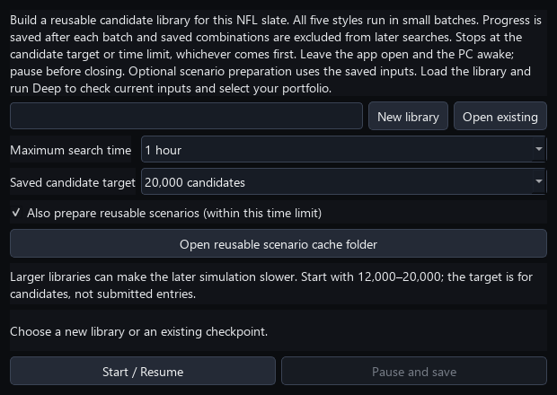

### Reusable scenario preparation (Classic and Showdown)

Overnight Preparation now offers **Also prepare reusable scenarios**, enabled by default. It reserves up to one quarter of the selected time limit, capped by the saved Deep time budget, for the ordinary Deep pipeline after candidate search. If the candidate target is reached early, preparation can use the remaining time up to the saved Deep budget. Pause applies to both stages; completed candidate batches remain saved. Preparation uses the library's frozen snapshot and does not update the output table, submit entries, or create export history. A portfolio-rule failure can stop preparation while leaving completed scenario caches and the candidate library available.

Normal app builds automatically save and reuse complete screening/validation scenario records. These contain shared player outcomes, sorted opponent scores and script counts; lineup scores, finish rates, portfolio rules and selection are still calculated for the current request. Opponent fields are regenerated and matched before reuse. Identity checks include complete ordered player inputs, actual opponent banks, field configuration, seed, scenario count, app code and Python environment. Changed inputs produce a fresh calculation; old data is never silently substituted. The independent ranking audit, sensitivity experiments and joint portfolio contest simulator remain uncached. Reuse does not create additional independent evidence or improve model accuracy by itself.

Each completed cache is verified before use. Incomplete/cancelled records are not published; corrupt or unavailable caches fall back to calculation. Records are limited to 512 MiB each with a 2 GiB storage allowance. When space is exhausted, builds continue without saving new cache data. Files are disposable and stored under the local DFS Optimizer application-data **scenario-cache** folder, outside history and therefore outside the history-only USB backup. **Open reusable scenario cache folder** provides access; close DFS before clearing files. Existing audit archives, snapshots and results are unaffected by clearing this cache. No automatic deletion or Windows task scheduling is enabled.

The build report shows the validation cache status and number of reused scenarios. After overnight preparation, load the matching candidate library and run Deep. Keep the same inputs/settings for reuse; refresh news and player status as needed, accepting a fresh calculation when inputs change. CLI users can add `--prepare-scenarios` to `scripts/long_search.py`; it shares the requested `--hours` budget rather than adding a second unrestricted job.

Validation used exact comparisons of cached and uncached metrics, hit sets, scenario returns and script mixes in both formats, plus changed input/model, corruption, cancellation and unavailable-storage checks. A small local timing check (20 candidates, 500 scenarios, 800 sampled opponents) measured Classic 2.52s uncached versus 1.09s replay, and Showdown 1.92s versus 0.72s. This is not a whole-build speed guarantee; candidate scoring, field generation, verification and portfolio selection still take time.

### Classic phase-2 rating performance

Classic previously sorted the full candidate-rating population again for each candidate and each of six rating columns after the scenario counter reached its target. This scaled poorly with large overnight libraries and did not show post-simulation progress. Each rating column is now sorted once and reused for percentile lookups, preserving the exact existing midrank/tie formula. Phase 2 separately reports Summarizing candidate scores and Finalizing candidate ratings, with candidate counts. Candidate pools, scenarios, scoring formulas and portfolio limits are unchanged. Showdown already used shared sorted rating columns.

Focused comparisons preserved complete Classic metrics and tie handling. A local microbenchmark took 1.715 seconds for 4,000 old-style rating lookups versus 0.003 seconds with shared sorting; the revised six-column rating stage for 100,000 candidates took 0.850 seconds. This measures rating finalization only: scoring, summaries, memory pressure and portfolio feasibility still contribute to build time. A running process uses its loaded code and must be restarted to receive the correction.

### Resizable generated-lineup tables

Classic/Sport and Showdown result tables now give player columns at least 180 pixels by default, expanding for visible names up to 260 pixels. All result columns can be resized by dragging header dividers; double-click a divider to fit contents. A horizontal scrollbar exposes later players and SIM/comparison metrics instead of compressing names into the window width. Hover over a player cell for its full displayed name.

Manual widths are retained within the open app while paging, sorting, restoring Best first, or refreshing results, including repeated roster slots. Numeric cells remain right-aligned and Save actions are unchanged. Widths are not saved across app restarts. This changes presentation only: lineup identities, ordering rules, saved selections, exports and simulation behavior are unchanged.

Illustrative layout data (not real player/team assignments or recommendations):

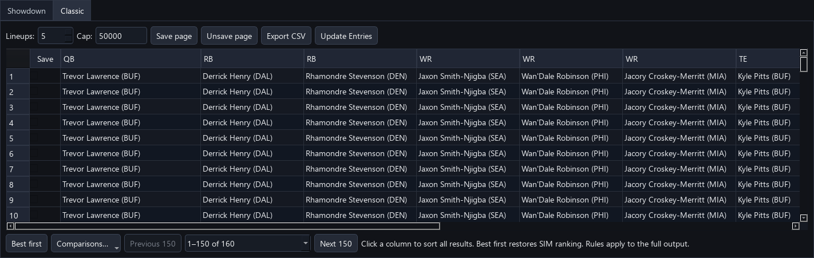

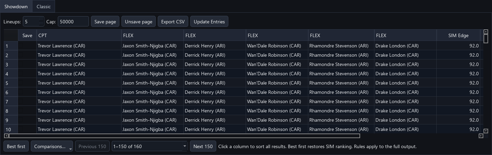

### Understanding Showdown concentration

In Copy Build Report, the Captain coverage section identifies build-time Captain locks and retained lineups. A lock explains a required Captain; it is not evidence of model preference. For completed independent validation, compare the individually ranked leaders with the selected output to see how portfolio rules affect Captain and quarterback concentration. The ranked comparison is descriptive and may violate portfolio constraints. Results matched to a later compatible snapshot cannot establish the original build settings.

### Offline Showdown construction comparison

The developer diagnostic `scripts/compare_showdown_construction.py` accepts a saved NFL Showdown input snapshot and its matching salary CSV. It checks active-player IDs, names, teams and both slot salaries before using the snapshot forecasts. DKEntries files with an embedded salary table are supported; submitted entry rows are not used for candidate generation.

The experiment compares all-style search with explicit zero/one-QB exploration using the same candidate cap and generation time allowance. Banks are reduced to equal counts before scoring. Baseline, 15% lower QB scoring, and wider QB scoring use the same underlying outcome draws and opponent identities. QB stresses affect opponents too. The wider case independently multiplies each QB outcome by 0.65 or 1.35 with equal probability; its expected multiplier is 1, but realized sample means can differ. These are sensitivity assumptions, not calibrated forecasts or production defaults.

Reports and frozen diagnostic banks are saved only at the specified output location. Top-150 comparisons rank individual candidates; they are not portfolio recommendations and do not apply cross-lineup exposure or uniqueness limits. Extra portfolio groups/player constraints are rejected. No application settings, live history, result imports or scenario caches are modified.

Example developer invocation:

```powershell
python scripts/compare_showdown_construction.py INPUT.json SALARIES.csv --output comparison.json
```

The comparison is a bounded diagnostic search, not a replay of the full Deep pipeline (including its Captain reservations and portfolio selection). The stresses are applied after scoring and do not regenerate specialist events; they measure sensitivity rather than define a new play-level scoring model.

### Comparing other users’ constructions

Analyze Saved Results reviews the complete available contest field, including other users, with separate top-5%, top-1%, winner and username groups. Showdown now lists zero, one and two defenses separately from kicker counts. Each construction includes its own top-1% finish rate: qualifying entries divided by all mapped entries using that construction. Rank cutoffs include ties. This is not a cash rate or ROI.

Run Analyze Saved Results after updating to refresh older cached construction reviews; the original results files must remain available. Multiple contests from the same game are shared outcomes, not independent evidence. Compare constructions against their field frequency and across different games before changing strategy. These reports do not automatically change simulation weights or lineup rules.

### Tracing both-defense selections

Copy Build Report includes Defense construction through the build for Deep Showdown. Compare the zero/one/two-DST counts after generation, salary filtering, screening, validation and selection. When independent validation completes, individually ranked leaders are shown before portfolio rules. Those leaders are a diagnostic comparison, not a separately feasible portfolio. Captain counts once. Missing player positions are reported as unknown. Stage averages describe their own simulation samples, not historical accuracy.

## Copying build errors

Lineup-limit warnings and optimization errors include **Copy Error**. Click it to copy the complete message, including any traceback, for troubleshooting.

## Capped-player alternatives in Fast Showdown

Fast Showdown builds now add a bounded exploration pass when a capped player is overrepresented in the generated candidates. It keeps the original bank, explores alternatives without up to four overrepresented players, then applies the same final portfolio limits. This adds at most 20 seconds of exploration and up to 600 candidates for large requests. Locks and original player tags are preserved; final selection still rejects incomplete or noncompliant portfolios. This addresses candidate coverage, not proof that every requested portfolio is feasible.

Fast Showdown also skips the Classic-only field comparison when finishing its report, preventing a roster-format error after successful selection.
