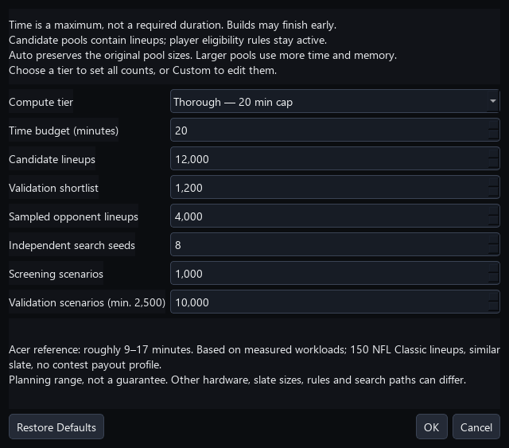
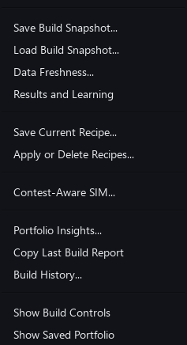
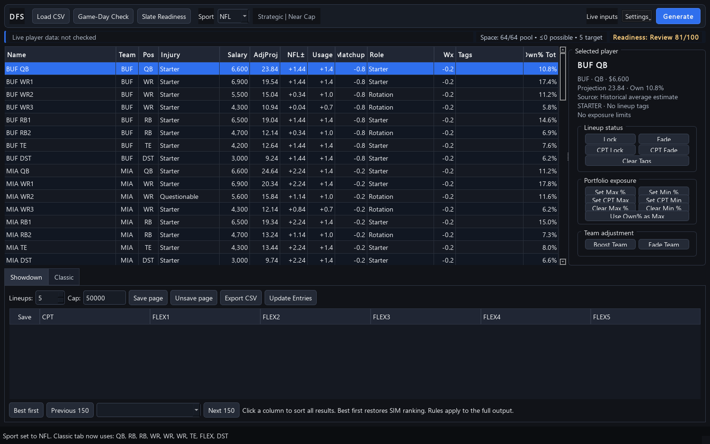

# DFS Optimizer User Guide

Version 1.19.0 | Windows desktop app

DFS Optimizer builds DraftKings lineups for NFL, MLB, NBA, NHL, and WNBA. It combines projections, contest construction, exposure rules, live NFL context, simulation, and local result tracking in one desktop workflow.

> Use the app to organize decisions, not to replace a final review. Player news, projections, ownership, and simulations can be incomplete or wrong.

## 1. Install the app

1. Open the repository's [latest GitHub release](https://github.com/mnicho17/DFS/releases/latest).
2. Download `DFS-Optimizer.exe`.
3. Optional: download `DFS-Optimizer.exe.sha256` and compare it with the executable's SHA-256 hash.
4. Double-click the executable. Python is not required.

The app is currently unsigned. Windows may identify it as coming from an unknown publisher. Only use the executable from this repository's Releases page.

{compact}

## 2. Five-minute workflow

1. Choose the sport and load the DraftKings salary CSV.
2. Choose **Slate Readiness**. For NFL, it refreshes a stale game-day check before auditing the slate.
3. Choose **Showdown** or **Classic** and set the lineup count. If you saved a setup earlier, choose **Settings > Apply or Delete Recipes** first.
4. Review **Build Strategy** and **Portfolio Rules**.
5. For NFL Classic, turn on **NFL SIM Edge** when you want field-based tournament scoring.
6. Choose **Generate** and wait for the progress message to finish.
7. Open **Portfolio Insights**. Filter review signals, inspect player exposure, and remove or replace weak rows before saving.
8. Choose **Export CSV**. For NFL, review the fresh **Final Lock Check**, replace any affected rows, then resolve every **Entry Safety** blocker before uploading to DraftKings.
9. After the contest, import DraftKings results through **Results & Learning**.


The pictured examples use representative NFL data. Player names, projections, ownership, live context, and SIM results will differ by slate.

The detailed Build Strategy, Portfolio Rules, and Data and Learning controls are folded away at startup so the player pool and generated lineups get most of the window. The quiet recipe summary beside the sport shows the active build style, salary approach, and, when applicable, SIM depth and contest preset. Choose **Settings > Show Build Controls** to change the detailed recipe. Choose **Settings > Show Saved Portfolio** to hide or restore the saved-lineup panel.

## 3. Classic and Showdown

**Classic** uses each sport's normal multi-game DraftKings roster. The selected sport controls slots, eligibility, grading, and sport-specific columns.

**Showdown** uses one Captain and five FLEX players. Captain salary and projection are multiplied according to DraftKings rules. Showdown keeps its own Captain exposure controls and uses the same NFL availability, roles, news, usage, matchup, and weather context. Larger builds explore a wider candidate bank, use Captain-specific ownership when available, estimate duplication risk, and balance Passing Stack, Receiver Captain, Rushing Control, Defensive, Onslaught, and Balanced lineup stories across the selected portfolio.

Always confirm that the loaded salary file matches the contest type you intend to enter.

## 4. Load and review the player pool

Choose **Load Player CSV** and select a DraftKings salary file. The player table is your slate workspace.

- **BaseProj** is the original projection.
- **AdjProj** includes supported context adjustments.
- **Status** and **Role** show NFL availability and depth information.
- **Own%** is the projected field ownership used by build and SIM logic.
- **Tags** show locks, fades, and related choices.
- Exposure columns hold maximum and minimum portfolio limits.

Sort and inspect the table before generating. A strong optimizer cannot repair a poor or stale player pool.

Player columns use content-aware alignment: descriptive fields stay left-aligned, team and position fields are centered, and numeric values align on the right. The table redistributes spare width among names, injury notes, roles, and tags when the window changes size.

{compact}

## 5. NFL Game-Day Check

For NFL slates, **Game-Day Check** refreshes structured availability, injuries, practice participation, roster status, news notes, and depth-chart roles. The app automatically excludes confirmed inactive, out, injured-reserve, suspended, and practice-squad players unless they were manually locked.

A locked unavailable player is never removed silently. Generation stops and names the conflict so you can decide what to do.

Run the check again near lock. No automated data source is a substitute for late-news review.

### Slate Readiness

{compact}

Choose **Slate Readiness** for a report-only preflight before generation and again before export. It gives the loaded slate a 0-100 score and separates findings into **Pass**, **Review**, and **Block**.

Select a finding and choose **Show Players**, or double-click it, to filter the player table to the affected players. Choose **Clear player filter** in the status strip to restore the full table. This is a visual filter only; it never changes lineup eligibility by itself.

The audit checks:

- salary-file identity and enough eligible players at each roster position;
- positive projection and ownership coverage, including unrealistic ownership-pool totals;
- locked players whose latest status is unavailable;
- freshness and coverage of NFL player news and depth roles;
- questionable players and active depth-order 3+ backups that deserve review;
- after generation, complete rosters, salary use, and the NFL portfolio's fit with the selected contest preset.

Only hard preparation problems are blockers, such as a missing roster position, poor projection coverage, or a locked-out player. The audit never changes a player, projection, ownership value, lock, fade, or lineup. Choose **Copy Report** when you want to keep or share the findings.

Reopen Slate Readiness after generation. The portfolio check then compares salary use, QB-stack mix, bring-backs, FLEX mix, and ownership coverage with the selected NFL field preset.


## 6. Build Strategy

The **Build Strategy** tab controls how candidates are created and ranked. Available choices vary by sport and contest type.

- Choose a style that fits the contest, such as balanced, projection-oriented, or leverage-oriented.
- For NFL Classic, Strategic, Balanced, Contrarian, and Chalk use the starter/rotation pool even when SIM Edge is off. Locks, minimum exposures, and required player groups are preserved. Choose Randomized with SIM Edge off when you intentionally want the broad player pool, including deep backups.
- Use ownership mode and weight to decide how much popularity affects ranking.
- For MLB, choose stack preferences and use optional lineup, form, matchup, park, weather, and Vegas inputs.
- Use salary strategy to discourage obviously under-cap builds without forcing every lineup to spend the full cap.
- For NFL Classic, enable **NFL SIM Edge** for correlated scenario and field evaluation.
- For NFL Classic, choose the contest entry-limit preset: **Single Entry**, **3-Max**, **20-Max**, or **150-Max**. This changes the opponent field size, salary floor, ownership emphasis, stack mix, bring-back rate, and FLEX mix used by the SIM.
- Choose **Build depth: Fast (default)** for normal builds. Choose **Deep (custom budget)** for broader NFL Classic SIM exploration and independent validation.

### Saved build recipes

Choose **Settings > Save Current Recipe** to give the current build configuration a reusable name. A recipe remembers the sport, contest type, lineup count, salary cap, ownership settings, build style, salary strategy, NFL SIM settings, contest preset, build depth, uniqueness, team and game caps, and ownership balancing.

Recipes intentionally do **not** save player locks, fades, exposure limits, or groups. Those choices belong to one slate and could be dangerous if silently carried into another. Choose **Settings > Apply or Delete Recipes** to inspect, apply, or remove a saved recipe. When a recipe changes sports, the app warns before clearing the current Classic results.

{medium}

## 7. Portfolio Rules

Portfolio rules shape the whole set rather than one lineup at a time.

- **Max Exposure%** limits how often a player appears.
- **Min Exposure%** requests a floor across the portfolio.
- Showdown has separate Captain minimum and maximum controls.
- Minimum uniqueness requires a set number of different players between lineups.
- Team and game caps prevent too much concentration in one source.
- **Group: At Least 1** requires one or more selected players.
- **Group: Never Together** blocks selected players from sharing a lineup.

Locks, fades, salary, roster eligibility, and hard maximums remain hard rules. Some minimums and uniqueness targets may be relaxed when the requested portfolio is impossible. The completion message and **Portfolio Insights** disclose those shortfalls.


## 8. Generate and review lineups

Choose **Generate** from the active Classic or Showdown area. During a build, the progress area reports the current stage and offers **Cancel**. Cancellation keeps valid lineups already completed.

The compact **Space** display shows the current eligible build pool, structural lineup possibilities, and requested lineup count. Fading, locking, or changing the NFL build style recalculates it immediately. Normal NFL Classic styles use the same starter/rotation role pool as generation whether SIM Edge is on or off, so omitted inactive players and deep backups visibly shrink the count. NFL Classic is an exact roster-shape count; Showdown and multi-position sports are labeled as upper bounds. Salary cap, stacking, correlation, exposure, and uniqueness rules narrow the real build space further.

During generation, the Space display follows the Generate, SIM, and Select stages. After completion, hover it for the last build's phase timing and the number of candidates evaluated versus lineups selected.

Deep Build shows Explore, Screen, Validate, and Select/Refine. When a contest profile is active, a final **Joint Contest** stage evaluates the selected entries together. Its selected time budget is a ceiling, not a required wait. After the normal coverage refinements, Select/Refine uses remaining compute to search for lower-duplication replacements that retain combined Edge and return strength. Every replacement must still satisfy uniqueness, exposure, group, team, and game rules. The search stops at the deadline or at a constrained local optimum, and time is reserved for the final joint check. The app keeps the strongest completed stage if you cancel or the compute budget is reached.

To share a complete performance snapshot, open **Settings** and choose **Copy Last Build Report**. The report includes the build-space count, eligible and omitted pool sizes, candidate budget, generated and selected counts, Generate/SIM/Select timing, strategy settings, portfolio rules, preset fit, and aggregate warnings. For NFL SIM Edge, the budget separates optimizer candidates from additional field-shaped and scenario-built candidates. Deep reports also show the coarse shortlist, independent validation count, top-candidate agreement between the two SIM passes, portfolio swaps, and time-budget status. The report identifies the slowest phase so a performance problem can be isolated without guessing.

{compact}

Choose **Settings > Build History…** to review the 25 most recent runs and copy any earlier report. Select exactly two rows and choose **Compare Two Builds** for a side-by-side view of candidate counts, timing, contest preset, SIM quality, duplication risk, scenario coverage, and selected candidate sources. Compare similar slates and inputs; a score change is not meaningful when the underlying assumptions changed. History is saved automatically after a completed or cancelled build and stays on this computer. Choose **Clear History** in that window when you no longer need it.

### Portfolio Insights

Choose **Insights** beside the saved-lineup tables or **Settings > Portfolio Insights…** after generation. If lineups are saved, the report analyzes that saved set; otherwise it analyzes the currently generated lineups.

The Overview explains:

- A/B/C/D grade distribution and salary bands;
- the selected mix of optimizer, field-shaped, and scenario-built lineups;
- selected Ceiling, Balanced, Leverage, and Low-Dup scenario archetypes;
- QB stacks, bring-backs, FLEX usage, and combined ownership shape;
- average SIM Edge, leverage, duplication risk, and preset fit;
- top-one-percent scenario coverage and portfolio concentration;
- when a contest profile is active, joint total cost, payout, profit chance, payout range, and estimate stability; and
- automatic review flags for weak grades, high duplication, excessive unused salary, unstacked NFL lineups, or concentrated player cores.

The sortable **Lineup details** tab identifies the exact rows behind those signals. Use **Show** to filter all flagged rows or one signal type, then choose **Select flagged**. You can also select rows manually.

- **Remove selected** deletes those rows from the generated or saved set after confirmation.
- **Replace selected** keeps every unselected lineup fixed and generates only the open slots with the current slate, strategy, and portfolio rules.
- Closing the window without choosing an action leaves the portfolio unchanged.

The **Player exposure** tab lists every player's count, percentage, and lineup numbers. Select a player and choose **Show selected player's lineups** to jump back to the exact affected rows. This is useful for reviewing a concentrated core before deciding whether individual lineups need replacement.

{compact}

{compact}

### After generation

- review salary and every roster slot;
- inspect the grade or NFL SIM Edge details;
- look for repeated cores and unexpected exposure;
- save only lineups you might enter;
- open **Portfolio Insights** before export and repair only the rows you do not want; and
- correct warnings rather than assuming they are harmless.

Generated-lineup columns keep salary and grade/SIM summaries compact so the roster slots receive most of the available width.

Large candidate pools, NFL simulation, and restrictive portfolio rules take more time than a simple projection build.


Choose **Compute settings** for longer builds. The default remains five minutes, with Auto pools and four search seeds. You can choose 1–60 minutes, up to 20,000 candidate lineups, a 2,000-lineup validation shortlist, 10,000 sampled validation opponents, 4–32 search seeds, and 250–1,000 screening scenarios. The main Scenarios control allows up to 10,000 validation scenarios; Deep uses at least 2,500. Screening uses the smaller of its configured count and the main scenario setting, with a minimum of 250. Its opponent field stays smaller than the validation field.



Auto retains the original pool budgets. Explicit candidate and shortlist sizes are raised to accommodate the requested portfolio when necessary. Pools describe **lineups**, not extra eligible players. Availability filters, locks, and portfolio constraints stay active. Time and pool values are maximum budgets; deadlines and available unique constructions can reduce the actual work. A local optimum may stop a build early. Cancellation is checked between work units, so the time budget is not an exact wall-clock guarantee.

For a first server test, use 15 minutes, 8,000 candidates, 1,200 shortlisted lineups, 4,000 opponents, eight search seeds, 750 screening scenarios, and 5,000 validation scenarios. Increase one setting at a time while comparing the same slate. Larger counts increase time and memory consumption and do not guarantee stronger predictions. These controls apply to NFL Classic SIM Deep builds. The final joint-contest pass retains its existing adaptive sample budget.

Compute settings persist locally and are included in saved build recipes. Loading an older recipe restores the original five-minute compute settings. Copy Last Build Report includes the chosen limits alongside actual counts and timing.


## 9. Understand NFL SIM Edge

NFL SIM Edge is for NFL Classic tournament decisions. It combines projection-led optimizer lineups, realistic field-shaped lineups, and lineups built from correlated ceiling, balanced, leverage, and low-duplication scenarios. The app evaluates them against a representative opponent field with a separate set of simulated outcomes, then selects a portfolio that covers different strong scenarios. Separating candidate creation from evaluation reduces overfitting.

{compact}

Deep Build strengthens that separation. A coarse random stream screens the expanded bank, while a different random stream validates only the strongest source-diverse shortlist. The final pass uses at least 2,500 scenarios even when the Fast scenario control is lower. A local search first improves the overall portfolio, then uses spare time for duplication polish. A polish replacement must lower duplication risk, preserve the combined Edge/return signal within a narrow guardrail, and satisfy every hard group, uniqueness, player, team, and game limit. The build report records total swaps, duplication-polish swaps, search passes, stop reason, and unused time.

Choose the preset that matches the contest's maximum entries per person. Presets are conservative starting assumptions, not promises. After at least three complete fields, 1,000 entries, and 70% player metadata coverage have been imported for that preset, the app can blend measured salary, construction, and winning-ownership patterns into its baseline. Until then, measurements remain report-only.

When the contest lobby provides the actual economics, open **Settings > Contest-Aware SIM**. Enter the contest name, total field size, entry fee, how many entries you plan to submit, and the payout table. Use one rank or range per line, such as `1 = $100,000` or `2-10 = $5,000`. **Save and Use** keeps the profile for later slates and turns on NFL SIM Edge. **Use Preset Only** removes the contest profile from the build without deleting it. If the requested build count differs from the profile's planned entries, the app stops before generation and lets you use the profile count, keep the requested count with a visible warning, or cancel.

{medium}

With a profile active, candidate grading first converts each simulated finish into the listed prize. After portfolio selection, the app runs all selected entries in the same contests. Your entries occupy ranks together, can take prizes from one another, and split ties with your other entries and sampled opponents. Results show **Edge | ROI** using this portfolio-adjusted pass. The tooltip adds each lineup's expected payout and profit plus the portfolio's total cost, payout, profit chance, and 95% ROI range.

The final outlook uses three sampled opponent fields instead of treating one generated field as exact. Game outcomes rotate through balanced, shootout, defensive, and blowout scripts informed by available totals and spreads. Established starters receive narrower scoring ranges than uncertain backups, while guarded rare ceiling outcomes preserve tournament tails. Adaptive stopping can finish early only after the portfolio estimate is both sufficiently precise and stable; top-heavy results normally use the full scenario budget.

{medium}

Portfolio Insights and the copied build report show expected total payout and profit, chance of finishing profitable or doubling the entry cost, any top-10 probability, 10th/median/90th-percentile payout, number of opponent-field samples, and estimate stability. The contest preset still controls how opponents are constructed; the saved profile controls the payout economics. These are model estimates, not guaranteed returns.

- **SIM Edge** is a slate-relative 0-100 summary. It is useful for comparing candidates from the same build, not as a universal score across slates.
- **Top 1%** and **Top 5%** estimate how often the lineup reached those field thresholds.
- **Win rate** is the representative-field first-place frequency, not an exact contest promise.
- **Cash rate** estimates how often the lineup cleared the simulated cash threshold.
- **Bust rate** measures poor simulated finishes.
- **Average percentile** summarizes normal field position.
- **Ceiling** is a high-end simulated score.
- **Tournament return index** combines upside, top finishes, and other tournament signals on a 0-100 scale.
- **Leverage** rewards useful paths that differ from expected field behavior.
- **Duplication risk** estimates how likely the construction is to be shared. Lower is generally better when other qualities are similar.
- **Joint contest ROI** is the selected portfolio's expected total profit divided by its total entry cost after your own entries occupy ranks together.
- **95% ROI range** is uncertainty around the estimated average, not the range of possible single-contest results. A wide range is normal for top-heavy tournaments.

The Classic results show Edge and top-one-percent rate, or Edge and expected ROI when Contest-Aware SIM is active. The **Why this SIM Edge** detail explains slate percentile, direction, and model weight for top finishes, ceiling, tournament return or contest ROI, and duplication safety. Generation and Slate Readiness show preset fit; the copied build report separates optimizer, field-shaped, and scenario-built candidates.

Portfolio selection rewards coverage of different strong scenarios, but applies a soft quality guardrail below the B-grade boundary so novelty alone does not rescue a weak candidate. Do not choose by one number alone. Compare ceiling, top-five rate, leverage, duplication, construction, news risk, preset fit, and portfolio coverage.

## 10. Save and export

Use **Save page**, individual save choices, or **Unsave page** to control the portfolio. Saved-lineup tools include player exposure, stack and team exposure, and Portfolio Insights.

Open **Settings > Stack / Team / Salary Exposure** to review saved-lineup concentration and construction. The dashboard is sport-aware: NFL and other non-baseball sports show team, stack-shape, and salary-band views, while the **Pitchers** tab appears only for MLB.

{medium}

Choose **Export CSV** from the correct contest tab. The export uses DraftKings roster IDs and does not add analysis columns that could break upload format. Every completed export is also recorded locally for Results & Learning.

For NFL, **Final Lock Check** first refreshes the live player source immediately before export. It maps every returned status change and every currently unavailable player to the exact saved lineup numbers. Choose **Replace Affected Lineups** to keep all unaffected saved rows fixed and rebuild only those rows. If the live source is unavailable, the dialog says so plainly and lets you continue with cached data for the remaining safety review.

{medium}

Next, **Entry Safety** checks the exact saved portfolio, not merely the last generated set. It blocks export when it finds an incomplete or position-invalid roster, a player repeated at their position and FLEX or at Captain and FLEX, the wrong or missing DraftKings slot ID, missing salary data, an over-cap lineup, a player absent from the current slate, a one-team Classic lineup, a Showdown lineup that does not use both teams or mixes games, duplicate entries, an unavailable player, or a violation of the current exposure, group, concentration, or uniqueness rules.

Questionable players, stale or incomplete slate data, and unusually low salary use appear as **Review** items. Those may be intentional, so Entry Safety allows **Export Anyway** after you inspect them. A blocker disables export. Choose **Replace Blocked Lineups** to preserve every unaffected row and rebuild only the blocked rows, or return to the workspace to make a different decision. Choose **Copy Report** when you want to preserve the full check. Neither safety step changes a lineup unless you explicitly choose replacement and confirm it.

{compact}

Before submitting:

1. Confirm the slate and contest type.
2. Confirm late scratches and start times; for NFL, require a fresh Final Lock Check whenever possible.
3. Review salary, slot-specific IDs, duplicate athletes, team diversity, slate membership, and exposure.
4. Upload to DraftKings and review the entries there.

## 11. Results & Learning

The app can compare exact exported rosters with DraftKings standings or contest-history CSV files. It can also measure the whole opponent field when the selected file contains complete standings.

{compact}

1. Export the lineups you actually plan to use.
2. After the contest, download the DraftKings result CSV.
3. Open **Results & Learning**.
4. Choose **Import DraftKings Results** and select the file.
5. For complete NFL standings, choose **Attach Matching Salaries** and select the DraftKings salary CSV from that exact historical slate.
6. Review the match rate, ROI, cash rate, finish percentile, projection error, and guarded breakdowns.

{compact}

The app reports general outcomes and projection calibration. Starting with v1.6.1, NFL SIM exports also retain their original Edge, top-finish, cash, return, leverage, and duplication estimates. Contest-Aware SIM exports additionally retain the contest name, field, fee, expected payout, profit, and ROI. When the Results & Learning summary shows matched SIM results, the report compares predicted and actual top-one-percent, top-five-percent, cash, and contest ROI rates. It also checks whether Edge tracks finish percentile and whether the return index tracks net results.

For a complete standings file, the report also measures:

- actual player ownership and its error versus the saved projection;
- field-wide and top-one-percent total ownership, including low-owned and high-owned player counts;
- ownership bands showing field share, top-one-percent rate, and exact-duplication rate;
- exact duplicated rosters, including duplication among top-one-percent entries;
- salary used and the low end of normal field salary;
- QB stack and bring-back patterns; and
- RB, WR, and TE FLEX usage.

A file is treated as a complete field only when it contains at least 25 entries and roughly 95% of the advertised contest field. Personal entry-history files still update your results, but they are not used to model opponents. To associate a complete field with a SIM preset, include **Single Entry**, **3-Max**, **20-Max**, or **150-Max** in the contest name or CSV filename. Entry labels such as `(92/150)` can also identify a 150-Max contest. Unclassified fields remain report-only.

Large complete standings are summarized in the background while they are read. The Results & Learning window stays responsive, shows progress, and lets you cancel safely. The app stores the field measurements rather than creating millions of local opponent-result records. DraftKings files that omit sport and contest-name columns can still be recognized from NFL roster slots and entry-name suffixes.

The matching salary file is optional, but it unlocks accurate salary, QB-stack, bring-back, and FLEX analysis when the standings file only contains names and roster slots. The app checks the player overlap first and refuses to attach a mismatched slate; at least 70% of the historical field players must match.

After generating and exporting an NFL Classic SIM build for the same preset, reopen **Results & Learning** to compare the latest simulated field with the measured real field. The comparison includes duplication, salary, construction, and ownership profile differences. It is a diagnostic comparison, not proof that the real contest will repeat.

{thumb}

SIM validation is labeled directional until at least 50 matched entries. Complete-field learning has separate, stricter guardrails. When those guardrails are met, only a small part of the measured winning-ownership profile affects candidate scoring, while salary and construction patterns are blended conservatively into the preset.

Exact matching matters. An entry can remain unmatched if it was edited after export or if its result row lacks a parseable lineup.

## 12. Troubleshooting

**Slow generation:** test fewer lineups and relax conflicting minimums, groups, uniqueness, or concentration limits.

**Too few lineups:** read the generation message and Portfolio Insights; the pool may not support all current rules.

**Replacement could not fill every selected row:** replace fewer rows together or relax the rule named in the warning.

**Rejected upload:** use a fresh DraftKings salary file from the exact slate and export again without modifying the upload columns.

**Unmatched results:** confirm the submitted roster exactly matches a lineup exported from this app.

**Incomplete learning comparison:** a preset with partial historical field data may show the real-field duplication value as **n/a**. Generation and results remain available; importing a complete matching field can fill the missing measurement.

**Recovered error message:** copy the technical details, keep any valid visible lineups, and include the last build report.

See the separate Troubleshooting guide for more detail.

## Section 13 - Local data and privacy

The optimizer stores exports, imported results, slate snapshots, build diagnostics, and settings on the computer. Choose **Open Local History Folder** in Results & Learning to inspect the history location, and back it up if the accumulated learning record matters to you.

{medium}

Build diagnostics contain aggregate settings, timing, counts, and generalized warning categories. They do not store player names, lineup contents, salary-file paths, or API keys.


### Compute tiers and Acer runtime estimates

In **Build Strategy → Deep → Compute settings**, choose a tier to set every resource control, including validation scenarios. Choose **Custom** to edit the current tier's values. OK saves the changes; Cancel leaves the active settings unchanged. Tier selection is recovered from its saved values, and recipes include those values. Changing the main Scenarios control can turn a preset into Custom.

| Tier | Time cap | Candidates | Shortlist | Opponents | Search seeds | Screening | Validation | Acer planning range |
| --- | ---: | ---: | ---: | ---: | ---: | ---: | ---: | --- |
| Baseline | 5 min | 4,500 | 900 | 2,700 | 4 | 600 | 5,000 | 3–6 min |
| Balanced | 15 min | 8,000 | 1,200 | 4,000 | 8 | 750 | 10,000 | 7–12 min |
| Thorough | 20 min | 12,000 | 1,200 | 4,000 | 8 | 1,000 | 10,000 | 9–17 min |
| Extended | 30 min | 16,000 | 1,600 | 6,000 | 12 | 1,000 | 10,000 | 11–27 min (extrapolated) |
| Maximum | 60 min | 20,000 | 2,000 | 10,000 | 16 | 1,000 | 10,000 | 16–39 min (extrapolated) |

These are **reference estimates for the Acer i7-9750H/16 GB and 150 NFL Classic lineups**, using a similar 192-player eligible pool and no contest-specific payout profile. The four completed reference runs took 261.06, 574.71, 747.16, and 790.29 seconds. The earlier 300.10-second time-limited run is excluded from calibration. Only workload timings are stored in code, not lineups or player data.

The heuristic scales generation, SIM, and selection phase costs from the closest measured workload. Its assumed SIM split is 40% screening / 60% validation, adjusted for opponent sample size; this split is not separately measured. The planning band is ±25%, widened to ±40% outside the measured workload range, rounded outward to minutes. It is not a statistical confidence interval. Changes in player pools, hard rules, search seeds, hardware, or joint-contest validation can substantially change actual runtime. The estimate is capped by the selected time budget, with a small allowance for finishing work units; a low time cap can stop work before the pools are exhausted.

The time cap does not force the app to keep running. A 60-minute tier can finish much sooner when its search reaches a local optimum. These presets are not claims of improved prediction quality.

### NFL Showdown Deep

Load a one-game NFL Showdown slate, enable **Showdown Deep SIM**, select **Deep (custom budget)**, and choose a compute tier. Start with **Baseline**. The tier sets candidate count, shortlist, sampled opponents, search seeds, screening/validation scenarios, and the time cap. Showdown timings are not yet calibrated; the dialog does not show Classic's Acer estimates.


Deep explores candidates across independent optimizer seeds, screens them against a Showdown opponent sample, validates a Captain-aware shortlist with a different random stream, and refines the selected portfolio. Captain identity survives deduplication: changing Captain produces a distinct entry even with the same six athletes. Every scenario draws each player's outcome once, then applies 1.5x to the Captain. Kickers have a separate offensive-opportunity correlation rather than using the defense model.

The opponent sampler uses Captain/FLEX ownership with a projection-based fallback, requires six unique athletes, both teams, and legal salary, and retains repeated entries as sampled duplicates. Personal locks and fades do not restrict the opponent field. Confirmed unavailable players are excluded; an unavailable user lock raises an error. No Classic starter/rotation pruning is applied. Existing Captain/FLEX locks, fades, and final portfolio constraints remain active. Repairs preserve the retained lineup identities.

The results table adds **SIM Edge** with scenario/top-one-percent details. Export still uses one Captain and five FLEX slots. The copied build report includes actual candidate, screening, validation, shortlist, refinement, and timing counts. Cancellation or a deadline returns the best available stage; missing independent validation is explicitly reported as a warning.

This version uses a generic tournament payout proxy and relative candidate metrics, **not contest-specific Showdown ROI or a calibrated opponent model**. Classic contest payout profiles and historical field calibration are not applied to Showdown. Higher compute does not guarantee stronger predictions. Keep the original Fast Showdown path available for comparison.

### All-style search and ranked results

For NFL Classic or NFL Showdown, enable SIM, choose **Deep**, and open **Compute settings**. Select **Search all five build styles** to share the tier's candidate and time budgets across Strategic, Balanced, Contrarian, Chalk, and Randomized. Each style uses the configured search seeds. Each search receives a share of the remaining generation time so one style cannot consume the whole generation phase. Identical entries are removed before screening; a different Showdown Captain remains a different entry. The report lists actual style candidate counts before deduplication. Locks, fades and player eligibility remain active; ownership preference remains a separate setting.

The combined pool is screened against common scenarios. Its shortlist is evaluated together against a fresh scenario stream and opponent sample. **Individual ranking** shortlists and selects by top-1% finish rate, then top-2%, top-5%, first-place rate, and mean points. It disables automatic Showdown exposure guardrails, diversification bonuses and portfolio refinement. Explicit player, group, team/game and uniqueness rules still affect selection; minimum exposure shortfalls are reported rather than prioritized. Existing uniqueness relaxation is reported if needed to fill the output. Retained repair entries remain included. **Portfolio selection** uses the existing complementary-outcome selection and refinement, then displays that selected group in the same finish-rate order.

Set **Lineups** to 300, 450, or any count up to **1,000**. Results display 150 per page with global row numbers, a page selector, and Previous/Next controls. The finish-rate columns show top-1%, top-2%, top-5%, first-place (including ties), and mean simulated points. The first page is the strongest individual ranking within the selected output. Portfolio rules and exposure percentages apply to the **entire output**, not each page. Choosing a subset can change exposures. All-style or larger-output runtime is uncalibrated; the dialog does not apply the previous 150-lineup Classic estimates to these workloads.

Use **Save page**, **Unsave page**, or individual checkboxes. Saved selections survive page changes and are ordered by finish rates when added. Export still contains only the proper roster IDs; generating more alternatives does not change a contest's entry limit. Finish-rate ordering is for comparisons within the same simulation run, not calibrated comparisons between separate runs. Non-SIM Classic builds keep their grade order. Equal metrics may tie. Budget exhaustion can produce fewer candidates or outputs, and incomplete validation is reported. Ranked results cover tested candidates, not every possible lineup.

Automatic Showdown guardrail relaxation is now explicitly reported when portfolio selection raises its starting caps to fill the requested count.

Illustrative results on synthetic fixtures (finish rates below are demonstration values):


### Sorting results and reading finish rates

Click a column heading in either generated-results table to sort **all generated results**, across every page. Numeric columns start highest first; player names start A–Z. Click again to reverse the order. **Best first** restores top-1%, top-2%, top-5%, first-place rate and mean-points ordering. Row numbers describe positions in the current view. Sorting changes the view, not the selected lineup set or simulation results. Save checkboxes remain attached to the correct lineup after sorting and paging.

Top 1%, Top 2% and Top 5% are the shares of simulated scenarios where the lineup reaches those opponent-field thresholds, including ties. They are cumulative: top-1% outcomes are also within top 2% and top 5%; do not add the columns. First % includes ties for the best sampled opponent score. Mean pts is average simulated fantasy points. SIM Edge is a relative composite score out of 100, not a probability. For example, a 19.58% top-1% rate over 10,000 scenarios means 1,958 qualifying scenarios. These are model results, not calibrated actual-contest winning probabilities.

Result refreshes rebuild exactly one set of finish-rate columns. Reentrant table rendering is removed to prevent stale renderers appending repeated metric groups.

### Broader candidate search and ranked-group diagnostics

NFL Classic and Showdown Deep now pass previously found lineup identities into subsequent seed/style searches. These are **exact exclusions**, not a requirement that every candidate differ by multiple players from the entire candidate bank. Classic retains the separate minimum-uniqueness checks within a batch and against retained repair lineups. Showdown treats Captain plus five FLEX identities as the entry identity; swapping Captain remains a distinct lineup. Search can still stop short of its candidate ceiling when time or feasibility is exhausted.

**Individual ranking** allocates up to 60% of the total time cap to generation, then screens until 78% of the cap, with the remaining time reserved for independent validation and selection. Maximum therefore allows up to **36 minutes of generation**, instead of 22 minutes 48 seconds. **Portfolio selection** keeps the previous 38% generation / 58% screening deadlines so it retains refinement time. These are phase deadlines, not forced waits or measured runtime predictions. Spare time after validation is not recycled into new unvalidated candidates. All-style budgets remain shared rather than multiplied by the number of styles.

Build reports include **Ranked groups**, covering 1–150, 151–300 and every remaining block, including a partial final block. Groups always follow canonical SIM finish-rate order, regardless of the table's current sort. Each block reports average top-1%, top-2%, top-5% and first-place rates, the range of individual top-1% rates, mean points, salary-strategy exceptions, and the five highest player exposures. Showdown also includes Captain exposures and correlation flag counts/types. Group exposures use the actual block size as their denominator; these groups are not independently optimized portfolios. Reports with these summaries include player names and say so in the privacy footer.

Individual ranking now reports **refinement disabled in individual ranking**, with zero refinement time; its normal mode explanation is no longer classified as a failed rule. Reports explicitly identify automatic Showdown cap increases, the effective relaxed uniqueness when available, incomplete validation, and candidate shortages while retaining identifier-free constraint warnings.

### Simulation input integrity

NFL simulation projections and opponent sampling ignore internal minimum-exposure/group search boosts. Explicit team projection adjustments still apply; optimizer search continues to use exposure preferences. Showdown fills missing opponents from its two validated slate teams and shares game context across the pool. Conflicting opponent or game metadata stops the build with an explanation. These are input-integrity fixes, not historical calibration or new penalties against unusual lineups.

### Replaying identical NFL build inputs

Under **Settings**, use **Save Build Snapshot** to save the currently loaded, enriched player data and build settings, then **Load Build Snapshot** to restore them without a live refresh or ownership recalculation. This supports NFL Classic and Showdown. Snapshots include locks, fades, exposure limits, groups, contest settings and field calibration; they do not include account settings or API keys. They contain player data, so share them deliberately.

Each ordinary NFL build also saves its effective pre-build inputs automatically under `history/snapshots`. The existing history-folder USB backup includes these files. Repair builds do not claim a replayable snapshot because they also depend on retained lineups. Snapshot files accumulate and can be copied or removed manually when no longer needed.

The workspace displays **Snapshot replay** while automatic pre-build refresh is paused. **Settings > Data Freshness** shows the original recorded check time and available player/odds source states. Unknown means no source status was recorded. Manually refreshing live data or loading another CSV leaves replay mode. Before using old snapshots for current contests, refresh current availability.

Build reports include an **Input ID**. In **Settings > Build History**, select two reports and choose **Compare Two Builds**: matching IDs confirm identical captured input data/settings; different IDs identify an uncontrolled comparison. Older reports cannot establish an input match. IDs include player order and metadata, so a changed ID does not prove projections changed. Matching inputs do not guarantee identical results across software versions or time-limited searches. No historical accuracy claim is implied.

To compare updates: keep the automatic snapshot from the first build, load it after updating, run the same build, and compare input IDs in Build History. A manually saved snapshot captures the current controls, which may differ from an earlier build. Generated lineups still use the separate export controls.



### Independent ranking audit

After independent validation, NFL Classic and Showdown Deep can score the same shortlist against **2,000 additional scenarios and a fresh sampled opponent field**. The separate fixed seed is 481516. Audit results never change selection or displayed scores. The audit starts only with at least 120 seconds before the existing selection reserve, and stops within 120 seconds or at that reserve, whichever comes first. SIM timing includes this work, so builds may take longer than earlier versions with the same snapshot.

The report compares the **top 50**: overlap, median absolute rank movement of the original leaders, and their worst audit rank. Banks below 200 use one quarter of the candidates; banks below 20 or validation below 1,000 scenarios are not audited. Exact boundary ties are disclosed. This measures sensitivity to both scenario and opponent sampling within the model, not historical accuracy or a confidence interval. A 2,000-scenario audit is noisier than a 10,000-scenario validation.

Skipped or incomplete audits are identified; partial audits never publish overlap percentages. The audit is not used to select or tune lineups. Existing screening/validation agreement remains a separate diagnostic.

The audit consumes available build time. Its scores never guide selection, but less time may remain for optional portfolio refinement; the existing selection reserve is preserved. Compare software versions as well as snapshot inputs when assessing changes.


### Sampled opponent-field diagnostics

NFL Classic and Showdown build reports describe the actual base opponent sample used for the reported simulation. They show sample size, unique entries, repeated copies beyond the first, largest duplicate group, mean/range salary and cap usage, team-count splits, and same-team WR/TE counts per QB. QB stack observations count quarterbacks, not entries; a Showdown entry with two quarterbacks contributes twice. Showdown also shows both-defense and three-plus kicker/defense frequencies and separate Captain/FLEX ownership.

The report lists the most sampled players and the largest absolute differences between recorded ownership percentages and sampled exposure. Missing inputs remain unknown, distinct from zero; zero-use players in the sampling pool are included. Ownership guides conditional sampling and is not an enforced marginal target. Slot-specific inputs may fall back to total ownership or projections. These diagnostics do not adjust field generation, scoring, or rankings and are not measured contest outcomes.

Duplicate entries count every sampled opponent; bootstrap field copies are not added to these counts. Showdown Captain swaps are distinct entries. If Classic cannot generate a field and uses candidate lineups as fallback opponents, the report discloses this limitation. Reports containing these diagnostics include player names in their privacy notice. The ranking audit uses a separate field; this section describes the primary simulation, not that audit or a later joint payout validation.

## Projection sources and players without NFL history

NFL Classic and Showdown now separate DraftKings historical PPG from forward forecasts. Load a salary CSV with an optional `Projection`, `Proj`, or `Projected Points` column to supply expected FLEX points; `AvgPointsPerGame` and `FPPG` remain historical values. A supplied zero is respected. Blank, negative, or non-finite forecasts are treated as missing. Captain points always use 1.5 times the FLEX forecast, even if the CSV contains a separate Captain projection.

Priority is manual override, imported forecast, automatic workload estimate, historical average estimate, then missing forecast. No manual forecasting is required for known active QB/RB/WR/TE roles. Kicker, defense and unknown-role players retain labeled historical estimates when available. Imported and manual forecasts are not adjusted again by NFL context. Automatic workloads already incorporate roles and recent opportunities, so only matchup/weather/odds adjustments are added. Team adjustments and lineup rules remain separate preferences.

Select a player to see the source and expected workload in the right-hand inspector. Hover over BaseProj or AdjProj for details. Double-click either column to enter an optional manual forecast; submit a blank value to clear it. Overrides survive live refreshes and snapshot saves. Rebuild after changes; loading a new CSV replaces that slate's overrides.

### Automatic workload model (workload-v2)

This initial model uses explicit heuristic assumptions, not fitted predictions. Each team starts with 34 passing attempts, 26 carries and 32 targets. Carry shares are QB 12%, RB 85%, WR 3%; target shares are RB 20%, WR 58%, TE 22%. Within positions, depth shares are QB 100/0/0, RB 62/28/10, WR 40/30/20/10 and TE 70/25/5 percent. Five percent is reserved; missing positions/roles leave additional unassigned workload. Duplicate depth ranks are normalized to respect budgets. Unknown roles receive no invented starting workload.

Recent per-game attempts, carries and targets blend into role shares with weight min(0.5, games/8); prior-season or season-not-matching-game-date usage receives half that weight. A missing/zero history rookie still receives the role prior. Explicitly unavailable earlier depth slots promote known active backups; returning starters remove that promotion. Fades and exposure limits do not redistribute real team opportunities.

Position efficiency assumptions (yards per carry / catch probability / yards per catch) are QB 4.5/0/0, RB 4.2/0.75/7.5, WR 4.5/0.63/12 and TE 4/0.70/10. Passing uses 7 yards/attempt, 4.5% TDs/attempt and 2.5% interceptions/attempt; rushing uses 2.8% TDs/carry and receiving 5.5% TDs/catch. These are configurable-in-code priors, not measured player statistics. Expected points use base [DraftKings scoring](https://dknetwork.draftkings.com/2025/08/27/nfl-dfs-beginners-guide-draftkings/); yardage bonuses and fumbles are omitted from this initial projection model.

Both Classic and Showdown SIMs perturb opportunity weights from 0.65 to 1.35 and renormalize against shared position budgets plus unused reserves. Existing scoring/game-script variability remains in place. This is not a play-by-play simulation: QB passing and receiver production are correlated but not reconciled event by event. Imported/manual forecasts keep their supplied scoring means. The model is not calibrated. For positive historical PPG, version 2 blends 75% history / 25% workload when no usage games match; workload weight increases by games/16 to a maximum of 50%. Players without positive history use the workload estimate. The same blend is applied in simulations, so workload variation changes only its own component. This preserves individual evidence without treating PPG as a true forward forecast. Version-1 snapshots keep their original formula. Review changed rankings on a new snapshot.

Snapshots store model version, expected workload, team budgets, rates, efficiencies, role, recent usage and source. Preserve the pre-contest snapshot for later evaluation against results. No automatic fitting from uploaded outcomes is introduced in this update; contest fantasy-point results alone may not include the carries/targets needed to evaluate workload components.

Old snapshots replay their original projections without guessing their provenance. To adopt the new handling, reload the original salary CSV and save a new snapshot. An old snapshot can also receive an explicit manual override. Do not compare changed-input rankings as an identical-input replay.



## Shared server preparation

The nflverse source uses `stats_player/stats_player_week_{season}.csv`, with one prior-season fallback. Live-data/report freshness now distinguishes usage availability, match count and season from depth-chart availability. A quick status refresh labels previously loaded usage as retained; it does not download statistics again. Reload the salary CSV for a full data refresh.

Run the following from the updated test-branch checkout, using the server Python environment (install the app requirements there if needed):

```powershell
C:\DFS_Server\.venv\Scripts\python.exe scripts/prepare_nfl_server.py C:\DFS_Server\data\incoming\DKSalaries.csv --mode classic --ownership-sims 1000 --output C:\DFS_Server\data\players\shared-v2-first --parquet
```

Choose a new output directory for every run. This command uses the desktop CSV parser, enrichment, role-pool builder, and Recalc Own% (Sim) worker. Both formats use the same ownership-field assignment function. For Showdown use `--mode showdown`, adding `--template-sim` only to match that desktop option. Qt is a library dependency, but no window is opened.

Outputs include enriched players and role pool in JSON (and optional Parquet), enrichment status, and preparation metadata with source-file hashes. Parquet requires pandas/pyarrow, as used by the server jobs; nested model fields are JSON strings there and native objects in the JSON outputs. Matching code, inputs and options is necessary for comparisons; randomized ownership runs need not be identical. Ownership is estimated, not observed contest ownership.

The original `C:\DFS_Server\app_src` main checkout may contain local changes. This update does not overwrite it or existing server jobs. Use the updated feature checkout for this preparation command; do not keep feeding an older prepared pool to the brute-force generator. Inspect usage status, projection sources and ownership before scaling up.


## Shared defense and kicker events

NFL Classic and Showdown SIMs now use experimental shared possession events for defense and kicker points. A made field goal gives the kicker 3/4/5 fantasy points by distance and adds three real points to the opposing defense's points allowed. Offensive touchdowns and extra points use the same ledger; defensive return touchdowns do not count against the offense's DST, but their extra points do. Sacks, takeaways and return touchdowns produce integer DST points. Captain scoring remains 1.5 times the same FLEX outcome. Multiple listed kickers do not each receive a full team's opportunities; the highest-projected kicker receives the team's simulated kicks.

This replaces continuous specialist tails, not offensive-player scoring. Team form combines the existing game environment with aggregate sampled offensive performance. It is not a complete play-by-play model: individual offensive touchdowns and turnovers are not reconciled to the event ledger. Safeties, blocked kicks, special-teams return touchdowns and two-point tries are omitted in this first version. No new exposure caps are imposed.

K/DST input projections guide event rates; they are **not guaranteed simulated means**, including imported/manual values. Reports label the model experimental. A replay retains its input ID but can change across model versions. Preserve older exports when comparing results.

Initial uncalibrated assumptions: 8–16 possessions per team (center 11), a 12% base takeaway probability per possession, a 23% touchdown probability, 10% return-TD probability conditional on a takeaway, three sack opportunities per possession at 7.5% each, and 95% extra-point conversion. Shared game/team conditions and defense projections adjust these probabilities within bounds. Kicker projections adjust made-field-goal frequency, with a 50/30/20 split across under-40, 40–49 and 50+ yards. Missed field goals are included in empty possessions. Full formulas and bounds are in nfl_specialists.py. These priors await historical calibration and are not claims about a specific upcoming game.

DraftKings scoring references: https://dknetwork.draftkings.com/2025/08/27/nfl-dfs-beginners-guide-draftkings/ and https://support.draftkings.com/dk/en-us/game-style-showdowns-overview?id=kb_article_view&sysparm_article=KB0010694 .
