# DFS Optimizer User Guide

Version 1.19.0 | Windows desktop app

DFS Optimizer builds DraftKings lineups for NFL, MLB, NBA, NHL, and WNBA. It combines projections, contest construction, exposure rules, live NFL context, simulation, and local result tracking in one desktop workflow.

> Use the app to organize decisions, not to replace a final review. Player news, projections, ownership, and simulations can be incomplete or wrong.

## 1. Install the app

1. Open the repository's [latest GitHub release](https://github.com/mnicho17/DFS/releases/latest).
2. Download `DFS-Optimizer.exe`.
3. Optional: download `DFS-Optimizer.exe.sha256` and compare it with the executable's SHA-256 hash.
4. Double-click the executable. Python is not required.

The app is currently unsigned. Windows may identify it as coming from an unknown publisher. Only use the executable from this repository's Releases page.

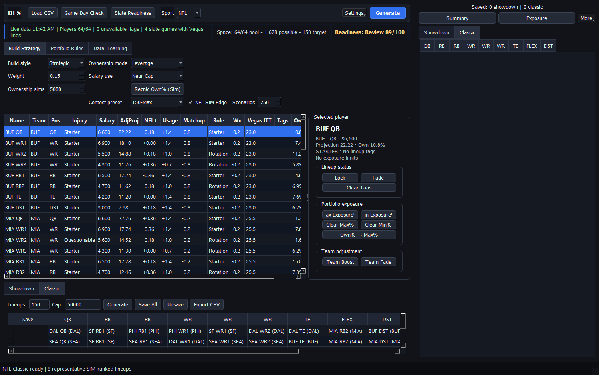{compact}

## 2. Five-minute workflow

1. Choose the sport and load the DraftKings salary CSV.
2. Choose **Slate Readiness**. For NFL, it refreshes a stale game-day check before auditing the slate.
3. Choose **Showdown** or **Classic** and set the lineup count. If you saved a setup earlier, choose **Settings > Apply or Delete Recipes** first.
4. Review **Build Strategy** and **Portfolio Rules**.
5. For NFL Classic, turn on **NFL SIM Edge** when you want field-based tournament scoring.
6. Choose **Generate** and wait for the progress message to finish.
7. Open **Portfolio Insights**. Filter review signals, inspect player exposure, and remove or replace weak rows before saving.
8. Choose **Export CSV**. For NFL, review the fresh **Final Lock Check**, replace any affected rows, then resolve every **Entry Safety** blocker before uploading to DraftKings.
9. After the contest, import DraftKings results through **Results & Learning**.

The pictured examples use representative NFL data. Player names, projections, ownership, live context, and SIM results will differ by slate.

The detailed Build Strategy, Portfolio Rules, and Data and Learning controls are folded away at startup so the player pool and generated lineups get most of the window. The quiet recipe summary beside the sport shows the active build style, salary approach, and, when applicable, SIM depth and contest preset. Choose **Settings > Show Build Controls** to change the detailed recipe. Choose **Settings > Show Saved Portfolio** to hide or restore the saved-lineup panel.

## 3. Classic and Showdown

**Classic** uses each sport's normal multi-game DraftKings roster. The selected sport controls slots, eligibility, grading, and sport-specific columns.

**Showdown** uses one Captain and five FLEX players. Captain salary and projection are multiplied according to DraftKings rules. Showdown keeps its own Captain exposure controls and uses the same NFL availability, roles, news, usage, matchup, and weather context. Larger builds explore a wider candidate bank, use Captain-specific ownership when available, estimate duplication risk, and balance Passing Stack, Receiver Captain, Rushing Control, Defensive, Onslaught, and Balanced lineup stories across the selected portfolio.

Always confirm that the loaded salary file matches the contest type you intend to enter.

## 4. Load and review the player pool

Choose **Load Player CSV** and select a DraftKings salary file. The player table is your slate workspace.

- **BaseProj** is the original projection.
- **AdjProj** includes supported context adjustments.
- **Status** and **Role** show NFL availability and depth information.
- **Own%** is the projected field ownership used by build and SIM logic.
- **Tags** show locks, fades, and related choices.
- Exposure columns hold maximum and minimum portfolio limits.

Sort and inspect the table before generating. A strong optimizer cannot repair a poor or stale player pool.

Player columns use content-aware alignment: descriptive fields stay left-aligned, team and position fields are centered, and numeric values align on the right. The table redistributes spare width among names, injury notes, roles, and tags when the window changes size.

{compact}

## 5. NFL Game-Day Check

For NFL slates, **Game-Day Check** refreshes structured availability, injuries, practice participation, roster status, news notes, and depth-chart roles. The app automatically excludes confirmed inactive, out, injured-reserve, suspended, and practice-squad players unless they were manually locked.

A locked unavailable player is never removed silently. Generation stops and names the conflict so you can decide what to do.

Run the check again near lock. No automated data source is a substitute for late-news review.

### Slate Readiness

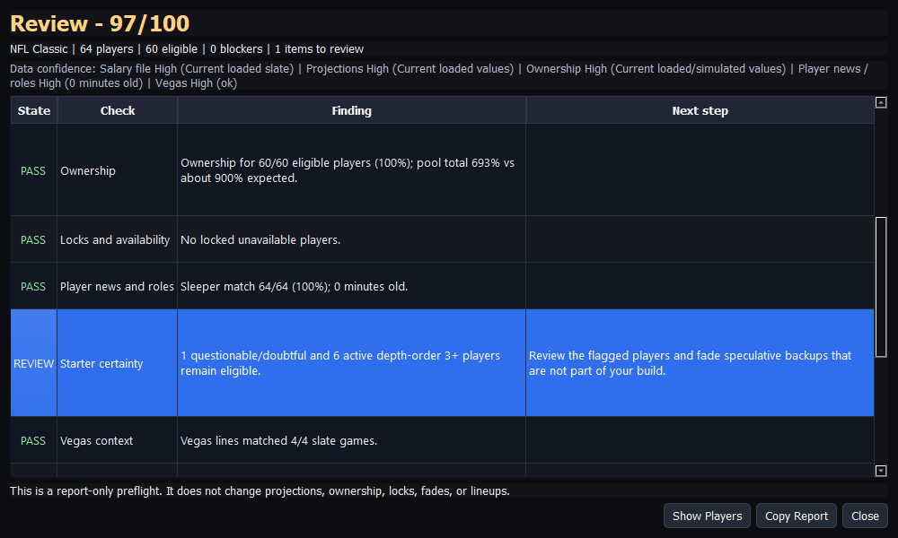{compact}

Choose **Slate Readiness** for a report-only preflight before generation and again before export. It gives the loaded slate a 0-100 score and separates findings into **Pass**, **Review**, and **Block**.

Select a finding and choose **Show Players**, or double-click it, to filter the player table to the affected players. Choose **Clear player filter** in the status strip to restore the full table. This is a visual filter only; it never changes lineup eligibility by itself.

The audit checks:

- salary-file identity and enough eligible players at each roster position;
- positive projection and ownership coverage, including unrealistic ownership-pool totals;
- locked players whose latest status is unavailable;
- freshness and coverage of NFL player news and depth roles;
- questionable players and active depth-order 3+ backups that deserve review;
- after generation, complete rosters, salary use, and the NFL portfolio's fit with the selected contest preset.

Only hard preparation problems are blockers, such as a missing roster position, poor projection coverage, or a locked-out player. The audit never changes a player, projection, ownership value, lock, fade, or lineup. Choose **Copy Report** when you want to keep or share the findings.

Reopen Slate Readiness after generation. The portfolio check then compares salary use, QB-stack mix, bring-backs, FLEX mix, and ownership coverage with the selected NFL field preset.

## 6. Build Strategy

The **Build Strategy** tab controls how candidates are created and ranked. Available choices vary by sport and contest type.

- Choose a style that fits the contest, such as balanced, projection-oriented, or leverage-oriented.
- For NFL Classic, Strategic, Balanced, Contrarian, and Chalk use the starter/rotation pool even when SIM Edge is off. Locks, minimum exposures, and required player groups are preserved. Choose Randomized with SIM Edge off when you intentionally want the broad player pool, including deep backups.
- Use ownership mode and weight to decide how much popularity affects ranking.
- For MLB, choose stack preferences and use optional lineup, form, matchup, park, weather, and Vegas inputs.
- Use salary strategy to discourage obviously under-cap builds without forcing every lineup to spend the full cap.
- For NFL Classic, enable **NFL SIM Edge** for correlated scenario and field evaluation.
- For NFL Classic, choose the contest entry-limit preset: **Single Entry**, **3-Max**, **20-Max**, or **150-Max**. This changes the opponent field size, salary floor, ownership emphasis, stack mix, bring-back rate, and FLEX mix used by the SIM.
- Choose **Build depth: Fast (default)** for normal builds. Choose **Deep (up to 5 min)** for broader NFL Classic SIM exploration and independent validation.

### Saved build recipes

Choose **Settings > Save Current Recipe** to give the current build configuration a reusable name. A recipe remembers the sport, contest type, lineup count, salary cap, ownership settings, build style, salary strategy, NFL SIM settings, contest preset, build depth, uniqueness, team and game caps, and ownership balancing.

Recipes intentionally do **not** save player locks, fades, exposure limits, or groups. Those choices belong to one slate and could be dangerous if silently carried into another. Choose **Settings > Apply or Delete Recipes** to inspect, apply, or remove a saved recipe. When a recipe changes sports, the app warns before clearing the current Classic results.

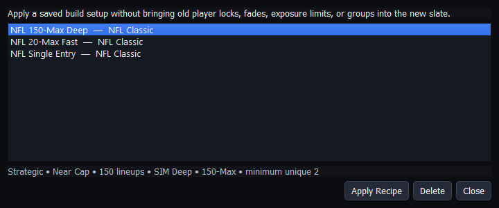{medium}

## 7. Portfolio Rules

Portfolio rules shape the whole set rather than one lineup at a time.

- **Max Exposure%** limits how often a player appears.
- **Min Exposure%** requests a floor across the portfolio.
- Showdown has separate Captain minimum and maximum controls.
- Minimum uniqueness requires a set number of different players between lineups.
- Team and game caps prevent too much concentration in one source.
- **Group: At Least 1** requires one or more selected players.
- **Group: Never Together** blocks selected players from sharing a lineup.

Locks, fades, salary, roster eligibility, and hard maximums remain hard rules. Some minimums and uniqueness targets may be relaxed when the requested portfolio is impossible. The completion message and **Portfolio Insights** disclose those shortfalls.

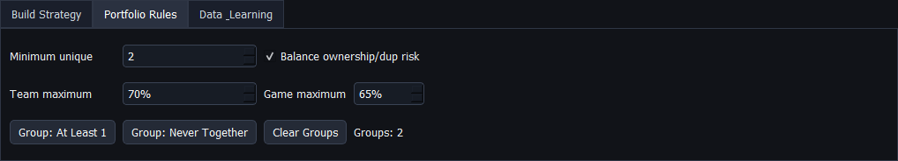

## 8. Generate and review lineups

Choose **Generate** from the active Classic or Showdown area. During a build, the progress area reports the current stage and offers **Cancel**. Cancellation keeps valid lineups already completed.

The compact **Space** display shows the current eligible build pool, structural lineup possibilities, and requested lineup count. Fading, locking, or changing the NFL build style recalculates it immediately. Normal NFL Classic styles use the same starter/rotation role pool as generation whether SIM Edge is on or off, so omitted inactive players and deep backups visibly shrink the count. NFL Classic is an exact roster-shape count; Showdown and multi-position sports are labeled as upper bounds. Salary cap, stacking, correlation, exposure, and uniqueness rules narrow the real build space further.

During generation, the Space display follows the Generate, SIM, and Select stages. After completion, hover it for the last build's phase timing and the number of candidates evaluated versus lineups selected.

Deep Build shows Explore, Screen, Validate, and Select/Refine. When a contest profile is active, a final **Joint Contest** stage evaluates the selected entries together. Its five-minute value is a ceiling, not a required wait. After the normal coverage refinements, Select/Refine uses remaining compute to search for lower-duplication replacements that retain combined Edge and return strength. Every replacement must still satisfy uniqueness, exposure, group, team, and game rules. The search stops at the deadline or at a constrained local optimum, and time is reserved for the final joint check. The app keeps the strongest completed stage if you cancel or the compute budget is reached.

To share a complete performance snapshot, open **Settings** and choose **Copy Last Build Report**. The report includes the build-space count, eligible and omitted pool sizes, candidate budget, generated and selected counts, Generate/SIM/Select timing, strategy settings, portfolio rules, preset fit, and aggregate warnings. For NFL SIM Edge, the budget separates optimizer candidates from additional field-shaped and scenario-built candidates. Deep reports also show the coarse shortlist, independent validation count, top-candidate agreement between the two SIM passes, portfolio swaps, and time-budget status. The report identifies the slowest phase so a performance problem can be isolated without guessing.

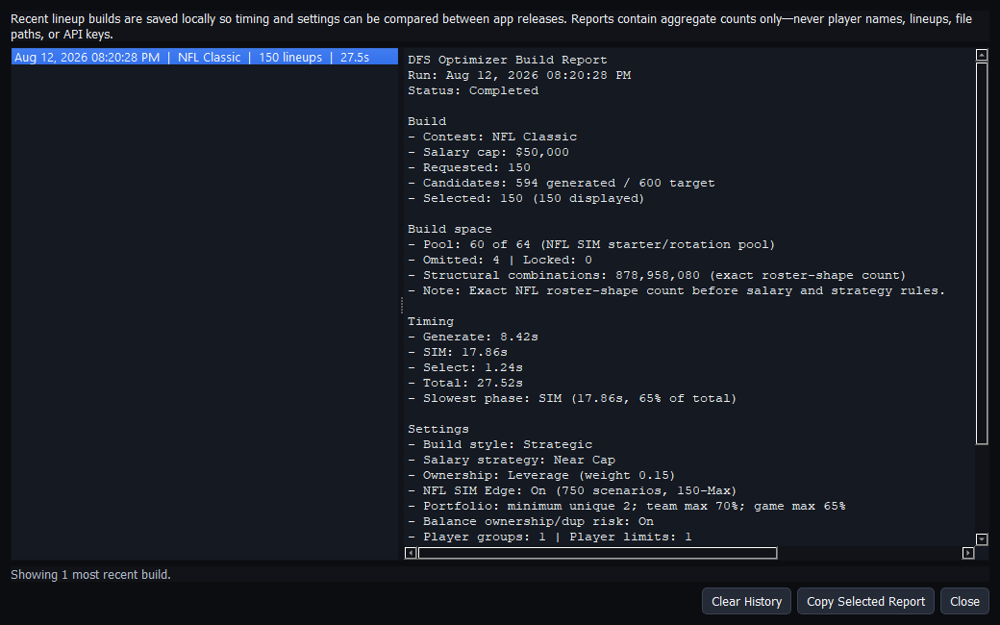{compact}

Choose **Settings > Build History…** to review the 25 most recent runs and copy any earlier report. Select exactly two rows and choose **Compare Two Builds** for a side-by-side view of candidate counts, timing, contest preset, SIM quality, duplication risk, scenario coverage, and selected candidate sources. Compare similar slates and inputs; a score change is not meaningful when the underlying assumptions changed. History is saved automatically after a completed or cancelled build and stays on this computer. Choose **Clear History** in that window when you no longer need it.

### Portfolio Insights

Choose **Insights** beside the saved-lineup tables or **Settings > Portfolio Insights…** after generation. If lineups are saved, the report analyzes that saved set; otherwise it analyzes the currently generated lineups.

The Overview explains:

- A/B/C/D grade distribution and salary bands;
- the selected mix of optimizer, field-shaped, and scenario-built lineups;
- selected Ceiling, Balanced, Leverage, and Low-Dup scenario archetypes;
- QB stacks, bring-backs, FLEX usage, and combined ownership shape;
- average SIM Edge, leverage, duplication risk, and preset fit;
- top-one-percent scenario coverage and portfolio concentration;
- when a contest profile is active, joint total cost, payout, profit chance, payout range, and estimate stability; and
- automatic review flags for weak grades, high duplication, excessive unused salary, unstacked NFL lineups, or concentrated player cores.

The sortable **Lineup details** tab identifies the exact rows behind those signals. Use **Show** to filter all flagged rows or one signal type, then choose **Select flagged**. You can also select rows manually.

- **Remove selected** deletes those rows from the generated or saved set after confirmation.
- **Replace selected** keeps every unselected lineup fixed and generates only the open slots with the current slate, strategy, and portfolio rules.
- Closing the window without choosing an action leaves the portfolio unchanged.

The **Player exposure** tab lists every player's count, percentage, and lineup numbers. Select a player and choose **Show selected player's lineups** to jump back to the exact affected rows. This is useful for reviewing a concentrated core before deciding whether individual lineups need replacement.

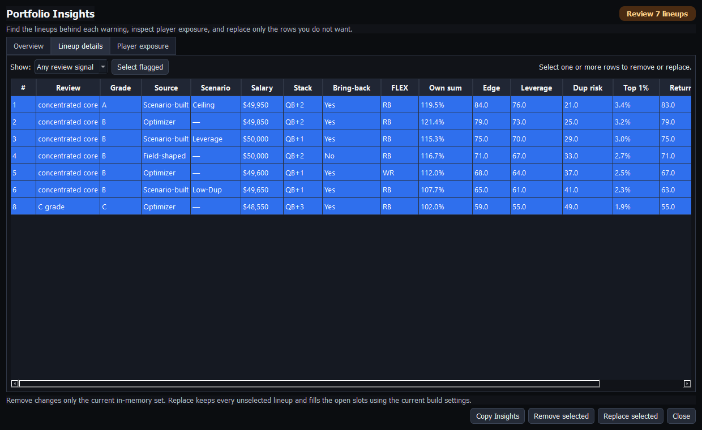{compact}

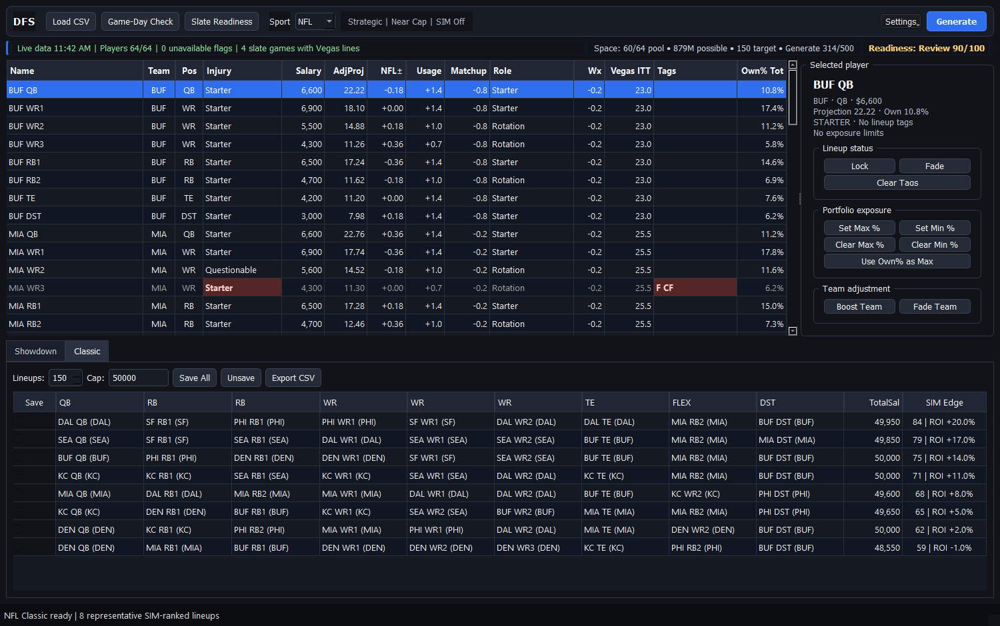{compact}

### After generation

- review salary and every roster slot;
- inspect the grade or NFL SIM Edge details;
- look for repeated cores and unexpected exposure;
- save only lineups you might enter;
- open **Portfolio Insights** before export and repair only the rows you do not want; and
- correct warnings rather than assuming they are harmless.

Generated-lineup columns keep salary and grade/SIM summaries compact so the roster slots receive most of the available width.

Large candidate pools, NFL simulation, and restrictive portfolio rules take more time than a simple projection build.

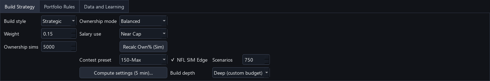

## 9. Understand NFL SIM Edge

NFL SIM Edge is for NFL Classic tournament decisions. It combines projection-led optimizer lineups, realistic field-shaped lineups, and lineups built from correlated ceiling, balanced, leverage, and low-duplication scenarios. The app evaluates them against a representative opponent field with a separate set of simulated outcomes, then selects a portfolio that covers different strong scenarios. Separating candidate creation from evaluation reduces overfitting.

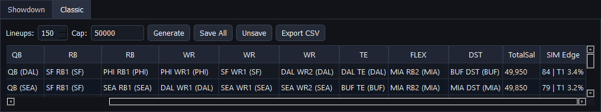{compact}

Deep Build strengthens that separation. A coarse random stream screens the expanded bank, while a different random stream validates only the strongest source-diverse shortlist. The final pass uses at least 2,500 scenarios even when the Fast scenario control is lower. A local search first improves the overall portfolio, then uses spare time for duplication polish. A polish replacement must lower duplication risk, preserve the combined Edge/return signal within a narrow guardrail, and satisfy every hard group, uniqueness, player, team, and game limit. The build report records total swaps, duplication-polish swaps, search passes, stop reason, and unused time.

Choose the preset that matches the contest's maximum entries per person. Presets are conservative starting assumptions, not promises. After at least three complete fields, 1,000 entries, and 70% player metadata coverage have been imported for that preset, the app can blend measured salary, construction, and winning-ownership patterns into its baseline. Until then, measurements remain report-only.

When the contest lobby provides the actual economics, open **Settings > Contest-Aware SIM**. Enter the contest name, total field size, entry fee, how many entries you plan to submit, and the payout table. Use one rank or range per line, such as `1 = $100,000` or `2-10 = $5,000`. **Save and Use** keeps the profile for later slates and turns on NFL SIM Edge. **Use Preset Only** removes the contest profile from the build without deleting it. If the requested build count differs from the profile's planned entries, the app stops before generation and lets you use the profile count, keep the requested count with a visible warning, or cancel.

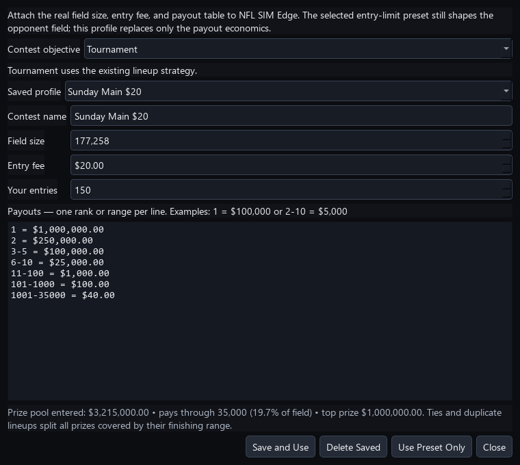{medium}

With a profile active, candidate grading first converts each simulated finish into the listed prize. After portfolio selection, the app runs all selected entries in the same contests. Your entries occupy ranks together, can take prizes from one another, and split ties with your other entries and sampled opponents. Results show **Edge | ROI** using this portfolio-adjusted pass. The tooltip adds each lineup's expected payout and profit plus the portfolio's total cost, payout, profit chance, and 95% ROI range.

The final outlook uses three sampled opponent fields instead of treating one generated field as exact. Game outcomes rotate through balanced, shootout, defensive, and blowout scripts informed by available totals and spreads. Established starters receive narrower scoring ranges than uncertain backups, while guarded rare ceiling outcomes preserve tournament tails. Adaptive stopping can finish early only after the portfolio estimate is both sufficiently precise and stable; top-heavy results normally use the full scenario budget.

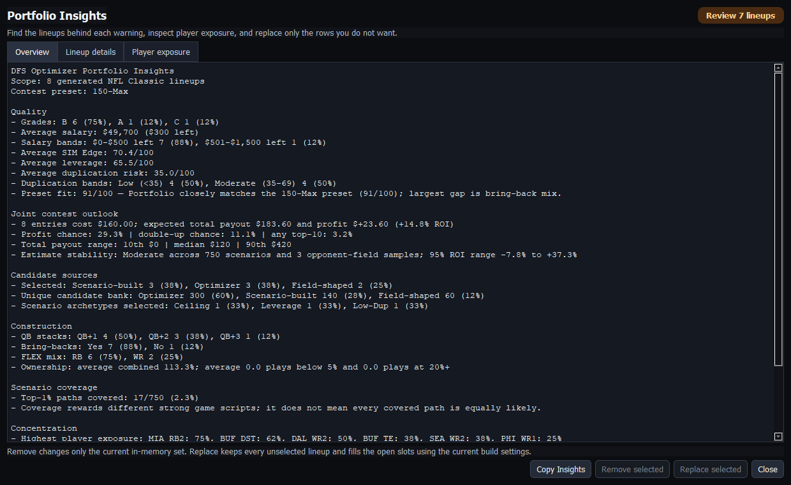{medium}

Portfolio Insights and the copied build report show expected total payout and profit, chance of finishing profitable or doubling the entry cost, any top-10 probability, 10th/median/90th-percentile payout, number of opponent-field samples, and estimate stability. The contest preset still controls how opponents are constructed; the saved profile controls the payout economics. These are model estimates, not guaranteed returns.

- **SIM Edge** is a slate-relative 0-100 summary. It is useful for comparing candidates from the same build, not as a universal score across slates.
- **Top 1%** and **Top 5%** estimate how often the lineup reached those field thresholds.
- **Win rate** is the representative-field first-place frequency, not an exact contest promise.
- **Cash rate** estimates how often the lineup cleared the simulated cash threshold.
- **Bust rate** measures poor simulated finishes.
- **Average percentile** summarizes normal field position.
- **Ceiling** is a high-end simulated score.
- **Tournament return index** combines upside, top finishes, and other tournament signals on a 0-100 scale.
- **Leverage** rewards useful paths that differ from expected field behavior.
- **Duplication risk** estimates how likely the construction is to be shared. Lower is generally better when other qualities are similar.
- **Joint contest ROI** is the selected portfolio's expected total profit divided by its total entry cost after your own entries occupy ranks together.
- **95% ROI range** is uncertainty around the estimated average, not the range of possible single-contest results. A wide range is normal for top-heavy tournaments.

The Classic results show Edge and top-one-percent rate, or Edge and expected ROI when Contest-Aware SIM is active. The **Why this SIM Edge** detail explains slate percentile, direction, and model weight for top finishes, ceiling, tournament return or contest ROI, and duplication safety. Generation and Slate Readiness show preset fit; the copied build report separates optimizer, field-shaped, and scenario-built candidates.

Portfolio selection rewards coverage of different strong scenarios, but applies a soft quality guardrail below the B-grade boundary so novelty alone does not rescue a weak candidate. Do not choose by one number alone. Compare ceiling, top-five rate, leverage, duplication, construction, news risk, preset fit, and portfolio coverage.

## 10. Save and export

Use **Save All**, individual save choices, or **Unsave** to control the portfolio. Saved-lineup tools include player exposure, stack and team exposure, and Portfolio Insights.

Open **Settings > Stack / Team / Salary Exposure** to review saved-lineup concentration and construction. The dashboard is sport-aware: NFL and other non-baseball sports show team, stack-shape, and salary-band views, while the **Pitchers** tab appears only for MLB.

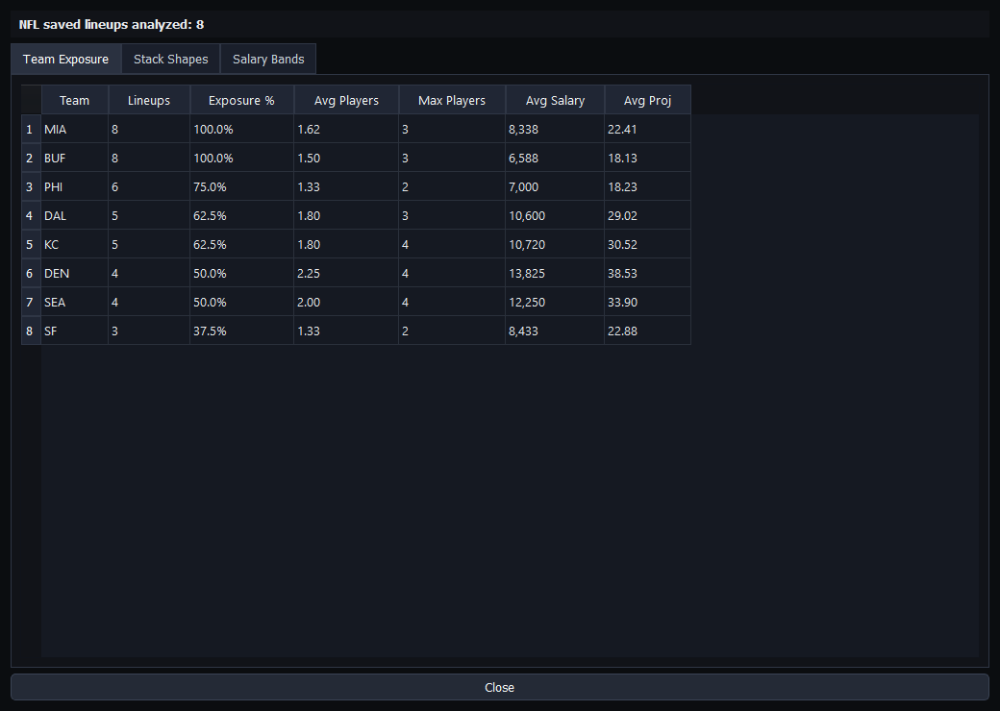{medium}

Choose **Export CSV** from the correct contest tab. The export uses DraftKings roster IDs and does not add analysis columns that could break upload format. Every completed export is also recorded locally for Results & Learning.

For NFL, **Final Lock Check** first refreshes the live player source immediately before export. It maps every returned status change and every currently unavailable player to the exact saved lineup numbers. Choose **Replace Affected Lineups** to keep all unaffected saved rows fixed and rebuild only those rows. If the live source is unavailable, the dialog says so plainly and lets you continue with cached data for the remaining safety review.

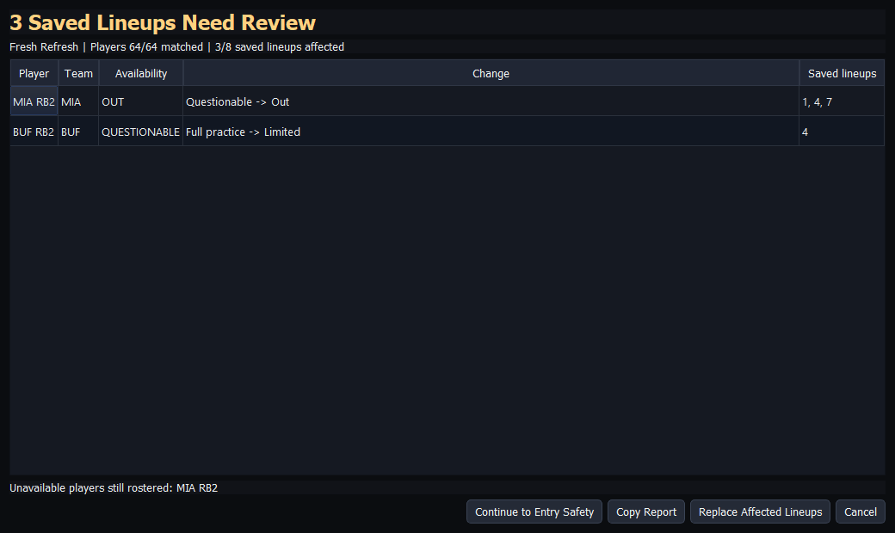{medium}

Next, **Entry Safety** checks the exact saved portfolio, not merely the last generated set. It blocks export when it finds an incomplete or position-invalid roster, a player repeated at their position and FLEX or at Captain and FLEX, the wrong or missing DraftKings slot ID, missing salary data, an over-cap lineup, a player absent from the current slate, a one-team Classic lineup, a Showdown lineup that does not use both teams or mixes games, duplicate entries, an unavailable player, or a violation of the current exposure, group, concentration, or uniqueness rules.

Questionable players, stale or incomplete slate data, and unusually low salary use appear as **Review** items. Those may be intentional, so Entry Safety allows **Export Anyway** after you inspect them. A blocker disables export. Choose **Replace Blocked Lineups** to preserve every unaffected row and rebuild only the blocked rows, or return to the workspace to make a different decision. Choose **Copy Report** when you want to preserve the full check. Neither safety step changes a lineup unless you explicitly choose replacement and confirm it.

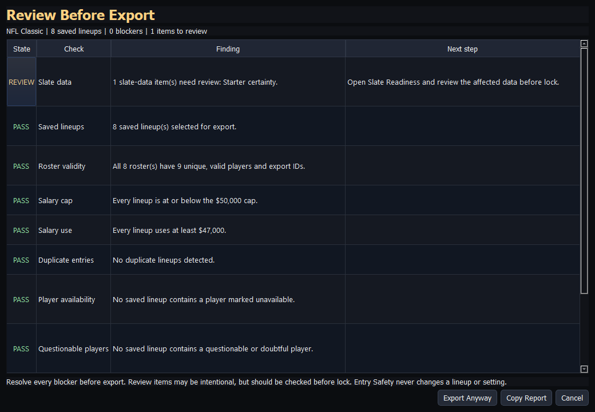{compact}

Before submitting:

1. Confirm the slate and contest type.
2. Confirm late scratches and start times; for NFL, require a fresh Final Lock Check whenever possible.
3. Review salary, slot-specific IDs, duplicate athletes, team diversity, slate membership, and exposure.
4. Upload to DraftKings and review the entries there.

## 11. Results & Learning

The app can compare exact exported rosters with DraftKings standings or contest-history CSV files. It can also measure the whole opponent field when the selected file contains complete standings.

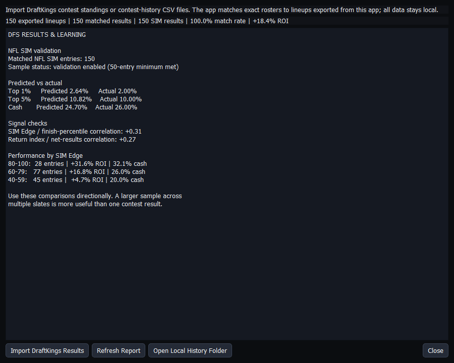{compact}

1. Export the lineups you actually plan to use.
2. After the contest, download the DraftKings result CSV.
3. Open **Results & Learning**.
4. Choose **Import DraftKings Results** and select the file.
5. For complete NFL standings, choose **Attach Matching Salaries** and select the DraftKings salary CSV from that exact historical slate.
6. Review the match rate, ROI, cash rate, finish percentile, projection error, and guarded breakdowns.

{compact}

The app reports general outcomes and projection calibration. Starting with v1.6.1, NFL SIM exports also retain their original Edge, top-finish, cash, return, leverage, and duplication estimates. Contest-Aware SIM exports additionally retain the contest name, field, fee, expected payout, profit, and ROI. When the Results & Learning summary shows matched SIM results, the report compares predicted and actual top-one-percent, top-five-percent, cash, and contest ROI rates. It also checks whether Edge tracks finish percentile and whether the return index tracks net results.

For a complete standings file, the report also measures:

- actual player ownership and its error versus the saved projection;
- field-wide and top-one-percent total ownership, including low-owned and high-owned player counts;
- ownership bands showing field share, top-one-percent rate, and exact-duplication rate;
- exact duplicated rosters, including duplication among top-one-percent entries;
- salary used and the low end of normal field salary;
- QB stack and bring-back patterns; and
- RB, WR, and TE FLEX usage.

A file is treated as a complete field only when it contains at least 25 entries and roughly 95% of the advertised contest field. Personal entry-history files still update your results, but they are not used to model opponents. To associate a complete field with a SIM preset, include **Single Entry**, **3-Max**, **20-Max**, or **150-Max** in the contest name or CSV filename. Entry labels such as `(92/150)` can also identify a 150-Max contest. Unclassified fields remain report-only.

Large complete standings are summarized in the background while they are read. The Results & Learning window stays responsive, shows progress, and lets you cancel safely. The app stores the field measurements rather than creating millions of local opponent-result records. DraftKings files that omit sport and contest-name columns can still be recognized from NFL roster slots and entry-name suffixes.

The matching salary file is optional, but it unlocks accurate salary, QB-stack, bring-back, and FLEX analysis when the standings file only contains names and roster slots. The app checks the player overlap first and refuses to attach a mismatched slate; at least 70% of the historical field players must match.

After generating and exporting an NFL Classic SIM build for the same preset, reopen **Results & Learning** to compare the latest simulated field with the measured real field. The comparison includes duplication, salary, construction, and ownership profile differences. It is a diagnostic comparison, not proof that the real contest will repeat.

{thumb}

SIM validation is labeled directional until at least 50 matched entries. Complete-field learning has separate, stricter guardrails. When those guardrails are met, only a small part of the measured winning-ownership profile affects candidate scoring, while salary and construction patterns are blended conservatively into the preset.

Exact matching matters. An entry can remain unmatched if it was edited after export or if its result row lacks a parseable lineup.

## 12. Troubleshooting

**Slow generation:** test fewer lineups and relax conflicting minimums, groups, uniqueness, or concentration limits.

**Too few lineups:** read the generation message and Portfolio Insights; the pool may not support all current rules.

**Replacement could not fill every selected row:** replace fewer rows together or relax the rule named in the warning.

**Rejected upload:** use a fresh DraftKings salary file from the exact slate and export again without modifying the upload columns.

**Unmatched results:** confirm the submitted roster exactly matches a lineup exported from this app.

**Incomplete learning comparison:** a preset with partial historical field data may show the real-field duplication value as **n/a**. Generation and results remain available; importing a complete matching field can fill the missing measurement.

**Recovered error message:** copy the technical details, keep any valid visible lineups, and include the last build report.

See the separate Troubleshooting guide for more detail.

## Section 13 - Local data and privacy

The optimizer stores exports, imported results, slate snapshots, build diagnostics, and settings on the computer. Choose **Open Local History Folder** in Results & Learning to inspect the history location, and back it up if the accumulated learning record matters to you.

{medium}

Build diagnostics contain aggregate settings, timing, counts, and generalized warning categories. They do not store player names, lineup contents, salary-file paths, or API keys.

