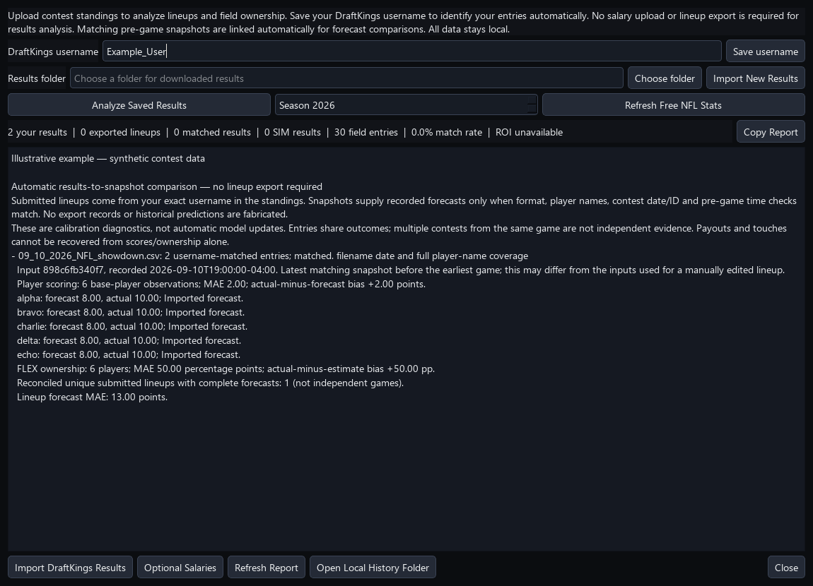
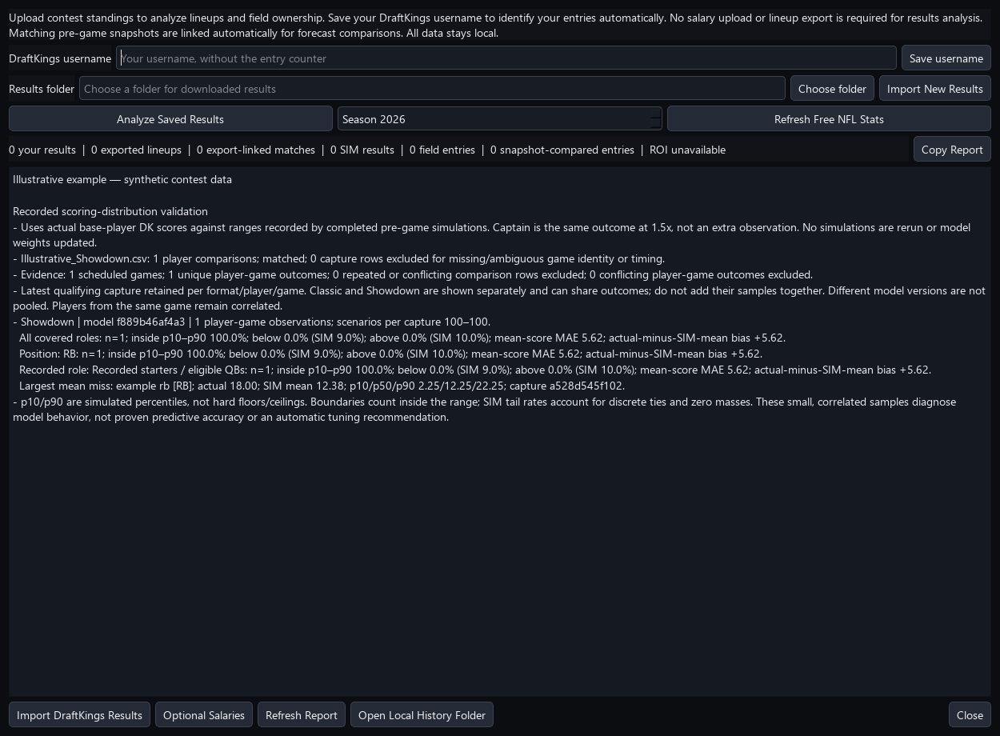
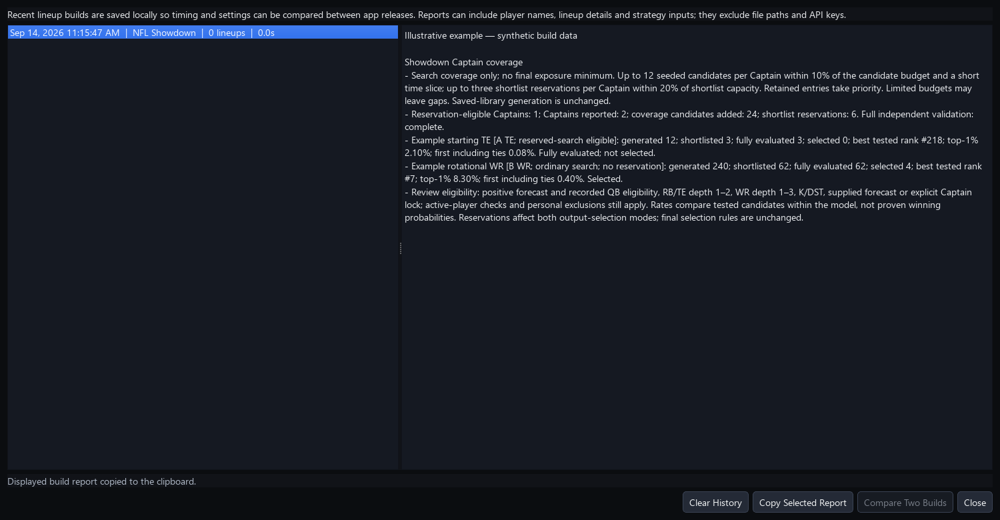

# DFS Optimizer v1.19.0


## Showdown portfolio upgrade


- A normal 150-entry Showdown build now explores roughly 1,500 candidates before selecting the final portfolio.

- Captain and FLEX ownership are evaluated separately when slot-specific ownership is available.

- Key-free QB/receiver and RB/DST correlations remain active without a betting-data subscription.

- Candidates are classified as Passing Stack, Receiver Captain, Rushing Control, Defensive, Onslaught, or Balanced constructions.

- Selection balances Captain concentration and construction coverage while preserving locks, fades, salary, uniqueness, groups, and exposure limits.

- Showdown portfolio summaries report Captain count, script count, common team splits, and estimated average duplication risk.


## Simpler live NFL data


- The unused Odds API key setting, automatic odds requests, and "Vegas key needed" status have been removed.

- NFL game-day checks continue to use key-free player availability, injury, practice, roster, news, depth-chart, usage, matchup, and weather inputs.

- Legacy stored odds fields remain readable for backward compatibility but are no longer requested or required.


## Repository cleanup


- Tracked Python cache files and the development debug log were removed from source control.

- They remain excluded by `.gitignore` and are not part of release builds.


Showdown quality, leverage, and duplication values are decision aids derived from the loaded projections and ownership assumptions. They are not guarantees of contest results.


## Projection input integrity


- Separate historical PPG from imported forward projections for both NFL contest formats; explicit zero forecasts remain intentional.

- Add manual forecasts by double-clicking BaseProj/AdjProj, with refresh-safe overrides and snapshot persistence.

- Add labeled, uncalibrated comparable-player estimates for missing-history players with known top-two roles and enough historical peers. Unknown roles and insufficient evidence remain missing.

- Show source details in the selected-player panel and tooltips; readiness and build reports disclose weak projection inputs.

- Preserve old replay inputs. Reload the original CSV to adopt new projection handling.


## Automatic workload projections


- Known active NFL QB/RB/WR/TE roles now receive automatic team-budgeted opportunity projections in Classic and Showdown, including rookies with no history.

- Recent usage blends with depth priors; explicitly unavailable starters promote known backups, with reserves for incomplete pools.

- SIMs vary teammate workload shares within shared position budgets. Imported forecasts and optional overrides retain priority.

- Snapshots retain model version and assumptions for later outcome evaluation. No automatic results-based training yet. Initial priors are uncalibrated and omit bonuses/fumbles; see the guide for every assumption.


## Shared data preparation and workload-v2


- Fix the obsolete nflverse statistics URL and validate weekly schema; retain the one-prior-season fallback. Show usage availability separately from player status.

- Preserve individual historical evidence: 75% history when usage is absent, declining to 50% as usage games accumulate; rookies retain role estimates. SIMs apply the same component blend and still support original v1 snapshots.

- Add a no-window server preparation command using the desktop parser, enrichment and ownership worker. Export JSON/optional Parquet plus source hashes to new directories; leave old server jobs/checkouts untouched.


### Shared specialist event scoring


Classic and Showdown now share experimental possession events for K/DST scoring, with common field goals, touchdowns, extra points and opposing points allowed. Reports disclose uncalibrated event rates and the distinction between input projections and resulting SIM means. Offensive-player scoring remains projection-based; this is not a complete game ledger. See the user guide for assumptions and omitted events.


### Kicker opportunity forecasts


Matched kickers now receive explicit attempts/accuracy/distance/XP forecasts from weekly records, with documented shrinkage and context. Components drive shared specialist events. Source details and report counts are visible; manual/imported forecasts and missing-data fallbacks are preserved. Reload the salary CSV to adopt this model; old snapshots retain their recorded inputs. See the guide for uncalibrated assumptions and tonight’s validation sequence.


## Historical Showdown salary attachment

Attach Matching Salaries now accepts complete NFL Showdown fields, including generic standings filenames once matching NFL salaries identify the sport. DKSalaries and DKEntries files with embedded player salary tables are supported. Captain/FLEX salaries, ownership and lineup identities remain distinct. Wrong-slate and missing-table checks remain in place. Showdown fields remain excluded from Classic construction calibration.


## Submitted-entry results

Matching DKEntries attachments now join submitted entry IDs and verified rosters to complete standings, retaining scores/ranks once and matching saved exports by player IDs. Entry Points cannot be overwritten by the adjacent player FPTS column. Missing winnings remain unknown. Report labels distinguish Classic-only calibration from Showdown field summaries. Original export history is required for prediction comparisons.


### Selected-player controls

The selected-player panel groups lineup status, portfolio exposure, and team adjustments with consistent two-column buttons. Minimum exposure controls are on the left and maximum controls on the right. When the player area is short, scroll within the panel to reach the lower actions; controls retain their spacing and remain readable.


### One-file results and username

Open **Results & Learning**, enter your **DraftKings username**, and choose **Save username**. The setting stays on this computer and is not included in shared source code. Import the complete contest standings CSV to identify your submitted entries by exact username (case-insensitive, ignoring the trailing entry counter), save their scores and ranks, and compare your regular-slot and Captain exposure with the observed field. No salary or entry-upload file is required for these comparisons.

If you previously imported the same file without a username, save your username and import it again; the field and personal entries are not duplicated. Different username spellings are not guessed. **Optional Salaries** adds salary/construction detail when desired. Forecast validation still requires original saved forecasts; winnings/cash rate require payout data. This update stores empirical results and ownership comparisons; it does not automatically retrain projections or tune Showdown from a single contest.


### Results audit and Copy Report

Results & Learning now appends a diagnostic audit automatically. **Copy Report** copies the complete displayed text, including per-contest match counts, up to five unmatched rosters, lineup score reconciliation, Captain/FLEX scoring consistency, player forecast misses, saved ownership ranges, and available export version/timestamps. Keep the original standings file accessible for its player FPTS side table. Missing files or fields are reported rather than guessed.

Identical player-score tables across contests indicate shared outcomes; the count is a proxy, not a verified game count. Repeated player appearances are not independent observations. Older exports may lack forecast provenance and ownership units; low saved ownership alone does not prove a normalization bug. New exports preserve forecast source and workload/kicker context for future audits. No forecasts are regenerated and no model weights change automatically. Copied reports contain player names, username and aggregate results, but omit file paths, entry IDs and API keys.

Classic nine-player scoring/name matching is explicitly covered alongside Showdown. Identical-file reimports refresh moved source locations for future audits without adding duplicate results.


### Results folder

In **Results & Learning**, choose or create a folder with **Choose folder**. The location is saved on this computer. Store downloaded standings there, then click **Import New Results**. The app scans that folder and subfolders, ignores non-result CSVs, and imports contents it has not already saved. Identical contents are skipped even after a rename; moved files refresh their audit location. Your saved username identifies your entries. An unavailable USB drive is reported without changing saved results.

The scan runs only when clicked. Keep **Import DraftKings Results** for selecting individual files or reprocessing an existing field after changing your username. File-content identity prevents duplicate imports of identical files; changed contents are treated as a new import.


- Added Long Search / Resume (1–12 hours), transactional candidate libraries and fresh Deep scoring for Classic and Showdown; 100,000 unique candidate ceiling.
- Enforced verified starting-QB eligibility across both build modes and ownership preparation; locks cannot admit backups. Unknown depth is excluded; questionable alone does not promote QB2.
- Corrected new quick ownership estimates from normalized player weights to bounded roster exposure; preserved historical exports and added ownership provenance.


- Added automatic new-import construction reviews plus Analyze Saved Results for older files, with field/top5/top1/winner/personal cohorts, coverage, duplication, Captain and Classic stack patterns.
- Cached base-slot contest player scores, conservative player/date deduplication, recent/earlier performance and original forecast bias; dates inferred from filenames remain unverified.
- Added explicit free nflverse selected/prior-season downloads, durable player-week statistics and correction upserts; PPR scores stay separate from DraftKings outcomes. No automatic strategy or projection fitting.


## Cross-contest score and QB-stage diagnostics

- Results & Learning distinguishes conflicting shared scores from missing player/Captain rows in overlapping same-date contests; cached base comparisons remain available when originals are missing.
- NFL Classic SIM and Deep Showdown reports show quarterback representation at generation, screening, independent validation and selection, including stage-specific simulated top-1% averages.
- Diagnostics preserve roster selection and model settings. Captain counts once, date uncertainty is disclosed, and older runs have no reconstructed stage counts.


## Showdown opponent spending and ownership provenance

- Deep Showdown screening, validation and audit fields use an experimental 60/25/10/5 salary-band prior, preserving lower-spend entries and reporting target/actual distributions and bounded-generation fallbacks.
- Legacy ownership weights no longer appear as confirmed percentage-point forecast errors. Inputs and snapshots retain their values.
- Build reports count Captain locks and display Captain/FLEX lock counts separately.
- A frozen-candidate comparison script isolates opponent changes with shared scenario outcomes. The documented comparison changed mean field salary from $45,945 to $49,067 and top-150 average top-1% rate from 9.90% to 4.57%; predictive accuracy remains unvalidated.


## Build controls cleanup

- One Compute profile picker replaces overlapping Deep mode/tier controls for NFL. Presets set counts together; Custom opens the editor.
- Search & output groups style scope and selection; resource details stay collapsed for presets. The single-style selector is disabled during all-style searches.
- Ownership sampling controls move to Data and Learning. Existing recipes, snapshot settings and portfolio rules retain their meaning.
- User guide navigation and screenshots updated.


- Corrected limited-history projection stress targeting for NFL Classic and Showdown: full current/prior-season evidence is separate from the recent four-week form window. Distinct weekly observations survive trades when stable player IDs agree; ambiguous names and missing sources remain unknown. Reports and future export records retain that evidence. Existing frozen banks require a fresh salary import and build to capture it; recent-form projection weights are unchanged.


Projection Sensitivity now tests each of the five saved favorites individually at 15% lower simulated production, alongside baseline, the combined reduction and wider-history outcomes. Classic and Showdown both support this. Defaults run up to eight profiles per batch: 3 batches at 5,000 scenarios means 24 simulations, roughly 2.7 times the former three-profile workload. The dialog shows the exact profile count for the selected bank. Existing banks can be reused; no new Deep build is required for these additional tests.

Copy Report identifies each displayed baseline leader's largest individual decline and summarizes each tested player's effect across the baseline top150. JSON/CSV retain all candidate/profile/batch results. Effects apply equally to opponents and candidates, with shared Captain scoring; they do not redistribute touches or add up to the combined effect. Every requested profile must finish before a batch counts. Saved comparison columns include all tested profiles in lowest-rate/rank summaries; older three-profile reports remain viewable. This diagnoses dependence on forecasts, not proven projection errors or automatic exposure changes.


### Automatic forecast checks

Normal NFL Classic and Showdown build reports now include **Automatic forecast checks**, using recorded player inputs with no additional simulations, network requests or user setup. Open **Settings > Copy Last Build Report** or Build History to read them. Long sensitivity comparisons remain optional model-development tools; they are not a per-contest requirement.

Checks review automatic skill-player estimates when base points differ from a positive historical average by at least 5 points and 50%, or projected opportunities differ from at least four recent observed games by at least 50% and 8 attempts / 4 carries / 3 targets. Observed zero opportunities remain valid; missing observations do not become zero. The report identifies the usage season because prior-season roles may differ. Recorded position-budget overruns and missing/invalid opportunity breakdowns also appear. Limited-history automatic estimates of at least 6 base points receive informational notices, not assertions that they are wrong. Thresholds are uncalibrated review heuristics and can miss real errors; role changes can legitimately trigger them.

The copied report shows at most six review findings and two limited-evidence notices, with all findings retained in build diagnostics. Warnings summarize the number of players needing review. Player names are included under the existing report privacy notice. Supplied/manual projections are preserved and excluded from automatic-workload comparisons; K/DST are outside these skill-player checks. No projections, lineups, exposure limits or simulation weights are changed. Continue importing results after contests to evaluate original forecasts against outcomes; these checks do not train the model.


### Automatic entry targets

**Auto from lineup count** is on by default in the NFL Build controls. Request 1 for Single Entry; 2–3 for 3-Max; 4–20 for 20-Max; 21–150 for 150-Max. More than 150 uses 150-Max assumptions while keeping individually ranked alternatives, so a 450-lineup request remains a browsing bank rather than claiming one legal 450-entry portfolio.

For Deep Classic and Showdown, one entry uses Individual ranking; 2–150 entries use Portfolio selection to select the requested set together. More than 150 uses Individual ranking. Explicit player/group/uniqueness rules still apply, and shortages are reported. Best means selected under the app's uncalibrated model and constraints, not proven optimal entries or guaranteed winnings. The compute profile stays under your control; choosing a count does not automatically start a longer simulation.

Classic selects its existing contest preset (including the 150-Max large-field defaults); supplied Contest-Aware SIM field size and payouts remain authoritative where supported. Entry count does not verify the real contest. Showdown uses the automatic entry-selection approach but retains its generic opponent model; changing the target is not a new calibrated Showdown field model. The summary discloses that distinction.

Turn Auto off to choose the contest preset and Search & output selection manually. For example, 20 entries can still be intended for a 150-Max contest. Auto mode persists locally and in new recipes/snapshots; older recipes without this setting retain manual behavior. Existing snapshots are not silently rewritten. Build reports show the target and whether it came from count or manual settings. No additional setup or test run is required.


## Review my entries

Open **Settings > Review my entries** (also under the saved-entry **More** menu) for the active NFL Classic or Showdown tab. Choose **Generated outputs** for the whole build, including all pages, or **Saved entries** for your saved collection. No extra simulations run and no entries, rankings or settings change.

Sortable tables show player exposure, repeated pairs/trios, repeated full rosters, constructions and unused salary. Showdown adds Captain + FLEX pairs and Captain positions; Classic includes QB receivers, opposing players and game concentrations. Percentages use all analyzed rosters, including repeated entries. Missing salaries/context are disclosed. These are shared-player counts, not measured outcome correlations or opponent duplication estimates. Saved collections may contain multiple builds: review one slate together. **Copy Report** copies the summary and top 20 rows per section; all rows remain available in the tables.


## Optional portfolio comparison

**Settings > Portfolio Comparison** compares the current portfolio selector with an experimental repeated-pair/trio penalty for NFL Classic and Showdown. Choose a saved Deep bank with more candidates than requested entries (1-150). Defaults: 150 entries and 2,000 scenarios per pass. Two passes run: shared selection scenarios, then fresh independent evaluation of both frozen selections. Allow several minutes; Cancel discards incomplete comparisons. This is optional development work, not a required step for every contest.

The trial adds a bounded 6-point penalty on the existing selection scale, normalized by roster core count and requested portfolio size. It supplements existing scenario-coverage rewards; it is not a calibrated risk estimate or a hard player cap. Athlete pairs/trios ignore Captain assignment, while existing Captain constraints remain. Production builds and Individual ranking stay unchanged.

Saved banks omit original group/team/game settings, so this does not recreate the original build. Both trials use minimum unique 2, ownership balancing on, saved player limits and standard Showdown guardrails, without refinement. The report discloses selection shortfalls/relaxations. Fresh evaluation reports average individual top-1% rates, scenarios covered by at least one entry, roster overlap and repeated-core concentrations. One held-out simulation stream does not establish historical accuracy, monetary returns or an improvement. Repeating uses the same seeds. Original forecasts and selected entries remain unchanged. **Copy Report** and automatic JSON/text files under `history/portfolio-checks` preserve the results, including player names and selected roster identities.


## Core Plays from loaded salaries

After loading NFL salaries and refreshing player data, open **Settings > Core Plays** for the active Classic or Showdown output tab. No Deep run is required. This read-only view uses the currently loaded inputs; it does not fetch data, change projections, set exposure limits or lock players. Reopen after changing inputs. Filters show core candidates, all eligible/loaded players, individual signal categories and Captain/FLEX slots. Search by player/team/position; click headers to sort numerically, with unknowns last in either direction. Select a row for workload, sources, history, status-check time, reasons and review notes. **Copy Report** copies every row in the current filtered/sorted view.

Signals are transparent heuristics, not recommendations to lock a player: **Underpriced role candidate** requires points per $1,000 percentile >=75 and projection percentile >=50 among at least four supported positive-forecast peers at the same position/slot. **High-projection anchor** requires projection percentile >=80; equal peers do not count as strictly lower. **Popular play to assess** uses estimated ownership >=10% Classic, >=25% FLEX or >=8% Captain. **Lower-owned alternative** compares same-position/slot players with >=90% of a popular peer's projection, <=110% salary, and both >=5 percentage points and >=30% lower ownership. Similar mean projections do not prove similar ceilings. **Role-change opportunity** requires explicit unavailability in every earlier recorded depth slot. No salary file alone establishes current starters or actual ownership.

Supported roles are eligible starting/promoted QBs, RB1-2, WR1-3, TE1-2, and K/DST in separate positional comparisons. Unknown/deep roles can be inspected under All loaded but receive no positive tags. Missing forecasts differ from explicit zero; neither receives positive tags. Recorded unavailable players, backup/unverified QBs and slot-specific fades are excluded from candidates. Rookie/limited evidence, automatic forecast-check findings, uncertain status, unknown check times and status checks older than 24 hours remain review notes even on otherwise attractive candidates. These signals do not validate data accuracy or injury news.

Showdown uses separate Captain/FLEX prices, forecasts and explicit percentage ownership; missing slot values are not borrowed. Captain and FLEX points-per-dollar are often equal because both salary and scoring scale together, so value alone cannot rank the best Captain. Classic QB details suggest up to three same-team receiving partners from eligible supported roles. Ownership remains an estimate; unverified units show Unknown. Reports contain player names, forecast inputs and data timestamps, not account settings/API keys. The existing Ownership & Leverage view provides post-SIM contender comparisons separately.


## Update one contest in a combined entries file

Save the replacement lineups, click **Update Entries**, and select your DraftKings entries CSV. When it contains multiple contests, choose the contest by name and ID. The dialog shows its entry count and how many other entries will remain unchanged; continue is enabled only when the saved lineup count matches. Same-name contests remain distinct by ID. **All contests** remains available for an explicitly ordered full-file replacement. Single-contest files retain the existing workflow.

Only the selected contest's roster cells change, in existing entry order. Entry IDs, contest metadata, other contests, instructions and embedded salary tables are preserved. Save a new upload file. To edit another contest, select that newly saved file as your next input, then upload the final combined file. Reusing the original download for the second update would omit your first update. This does not submit entries or change contest entry limits. Use replacement lineups from the matching slate.


## Results plus username: automatic snapshot comparisons

For NFL Classic and Showdown, open **Results & Learning**, save your DraftKings username once, then **Import DraftKings Results** or **Import New Results** from your chosen folder. The app identifies your submitted entries directly from standings, including DraftKings entry-counter suffixes. No salary upload or lineup export is required to analyze your scores, ownership versus the field, repeated rosters and available constructions. If files were imported before you saved a username, importing again or **Analyze Saved Results** finds your entries without duplicating the contest. **Copy Report** includes the analysis and comparison diagnostics.

Forecast comparisons automatically search local pre-game snapshots. Ordinary NFL builds save these automatically; repeating identical inputs preserves the original snapshot timestamp. **Update Entries** also records the selected contest ID with the current inputs so future standard `contest-standings-ID.csv` downloads can be linked. Older imports can match a date in their filename (for example `09_10_2026_NFL_Showdown_Results.csv`). No second file is required. A date or previously saved contest-ID association is needed; unknown dates are not guessed from scores or player names.

Matching requires NFL, the same roster format, complete coverage of observed player names without ambiguous identities, one scheduled game date, and a snapshot recorded before the earliest game starts. The latest qualifying snapshot supplies the reference forecasts. It may differ from inputs used for manually edited entries; it does not create an export record or claim exact prediction provenance. Missing, conflicting, post-game, unsupported-schedule or multi-date snapshots leave forecast comparisons unavailable while observed results analysis remains available.

The automatic comparison reports snapshot ID/time, per-player forecast errors and largest misses, Captain/FLEX ownership error separately for Showdown, and unique submitted-lineup forecast error when all player scores reconcile with the reported entry score. Repeated identical entries count once for this forecast comparison. Missing forecasts stay unknown; recorded zero forecasts remain zero. Teams, positions and salaries use saved metadata when available; a standings file alone cannot supply missing prices, depth roles, touches or payouts.

These are calibration diagnostics saved locally, not automatic model changes. Multiple contests from the same game and lineups sharing players are not independent evidence. Existing export-linked validation remains separate. Import results after each slate and use **Copy Report** to review mismatches before changing the model.




## Ownership and forecast report corrections

After updating, use **Results & Learning > Analyze Saved Results** once. Older lineup-ownership summaries are rebuilt from observed roster appearances; no salary file or new simulation is needed. Each player's field ownership and each lineup's ownership total now share the same denominator and observed source, including distinct Captain/FLEX slots. The CSV's listed percentages are compared separately as an input consistency check, never used in place of actual roster ownership. Older unversioned summaries are hidden and excluded from ownership-profile calibration until rebuilt; other field metadata remains intact. Cancel leaves the current contest's previous summary unchanged. Original files must still be available for rebuilding.

The summary distinguishes your username-matched results, reconciled snapshot-compared entries and export-linked matches. Snapshot comparisons count repeated submitted entries, while forecast error continues to count identical lineups once per contest. These counts overlap and must not be added together. A low export-match percentage is not a failure to identify your entries or match snapshots.

Snapshot player-error reports show separate groups for recorded starters/eligible QBs, other depth roles/rotation, backup QBs, recorded unavailable players, unverified/excluded QBs and unknown roles. Classification uses only frozen pre-game evidence. An eligible replacement QB stays in the eligible group. Other depth roles are not automatically inactive, and zero outcomes do not determine eligibility. Legacy snapshots with missing role evidence remain unknown. The all-player error is explicitly labeled as including these groups; no forecast, role, lineup or simulation weights change.


## Observed ownership accuracy and username finish summaries

**Analyze Saved Results** now refreshes snapshot ownership accuracy and construction-review ownership using the same observed roster counts as field summaries. Export-linked ownership audits also use those counts. Classic regular slots and Showdown Captain/FLEX remain separate. A player/slot present in the results side table but absent from all parsed field rosters has observed zero ownership. Without one complete field, observed ownership is unavailable; the CSV's listed percentages are not substituted. Existing snapshot ownership comparisons are hidden until refreshed. Forecasts, actual scores and simulation weights remain unchanged.

Finish summaries use all entries belonging to the saved username, independently of exports and snapshots. Reports show covered/total entries, overall and per-contest average finish percentile and top-1% rate. Missing field size, missing rank and out-of-range ranks are excluded with coverage disclosed. Higher percentile is better; percentile is `100 * (1 - (rank - 1) / field size)`. Rank ties share their reported rank, and the top-1% cutoff is rounded up. Overall figures are entry-weighted; repeated submitted entries count separately and do not establish independent predictive evidence. Monetary results and export-linked projection validation remain separate; finish rates do not establish cash rate or ROI.


## Automatically recorded scoring ranges

Complete a normal NFL SIM build before kickoff: Classic Fast or Deep, or Showdown Deep. The app records each player's actual simulated mean and percentiles from the scenarios already used by that build, without an additional simulation pass. **Copy Last Build Report** confirms whether scoring distributions were saved. Compact summaries, input ID, model version, scenario count and capture times stay under `history/scoring-distributions`; raw scenario draws are not retained. Save failure is reported without discarding lineups.

After the games, import your standings in **Results & Learning**, then use **Analyze Saved Results** to refresh comparisons and **Copy Report** to share them. Existing snapshot matching identifies the reference inputs; a scoring record must have that exact input ID and format, a complete scenario run, and a capture timestamp before the player's scheduled kickoff. Missing or ambiguous game identities, invalid records and later replays do not qualify. Old snapshots alone cannot recreate historical scoring ranges, so older results may correctly say unavailable. Continue with your next pre-game build; another long run on an old slate is unnecessary.

The recorded-distribution section separates Classic/Showdown and model versions, then groups observations by position and frozen role. It shows how often actual scores fall inside the simulated p10–p90 range, below it or above it, along with expected simulated tail rates, mean-score error and the largest misses. Quantile boundaries count inside; empirical tail rates account for ties and zero scores, so the expected inside rate is not always exactly 80%. These ranges are not hard minimums or maximums.

One player in one scheduled game counts once across repeated contests within a format, using the latest qualifying capture. Conflicting actual scores are excluded. Captain uses the same base-player outcome, not a second observation. Classic and Showdown can share games, so their sample counts are not additive; players in the same game remain correlated. No projection, ownership, scenario weights or lineup rankings are changed by this diagnostic. Many separate games are needed before drawing conclusions about calibration.

Older ownership aggregates are labeled **Legacy export-metadata ownership difference** because their forecast timing or units may be unverified. Use the snapshot-backed ownership comparison for current accuracy checks.




## Showdown Captain search coverage

Normal **Showdown Deep** builds now reserve a bounded part of generation and screening for plausible Captain alternatives. No extra control or results upload is required. Review eligibility requires a positive forecast and recorded eligible/starting QB status, RB/TE depth 1–2, WR depth 1–3, K/DST, a supplied forecast or an explicit Captain lock. Active-player/QB eligibility checks, Captain fades, FLEX locks, another Captain lock and explicit zero exposure limits still apply. Ownership alone neither qualifies nor disqualifies a Captain; unknown unsupported roles are not automatically included.

The search attempts up to 12 candidates per eligible Captain within 10% of the overall candidate budget. It uses at most 30 seconds or 10% of the generation time allowance, whichever is smaller, sharing that time across Captains. These are existing-budget candidates, not additional output entries. Temporary Captain search locks are removed before scoring and selection; user locks are preserved. Candidate shortage can mean insufficient time, budget or feasible constructions, not proof of an impossible lineup.

After coarse scoring, up to three of each review Captain's strongest generated candidates receive shortlist reservations. Reservations share at most 20% of shortlist capacity; existing retained entries take priority. Scarce slots are distributed round-robin, with higher projected players considered first. The remaining shortlist uses the existing selection policy. This applies to both **Individual ranking** and **Portfolio selection**. It improves coverage but cannot guarantee every Captain is tested under every budget or constraint. Saved candidate libraries are not expanded; their existing Captain candidates can receive shortlist reservations.

**Copy Last Build Report** and **Build History** include **Showdown Captain coverage**: generated, shortlisted, fully evaluated and selected counts for each review Captain, plus the best tested rank, top-1% rate and first-place rate including ties. Full evaluation is claimed only when all requested independent validation scenarios complete. Reports distinguish missing candidates, screening gaps, incomplete validation and evaluated-but-unselected alternatives. Ranks are among that build's evaluated candidates and do not measure historical prediction quality.

Coverage does not impose final exposure minimums or change forecasts, ownership, outcome models, or portfolio rules. Final lineup selection can still choose zero of a reviewed Captain. Classic and non-Deep Showdown behavior are unchanged. Run a fresh Showdown Deep build to use the expanded search; old banks are not rewritten. A new build may have different lineups because different candidates were compared.




## Usage resilience and build-rule integrity

Full NFL data refreshes retry a transient weekly-statistics download failure once (timeouts, connection failures, HTTP 429 or server errors). Successful, schema-checked season downloads are saved under `history/usage-cache`. If a later download fails, a matching season/source cache with a valid content digest can supply the last successful rows. The original download timestamp stays intact. Build input summaries explicitly label cached usage as not freshly downloaded; each player retains the fetch state/date. Current and prior seasons remain separate, and missing usage is never interpreted as an observed zero. Cache loss or corruption leaves the source unavailable. There is no cache to recover until a successful download has occurred. A successful empty season still allows the existing prior-season fallback.

Reload the salary file for a full data refresh after updating; the lightweight pre-build status check does not download weekly usage again. Snapshot replay continues to preserve its original inputs. Results & Learning's **Refresh Free NFL Stats** uses the same download cache and labels cached refreshes. Back up the history folder to retain this cache with snapshots and results.

Normal desktop Classic and Showdown builds no longer automatically weaken minimum uniqueness or raise automatic Showdown exposure caps to fill an output request. If greedy selection gets stuck, a bounded feasibility repair can rearrange candidates under the same maximums, group rules, team/game limits, retained entries and uniqueness. It prioritizes retaining greedy selections, then their quality order, and does not fit or change scoring models. The repair has a 15-second maximum, limited by remaining Deep time. A solver result is accepted only when it is integral and satisfies every modeled constraint; it need not be proven optimal. Existing minimum-exposure shortfalls remain reported rather than guaranteed.

If no complete compliant portfolio is found, the build explains the shortage instead of releasing the incomplete constrained portfolio or silently changing its limits. This is a search limitation, not proof of mathematical infeasibility. Increase candidate/shortlist coverage or explicitly change the requested count or rules before rebuilding. Evaluated Deep banks and pre-game scoring summaries saved before selection remain available. Cancellation still preserves retained entries. Unconstrained generator shortages may still return fewer entries with a warning.

Showdown's experimental opponent sampler now targets underfilled salary bands by drawing a Captain and four FLEX players, then choosing a weighted legal fifth FLEX that completes the requested band. It retains distinct athletes, both teams and legal salaries. Unavailable bands, finite search and cancellation can still cause disclosed shortages/fallbacks; it never copies a roster just to fill a quota. Ownership feedback accepts a lower-error field only if it does not worsen salary-band shortage. Matching the salary mix may therefore leave a larger ownership mismatch. Both diagnostics remain visible; this is not a calibrated joint ownership model or proven improvement in predictive accuracy.

Captain coverage now reports every Captain appearing in generated, shortlisted, validated or selected candidates, alongside reservation-eligible candidates with no generated lineups. Each row distinguishes **reserved-search eligible** from **ordinary search; no reservation**. This closes reporting gaps for successful ordinary-search Captains without expanding the reservation eligibility rules or forcing final exposure.


### Clear messages when lineup limits stop a build

A constrained portfolio shortage now opens a **Lineup limits** warning instead of a Python traceback. It lists the strongest blockers at the greedy selection stop: uniqueness, player total/Captain caps (automatic or explicit), team/game caps, specialist Captain caps, and player groups. Candidate counts can overlap; they are diagnostic observations, not proof that the constraints are impossible. No incomplete constrained portfolio is released and no rules are silently relaxed. Broaden the candidate pool or Deep shortlist to supply more choices; increasing scenario count alone does not do that. Reducing output count recalculates percentage caps, so it is not a guaranteed remedy. Unexpected programming errors still retain their traceback for troubleshooting. This handling covers Classic and Showdown.


### Preserve a feasible portfolio before Deep shortlisting

Classic and Showdown Deep builds now search the full screened candidate pool for a complete set satisfying the current maximum exposures, uniqueness, groups, team/game limits and retained entries **before** narrowing the SIM shortlist. The check uses the same limits as final selection, including automatic Showdown caps, with up to 20 seconds from remaining build time. A verified complete set is reserved ahead of optional shortlist reservations; it receives the same later SIM evaluation as other shortlisted candidates. The rest of the shortlist still follows the selected ranking/search mode. No scoring forecasts or exposure limits are changed.

If final greedy selection gets stuck, the app rechecks the preserved set against the current candidates and rules and can use it as a complete fallback, followed by normal refinement where enabled. Output ordering still uses the final SIM ranking. This is a feasible portfolio, not proof of the best possible portfolio. Build reports disclose preservation and fallback use. If no complete set is found within the available pool/time, existing strict shortage handling remains. More scenarios alone cannot replace missing candidate alternatives. Run a fresh Deep build after updating; old saved shortlists are not expanded or rewritten.


### Responsive portfolio feasibility checks

The pre-shortlist check now has an app-enforced solver deadline and cancellation, rather than relying only on CBC's internal time limit. The app polls its own solver process, terminates that process if the budget expires or Cancel is pressed, and cleans up its temporary files. Preparation checks the same deadline/cancellation; the full-pool check avoids expanding shared-roster groups into a large pairwise conflict graph. Classic and Showdown display the feasibility subphase explicitly and record its start/end in the debug log.

A timed-out check cannot supply a partial or unchecked portfolio. The build continues with the ordinary shortlist if the feasibility check finds no complete set within its budget; final exposure/uniqueness safeguards still apply. Cancellation ends the current check. These bounds apply to the portfolio feasibility check, not to all other build phases.


### Successful recovery messages and Showdown salary filtering

A successful preserved-portfolio fallback or feasibility repair is no longer translated into a generic failed-rule warning. Recovery remains visible in the build details; real exposure, uniqueness, group and other warnings remain reported.

Deep Showdown now filters generated candidates, including Captain coverage and loaded-library candidates, before screening and feasibility preservation. Near Cap requires at least cap minus $2,500; Maximize Salary requires at least cap minus $500 ($47,500 and $49,500 respectively on a $50,000 cap). These match the existing Showdown report tolerances. Balanced Spend and Salary Leverage keep their broader salary choices. A conflicting retained lineup produces a clear stop before generation, rather than silently modifying it. Build reports show how many candidates were excluded. If the allowed pool cannot support the requested portfolio, limits remain intact and a shortage is reported.

This does not change Classic salary behavior or turn Showdown correlation review flags into hard bans. Old saved shortlists and completed lineups remain unchanged; run a fresh Deep build to apply the filter before shortlisting.


### Automatic generated-output archives and incremental USB backups

Every build completion now writes a compressed audit ZIP under `history/build-archives`, including all returned outputs beyond the first 150 displayed. Settings > **Open Automatic Build Archives** opens the folder. Each ZIP contains `lineups.json` (ranked slot identities, projections and SIM metrics), `audit-lineups.csv` (readable long-form audit rows, not a DraftKings upload template), a build report, and a SHA-256 manifest. The matching validated input snapshot is included when available; missing snapshots are disclosed. The implementation fingerprint and build settings are recorded. Repeated builds have separate files; cancelled builds with returned outputs are labelled cancelled. Archives exclude bulky per-scenario arrays and do not create export records or imply that any lineup was submitted. Archive failures are visible but do not discard built lineups. Existing builds are not reconstructed retrospectively.

`history_backup.py` is an optional replacement for copying every history file to a new USB folder. Run it only after DFS closes. It hashes local history, copies and verifies new content once, reuses unchanged content, and writes a dated manifest for each successful backup under `D:\DFS-Backups\incremental-v1`. Earlier manifests and content remain unchanged, including files later deleted from the source. Keep the **entire incremental-v1 folder** together; manifests alone are not recoverable backups. Existing dated full backups remain untouched. The first incremental backup still copies all unique content. Subsequent backups avoid rewriting and rereading unchanged USB objects; local files are still hashed. Use `--verify-existing` for a full check of existing USB content; restores always verify content. No automatic retention/deletion policy is enabled.

After installing the updated app code and closing DFS, the prepared `scripts/Launch_DFS_Acer_Incremental.example.bat` can replace the personal launcher. It retains update/launch behavior and calls the incremental backup only after the app exits. Do not replace a launcher that is currently running.

```powershell
.\.venv\Scripts\python.exe history_backup.py --source history --destination D:\DFS-Backups
.\.venv\Scripts\python.exe history_backup.py --source history --destination D:\DFS-Backups --verify-existing
.\.venv\Scripts\python.exe history_backup.py --restore "D:\DFS-Backups\incremental-v1\manifests\CHOSEN-BACKUP.json" --target "D:\DFS-Restore-New"
```

Restore requires a new destination folder, never the live installation. The backup summary reports bytes written, files reused, and time spent hashing the source, copying, and verifying so bottlenecks can be measured. These changes do not enable overnight scheduling or alter lineup generation, ownership, exposures, projections or submission behavior.

### Overnight candidate preparation targets

Settings > **Long Search / Resume** opens Overnight Preparation for NFL Classic or Showdown. Choose **New library**, select a maximum of 1–12 hours, and choose a total saved-candidate target of 12,000, 20,000, 50,000 or 100,000. The default is 20,000. Start / Resume runs all five styles in checkpointed batches; it stops when the target or time limit is reached. Existing candidates count toward the target. Pause and save retains completed batches. Leave the app open and the computer awake; the dialog prevents starting a competing interactive build in this app window. It is not an unattended scheduler and does not change Windows sleep settings.

Saved roster identities are excluded from later batches and resumed searches. Captain swaps remain distinct in Showdown. Five consecutive styles adding no new candidates stop the search with an explanation; this does not prove all possible lineups were searched. Time limits and heuristic searches can finish below the target. App-code or input changes still require a new library to continue searching; existing libraries can still be loaded for a matching slate and checked against current player inputs.

After preparation, close the dialog, use **Load Candidate Library**, and run **Deep** with SIM enabled. Both formats reuse the saved combinations and validate current eligibility, salary and lineup rules. This avoids ordinary candidate generation for that build, but still runs current scenario scoring, feasibility checks and selection. It does not cache scenario scores or automatically submit/export lineups. Start with 12,000–20,000: very large libraries can increase screening time and memory use. No overnight job starts automatically on app launch.

Command-line preparation also accepts `--candidates 20000` with `--hours 8`; both limits are validated before creating a library. The candidate target is not a contest entry limit.
